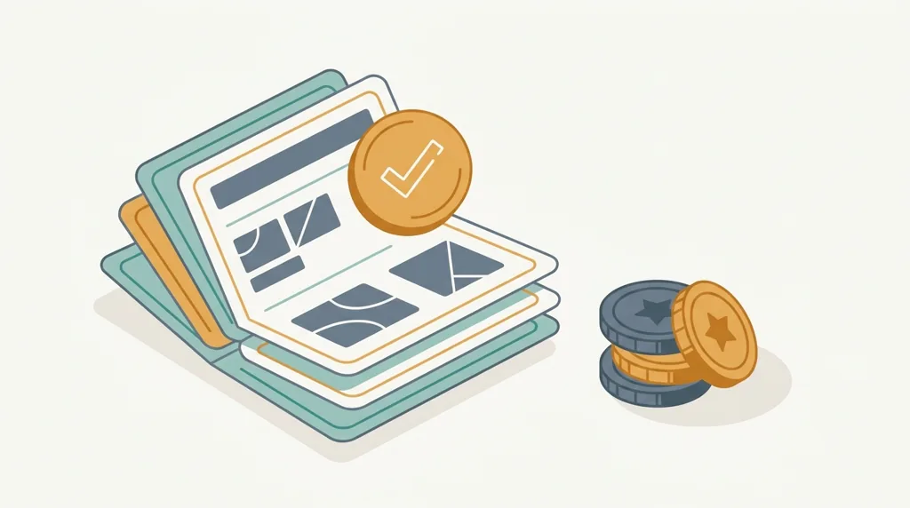

# Festzuschuss und Bonusheft: was die Krankenkasse 2026 beim Zahnersatz zahlt

*Von Mario Yordanov, Patientenkoordinator bei Dentalvia*

Der Betrag, den die gesetzliche Krankenkasse zum Zahnersatz beisteuert, richtet sich nach Ihrem zahnmedizinischen Befund. Wie teuer die Behandlung am Ende wird, spielt für seine Höhe keine Rolle. Zum 1. Januar 2026 ist dieser Festzuschuss um 4,34 % [VERIFY] gestiegen. Wer sich für eine aufwendigere Versorgung entscheidet, bekommt deswegen keinen Cent mehr und trägt den Aufpreis selbst.

## Der Festzuschuss folgt dem Befund, nicht der Rechnung

Seit 2005 läuft die gesetzliche Zahnersatzversorgung in Deutschland über den befundorientierten Festzuschuss, geregelt in § 55 SGB V [VERIFY]. Für jeden Befund, für jede Lücke und jeden geschädigten Zahn also, legt die Kasse eine Regelversorgung fest. Das ist die wirtschaftlich ausreichende Standardlösung, mit der sich der Befund zweckmäßig und dauerhaft versorgen lässt. Den Maßstab bildet diese zweckmäßige Versorgung. Die teuerste denkbare Variante bleibt außen vor.

An den durchschnittlichen Kosten dieser Regelversorgung bemisst sich Ihr Zuschuss. Sobald Ihr Befund feststeht, ist auch die Höhe des Zuschusses fixiert, egal für welche Versorgung Sie sich danach entscheiden. Wählen Sie etwas Aufwendigeres als die Regelversorgung, überweist die Kasse trotzdem nur den befundbezogenen Festzuschuss. Alles, was darüber liegt, zahlen Sie als Eigenanteil selbst.

## Das Bonusheft: 60, 70 oder 75 Prozent

Wie groß der Anteil ausfällt, den die Kasse an der Regelversorgung übernimmt, hängt von Ihrem Bonusheft ab. Ohne Heft oder mit Lücken bleibt es bei 60 % der durchschnittlichen Kosten der Regelversorgung [VERIFY]. Fünf Jahre lückenlos geführtes Heft heben den Anteil auf 70 % [VERIFY], nach zehn lückenlosen Jahren sind es 75 % [VERIFY].

Für Versicherte mit geringem Einkommen greift zusätzlich die Härtefallregelung. Der Festzuschuss verdoppelt sich dann und kann bis zu 100 % der Regelversorgung erreichen [VERIFY]. Ob Sie die maßgebliche Einkommensgrenze erreichen, entscheidet allein Ihre Krankenkasse anhand fester Grenzwerte.

Der Nachweis ist unkompliziert: Erwachsene brauchen mindestens eine Kontrolluntersuchung pro Jahr, Kinder und Jugendliche zwischen 6 und 17 Jahren zwei. Ein einmaliges Versäumnis im Zehnjahreszeitraum muss den Bonus nicht kosten, sofern Sie es gegenüber der Kasse ausreichend begründen können [VERIFY]. Das Heft ist kein Behördenformular, sondern Ihr Nachweis gegenüber der Kasse.

## Was sich 2026 geändert hat

Zum 1. Januar 2026 hat die KZBV die Festzuschüsse um 4,34 % [VERIFY] angehoben, beschlossen am 5. Dezember 2025. Gestiegen ist die Bezugsgröße, also die zugrunde gelegten Beträge der Regelversorgung; die Prozentsätze der Bonusstufen bleiben, wie sie waren. Bei gleichem Befund fällt der Zuschuss damit etwas höher aus als im Vorjahr. Den maßgeblichen Betrag weist ohnehin immer der aktuelle Heil- und Kostenplan aus.

## Beispielbeträge (Stand 2026)

Die folgenden Beispielwerte (Stand 2026) machen die Größenordnung greifbar; verbindlich ist immer der Betrag, den Ihre Kasse für Ihren konkreten Befund festsetzt.

| Befund | Regelversorgung | Festzuschuss 60 % | Festzuschuss 70 % | Festzuschuss 75 % |
|---|---|---|---|---|
| Einzelkrone | rund 280 € [VERIFY] | 168 € [VERIFY] | 196 € [VERIFY] | 210 € [VERIFY] |
| Dreigliedrige Brücke | rund 530 € [VERIFY] | 318 € [VERIFY] | 371 € [VERIFY] | 398 € [VERIFY] |
| Vollprothese (je Kiefer) | rund 500 € [VERIFY] | 300 € [VERIFY] | 350 € [VERIFY] | 375 € [VERIFY] |

*Festzuschuss nach Bonusheft (60/70/75 % der Regelversorgung), Beispielwerte Stand 2026.*

Über alle Befunde hinweg reicht der befundbezogene Festzuschuss von rund 17 € [VERIFY] bis etwa 965,93 € [VERIFY], je nachdem, wie aufwendig die Regelversorgung im Einzelfall ausfällt.

## Regelversorgung, gleichartig, andersartig: was den Eigenanteil bestimmt

Wie hoch Ihr Eigenanteil ausfällt, hängt davon ab, welchen Versorgungsweg Sie wählen. Die Regelversorgung ist die Standardlösung, an der sich der Zuschuss bemisst. Wer auf diesem Weg bleibt, ihn aber um private Zusatzleistungen wie eine Vollverblendung ergänzt und dafür aufzahlt, wählt eine gleichartige Versorgung. Entscheiden Sie sich dagegen für eine ganz andere Methode, etwa ein Implantat anstelle der vorgesehenen Brücke, spricht man von einer andersartigen Versorgung.

Was Sie selbst tragen, folgt einer einzigen Rechnung: die [LINK: Gesamtkosten der gewählten Versorgung → /kosten/] minus Festzuschuss ergeben Ihren Eigenanteil.

Ein Beispiel: Für eine einzelne Zahnlücke sieht die Regelversorgung eine dreigliedrige Brücke vor, und Ihr Bonusheft steht bei zehn lückenlosen Jahren. Der Festzuschuss liegt dann bei rund 398 € (75 %, Beispielwert Stand 2026) [VERIFY]. Sie entscheiden sich stattdessen für ein Implantat, also für eine andersartige Versorgung. Am Zuschuss ändert das nichts, er bleibt bei 398 € [VERIFY]. Kostet [LINK: das Implantat samt Krone → /ratgeber/was-kostet-ein-zahnimplantat/] in Deutschland beispielsweise 2.200 € (Beispielwert Stand 2026) [VERIFY], bleibt ein Eigenanteil von rund 1.802 € [VERIFY]. Wird die Behandlung günstiger, sinkt Ihr Eigenanteil im gleichen Maß, während der Zuschuss unangetastet bleibt. Sobald der Preis der gewählten Versorgung feststeht, steht auch Ihr Eigenanteil fest und lässt sich bei Bedarf [LINK: in Raten finanzieren → /finanzierung/].

## Erst der Heil- und Kostenplan, dann die Behandlung

Am Anfang steht immer der Heil- und Kostenplan, den Ihr Zahnarzt erstellt und der die vorgesehene Versorgung samt Kosten dokumentiert. Ihre Krankenkasse muss ihn vor Behandlungsbeginn genehmigen [VERIFY]; wer ohne diese Genehmigung behandeln lässt, riskiert den Zuschuss. Den Plan prüft Ihr eigener Zahnarzt, eingereicht wird er bei der Kasse, bevor Sie sich festlegen. Verbindlich ist für Ihren Fall allein Ihre Krankenkasse, weder ein Ratgeber noch eine Vermittlungsagentur; was Ihr Zuschuss konkret beträgt, wie Ihr Bonusstatus steht oder ob die Härtefallgrenze greift, beantwortet sie Ihnen schriftlich.

## Derselbe Zuschuss gilt auch im EU-Ausland

Der befundbezogene Festzuschuss ist nicht an eine Behandlung in Deutschland gebunden. Grundsätzlich gilt er auch für Zahnersatz, der im EU-Ausland erbracht wird, sofern die Versorgung einer deutschen GKV-Abrechnung standhält und der Heil- und Kostenplan vorab genehmigt wurde [VERIFY]. Wer eine Behandlung etwa in Sofia erwägt, nimmt den Kassenzuschuss also mit; und weil die Behandlungskosten dort oft niedriger liegen, fällt der Eigenanteil entsprechend geringer aus. Die genauen Voraussetzungen und den Ablauf der Erstattung behandelt [LINK: unser Ratgeber zum Zuschuss der Krankenkasse bei Zahnersatz im Ausland → /ratgeber/zahnersatz-ausland-zuschuss-krankenkasse/]. Über die Höhe entscheidet auch hier allein Ihre Krankenkasse.

Der nächste Schritt liegt bei Ihnen: Führen Sie Ihr Bonusheft lückenlos weiter und lassen Sie den Heil- und Kostenplan von Ihrer Kasse genehmigen, bevor Sie sich auf eine Versorgung festlegen.

[AUTHOR BIO BLOCK - patient coordinator]

[BRAND BOILERPLATE]

**Kostenlose Beratung**

Wenn Sie Ihren Festzuschuss für eine Behandlung im Ausland nutzen und den Ablauf einmal in Ruhe durchsprechen möchten, fragen Sie über [LINK: Ihre kostenlose Beratung → /kontakt/] unverbindlich an.

*Wir sind eine Vermittlungsagentur und vermitteln Zahnbehandlungen bei einer Partnerklinik in Sofia. Die Behandlung führt die Partnerklinik durch; wir organisieren Beratung, Reise und Betreuung.*

Dieser Beitrag dient der allgemeinen Information und ersetzt keine zahnärztliche Beratung, Diagnose oder Behandlung.
