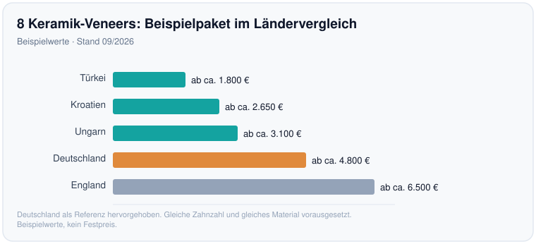

# Veneers-Kosten 2026: Deutschland und Ausland im Vergleich

*Von Georgi Todorov, Patientenkoordinator bei Dentalvia*

Sechs Keramik-Veneers für die sichtbare Oberkiefer-Front kosten in Deutschland ab ca. 3.000–6.000 € (Stand 09/2026), und diesen Betrag tragen Sie in voller Höhe selbst. Im europäischen Ausland lässt sich dieselbe Front oft für einen Bruchteil versorgen. Zur echten Ersparnis wird der niedrigere Preis aber erst, wenn im Angebot wirklich dasselbe steckt und ein Veneer für Ihren Fall überhaupt das Richtige ist.

## Ein Veneer ist eine ästhetische Entscheidung

Ein [LINK: Veneer, deutsch Verblendschale → /veneers/] ist eine dünne Schale, die auf die Vorderseite eines Frontzahns geklebt wird und Farbe, Form oder kleine Lücken korrigiert. Der Eingriff verbessert das Aussehen, ein medizinisches Problem behebt er nicht. Weil die gesetzliche Kasse nur medizinisch notwendige Leistungen trägt, zahlt sie bei Veneers nicht mit.

## Was ein Veneer pro Zahn kostet

Den [LINK: Preis eines einzelnen Veneers → /kosten/] bestimmen zuerst das Material und die Herstellung. Für Deutschland sehen die Ausgangspreise pro Zahn so aus:

| Variante (Deutschland) | Preis pro Zahn (Stand 09/2026) |
|---|---|
| Komposit-Veneer | ab ca. 250–500 € |
| Keramik-Veneer | ab ca. 700–1.500 € |
| Standard-Keramik | teils ab 500–1.000 € |
| Non-Prep / Lumineers | ab ca. 700–1.500 € |
| Same-Day / Veneers-to-Go | ab ca. 350–600 € |

Im Ausland beginnt derselbe Keramik-Veneer pro Zahn deutlich niedriger; der deutsche Richtwert von ab ca. 700–1.500 € pro Zahn steht zum Vergleich in der letzten Zeile:

| Land | Keramik-Veneer pro Zahn (Stand 09/2026) |
|---|---|
| Türkei | ab ca. 250–350 € |
| Ungarn | ab ca. 250–350 € (teils bis 800 €) |
| Polen | ab ca. 330–550 € |
| Kroatien / Tschechien | ab ca. 350–580 € |
| Sofia (Bulgarien) | ab ca. 350–500 € |
| Deutschland (Referenz) | ab ca. 700–1.500 € |

*Keramik-Veneer pro Zahn: Startpreise im Ländervergleich (Beispielwerte, Stand 09/2026).*

Für Emax-Veneers aus Sofia kursieren Beispielwerte um 450–522 € (Stand 09/2026). Diese Bulgarien-Zahlen schwanken je nach Klinik und Technik stark und gehören vor jeder Entscheidung als aktueller Kostenvoranschlag angefragt [CONFLICT: Quelle nennt teils ~350 $, teils ~522 €]. Worauf Sie bei [LINK: Zahnersatz in Bulgarien → /ratgeber/zahnersatz-bulgarien-worauf-achten/] sonst noch achten sollten, klären Sie am besten vor der Buchung. Jedes dieser Länder liegt unter dem deutschen Richtwert von ab ca. 700–1.500 € pro Zahn.

## Warum zwei gleiche Zähne verschieden viel kosten

Der Unterschied zwischen dem günstigsten und dem teuersten Frontzahn-Veneer steckt im Material und im Herstellungsweg: Komposit wird direkt im Mund modelliert, hochfeste Presskeramik wie Emax dagegen aufwendiger im Labor gefertigt.

## Die ganze Front: Paketpreise im Vergleich

Wer die sichtbare Front einheitlich gestalten will, versorgt meist sechs bis acht Zähne. Sechs Keramik-Veneers kommen in Deutschland auf ab ca. 3.000–6.000 € (Stand 09/2026); für sechs bis acht im Oberkiefer nennen Quellen eine breite Spanne von ab ca. 4.200 € bis 12.000 € je nach Zahnzahl und Technik. Ein Paket aus acht Keramik-Veneers wird in Deutschland häufig mit ab ca. 4.800 € angesetzt (Stand 09/2026).

| Land | 8 Keramik-Veneers, Beispielpaket (Stand 09/2026) |
|---|---|
| Türkei | ab ca. 1.800 € |
| Kroatien | ab ca. 2.650 € |
| Ungarn | ab ca. 3.100 € |
| Deutschland | ab ca. 4.800 € |
| England | ab ca. 6.500 € |

*8 Keramik-Veneers als Beispielpaket: Ländervergleich (Beispielwerte, Stand 09/2026).*

Bei gleicher Zahnzahl und gleichem Material liegt das Ungarn-Beispiel mit ab ca. 3.100 € rund 1.700 € unter dem deutschen Paketpreis von ab ca. 4.800 €, das Türkei-Beispiel mit ab ca. 1.800 € rund 3.000 € darunter. Wer sechzehn Veneers plant, zahlt pro Einheit oft weniger, weil manche Fertigungsschritte nur einmal anfallen; Beispielpakete liegen dann bei ab ca. 3.000–5.600 €.

## Warum die Preise so weit auseinanderliegen

Der niedrigere Auslandspreis ist kein Qualitätssignal, sondern eine Kostenfrage: Löhne, Praxismieten und Laborkosten liegen in vielen Ländern Süd- und Osteuropas unter dem deutschen Niveau, und dieser Abstand schlägt direkt auf den Endpreis durch, ohne dass am Material gespart würde. Ein Emax-Veneer aus Sofia stammt aus demselben Werkstoff wie eines aus München, und die Technik dahinter kann identisch sein. Wer im Ausland behandelt wird, bezahlt damit vor allem eine andere Kostenstruktur. Die Arbeit selbst muss deswegen nicht schlechter sein.

## Einen Kostenvoranschlag richtig lesen

Prüfen Sie zuerst das Material (Komposit, Standard-Keramik oder hochfeste Presskeramik wie Emax), dann die genaue Zahnzahl und die Frage, ob klassisch präpariert oder als Non-Prep gearbeitet wird.

Ebenso wichtig ist, ob Beratung, digitale Simulation, Provisorium und Nachsorge im Preis enthalten sind oder separat berechnet werden. Bei einer Auslandsbehandlung gehört die Reiselogistik in dieselbe Rechnung, denn die Versorgung läuft in der Regel in zwei Reisen ab [VERIFY: genaue Reisenzahl je Fall], Non-Prep-Fälle teils in einer.

Der Ablauf selbst folgt drei Schritten. Am Anfang stehen Beratung, Farbabgleich und eine digitale Simulation. Bei klassischen Veneers folgt die Präparation mit einem Schmelzabtrag von etwa 0,3–0,7 mm [VERIFY] und ein Provisorium für die Zwischenzeit. Zuletzt werden die fertigen Schalen eingeklebt. Eine Einheilzeit wie beim Implantat entfällt, weil nicht operiert wird.

## Wie lange Veneers halten

Die Haltbarkeit entscheidet wieder das Material (Beispielwerte, alle [VERIFY]): Komposit ca. 5–8 Jahre, Keramik ca. 10–15 Jahre, Lumineers ca. 10–20 Jahre, Same-Day-Lösungen ca. 5–10 Jahre. Kein Veneer hält ewig; irgendwann steht ein Austausch an, und das macht den günstigen Auslandspreis zu einer wiederkehrenden, nicht einmaligen Rechnung.

## Risiken und wann Veneers nicht passen

Bei klassischen Veneers wird gesunder Schmelz beschliffen, und dieser Abtrag ist nicht umkehrbar: Der Zahn bleibt danach dauerhaft versorgungsbedürftig. Nach der Präparation kann er vorübergehend empfindlich reagieren, und eine Schale kann im Lauf der Jahre abplatzen oder sich lösen. Non-Prep-Veneers vermeiden den Schmelzabtrag, sind aber nicht in jedem Fall möglich. Als klare Kontraindikation gilt starkes nächtliches Zähneknirschen (Bruxismus) ohne schützende Aufbissschiene, weil die Kaukräfte die Schalen überlasten [VERIFY]. Gegen eine sofortige Versorgung sprechen ebenso zu wenig gesunder Schmelz sowie unbehandelte Karies oder Parodontitis, die zuerst behandelt gehören [DATA NEEDED: benannte fachliche Quelle für Kontraindikationen].

## Zahlt die Kasse mit?

Nein. Veneers gelten als rein ästhetische Behandlung, deshalb übernimmt die gesetzliche Krankenversicherung in Deutschland keine Kosten, und einen Festzuschuss gibt es nicht [VERIFY: KZBV/GKV-Grundsatz]. Eine private Zusatz- oder Vollversicherung leistet nur, wenn der Tarif ästhetische Leistungen ausdrücklich einschließt [VERIFY]; kalkulieren Sie den vollen Betrag als Eigenzahlung. Für Österreich und die Schweiz gelten eigene Regeln, das oben Gesagte ist der deutsche Grundsatz.

## Sofia als praktische Option

Bulgarien ist EU-Mitglied, Sofia aus dem deutschsprachigen Raum in wenigen Flugstunden erreichbar. Kürzere Wege erleichtern die zweite Reise und spätere Kontrollen, und für Ihre Ansprüche gilt ein europäischer Rechtsrahmen samt [LINK: Gewährleistung → /garantie/]. Diese Nähe und der rechtliche Rahmen sind prüfbare Vorteile, kein Versprechen auf ein bestimmtes Ergebnis.

Der niedrige Preis allein entscheidet nichts. Ob ein Veneer ästhetisch zu Ihrem Zahnstatus passt, klärt Ihr behandelnder Zahnarzt; lassen Sie Ihren Befund und den Kostenvoranschlag dort prüfen, bevor Sie sich festlegen. Passt die Versorgung, dann ist Sofia bei gleichem Material und gleicher Zahnzahl die klar günstigere Adresse.

[AUTHOR BIO BLOCK - patient coordinator]

[BRAND BOILERPLATE]

**Kostenlose Beratung**

Möchten Sie wissen, ob Veneers in Ihrem Fall sinnvoll sind und was eine Versorgung an unserer Partnerklinik in Sofia konkret kosten würde? Fordern Sie einen [LINK: unverbindlichen, individuellen Kostenvoranschlag → /kontakt/] an.

Wir sind eine Vermittlungsagentur und vermitteln Zahnbehandlungen bei einer Partnerklinik in Sofia. Die Behandlung führt die Partnerklinik durch; wir organisieren Beratung, Reise und Betreuung.

*Dieser Beitrag dient der allgemeinen Information und ersetzt keine zahnärztliche Beratung, Diagnose oder Behandlung.*
