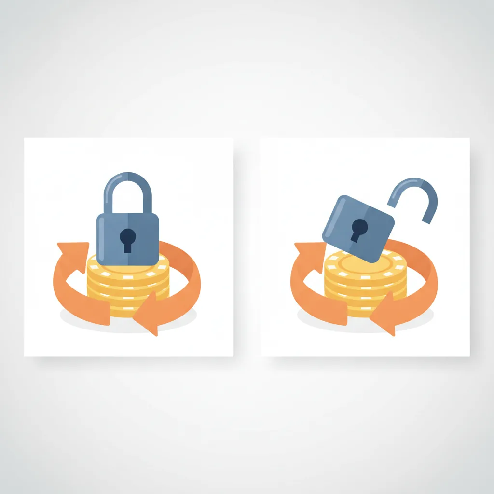
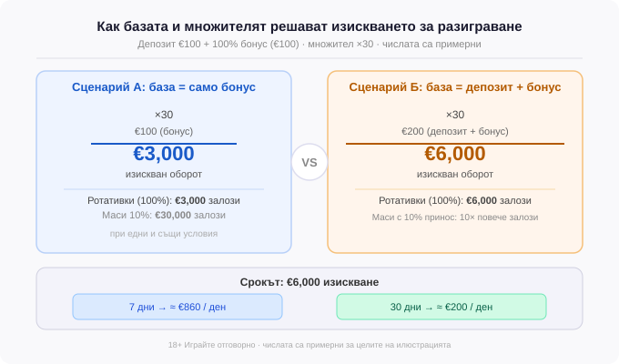

Title tag: Как работи изискването за разиграване (wagering)
Meta description: Разиграването (wagering) е задача, не число на банера. Виж как множителят, базата, приносът на игрите и срокът решават дали бонусът си струва.

---

# Как работи изискването за разиграване (превъртане)

Бонусът не е пари, които можеш да изтеглиш веднага. Той е задача, а изискването за разиграване, или превъртане (wagering), е нейният размер: колко оборот трябва да мине през залозите ти, преди сумата, свързана с бонуса, да стане реални пари. Докато не изпълниш условието, тези пари стоят заключени в отделен баланс и касата не ги пуска навън. Същото важи и за печалбите от безплатни завъртания, ако офертата дава такива, те чакат зад същата задача.

Числото, което виждаш на банера, е множител: x30, x35, x40. Толкова се набива в очи, че лесно го приемаш за цялата истина за офертата. Само че сам по себе си множителят не казва нищо, докато не знаеш върху какво се умножава.

## База: само бонус или депозит плюс бонус

Превъртането се смята по два начина, и разликата между тях е буквално двойна.

Умножава се или само бонусът, или депозитът и бонусът заедно. Например, при депозит от €100 със 100% бонус, тоест още €100 отгоре, и множител x30: ако базата е само бонусът, дългът към оператора е 30 × €100, или €3,000 оборот. Смята ли се обаче върху депозит плюс бонус, същият x30 се умножава по €200 и искането става €6,000. Двойно повече завъртания, без нито една цифра на банера да мръдне. Оператор с по-нисък на вид множител върху депозит+бонус може да изисква повече реален оборот от друг с по-висок множител само върху бонуса, така че две оферти, сравнени единствено по множителя, лесно подвеждат.

*Всички числа са примерни: депозит €100, 100% бонус, множител ×30.*

Базата почти никога не стои с едър шрифт до числото на офертата. Пише я в общите условия, и това е първото, което търсиш там.

## Не всеки залог тежи еднакво

Дори да знаеш точния оборот, той не е просто „завърти €3,000 и си готов". Всяка игра допринася с различен процент към превъртането, и този процент решава колко тежка е задачата в действителност.

Ротативките обикновено броят 100%: заложиш ли €1 на ротативка, сваляш €1 от изискването. Игрите на маса и казиното на живо са друго. Рулетка, блекджек и голяма част от масите често се зачитат с 10–20%, а някои изобщо не се броят.

Ако дадена маса допринася с 10%, €10 заложени тежат колкото €1 срещу превъртането. За да свалиш изискване от €3,000 през такава игра, трябва да завъртиш €30,000 реален оборот. Играчът, който сяда на блекджек с активен бонус с идеята да изчисти условието бързо, всъщност почти не мърда брояча, а на всичкото отгоре понякога нарушава условията, без да подозира, защото същата тази игра често е ограничена при активен бонус.

Приносът на игрите често тежи повече от самия множител. Един и същ множител върху една и съща база бива изпълним през ротативки и практически непосилен през маси, а тази разлика не личи никъде на офертата.

## Срокът за разиграване е част от задачата

Превъртането почти винаги има времево ограничение. Срок от 7 дни и срок от 30 дни описват две различни оферти, дори множителят и базата да са едни и същи.

Ако изискването се раздели на дните, картината се променя. €6,000 оборот за 7 дни са близо €860 залози на ден, темп, който бута към по-големи и по-чести залози, тоест към по-голям риск. Същите €6,000 за 30 дни са спокойни €200 на ден. Кратък срок върху висока база прави бонуса непосилен за умерен играч, макар на банера да изглежда щедър. Изтече ли неизпълнен, обикновено пада целият, заедно с натрупаните през него печалби.

## Каквото банерът пропуска

Освен множителя и базата, в условията има още няколко клаузи, които често изненадват играчите. Докато превърташ, обикновено има таван на единичния залог, например €5; надхвърлиш ли го дори веднъж, операторът има право да анулира бонуса и печалбите от него, без частично наказание и рядко с право на обжалване. Отделно съществува таван колко от спечеленото с бонус може да излезе навън, да речем 5 пъти бонуса, тоест €500 при €100 бонус, а всичко над него се отрязва, така че голяма печалба от малък бонус рядко се тегли цяла. И накрая, отделни заглавия, понякога цели доставчици, стоят изцяло извън превъртането: игра на тях с активен бонус в добрия случай не се брои, а в лошия анулира офертата.

Тези клаузи обикновено са описани в общите условия, макар да липсват на рекламния банер.

## Кое важи, ако нещо се обърка

Превъртането не е начин да „победиш" бонуса. Такава игра няма. Рекламният банер привлича вниманието, но правилата, които важат, са в общите условия, и когато нещо се обърка, значение има техният текст. В България това значи общите условия на лицензиран от НАП оператор, не обещанието от рекламата.

## Преди да депозираш

Преди да натиснеш „депозирай", отвори общите условия и провери множителя (x30, x35 или x40), базата под него, тоест само бонус или депозит+бонус, приноса на игрите, които реално ще играеш, срока за разиграване и двата тавана: максималния залог при активен бонус и максималната изтегляема сума.

Липсва ли някое от тях или е формулирано мъгляво, това само по себе си е отговор за качеството на офертата. Бонусът има смисъл единствено ако условието е изпълнимо при начина, по който ти играеш, а не при начина, по който операторът се надява да играеш. 18+ Хазартът може да пристрасти. Играйте отговорно. Играй с пари, които можеш да загубиш изцяло, и ако усетиш, че гониш оборот само заради изтичащия срок, спри и виж [инструментите за отговорна игра](/otgovorna-igra/).

Точно тези клаузи претегляме, когато оценяваме бонусите: методът е описан в [как оценяваме бонусите](/kak-ocenyavame/), а събраните велкъм оферти с условията им са в [велкъм бонусите с пълните им условия](/bonus-category/welcome-bonus/). Изчистените печалби после се теглят по общия ред за [депозити и тегления](/depoziti-i-teglenia/).

---

**Георги Тодоров**
Публикувано: 07.09.2026 · Последна редакция: 07.09.2026

[About Всички Казина boilerplate]

**Отговорна игра.** 18+ Хазартът може да пристрасти. Играйте отговорно. Ако усетиш, че играта излиза извън контрол или искаш да я ограничиш, виж [инструментите за отговорна игра](/otgovorna-igra/) и възможността за самоизключване чрез националния регистър на уязвимите лица към НАП (подава се писмено само от засегнатото лице). Национална информационна линия за наркотиците, алкохола и хазарта („Солидарност") 0888 99 18 66, делнични дни 10:00–17:00.

**Разкриване на партньорства.** Всички Казина съдържа партньорски (афилиейт) връзки; когато отвориш оферта през такава връзка, това може да финансира сайта, без да променя цената за теб и без да влияе на оценките ни. От 1 август 2026 г. дейността на афилиейт оператори в България се лицензира съгласно Закона за държавния бюджет за 2026 г. (ДВ, бр. 69 от 31.07.2026 г.). Всички Казина е подало заявление за лиценз пред Националната агенция по приходите и очаква издаването му.
