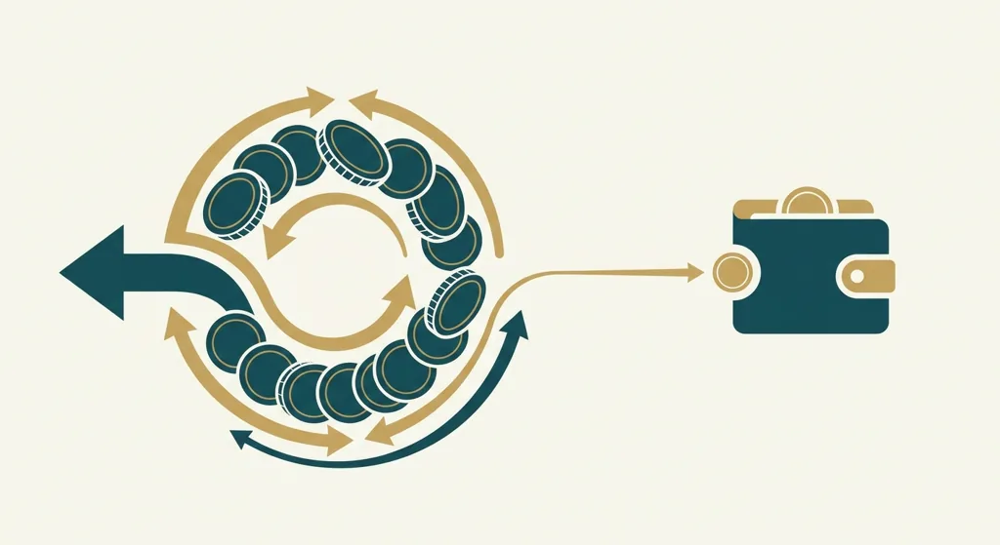
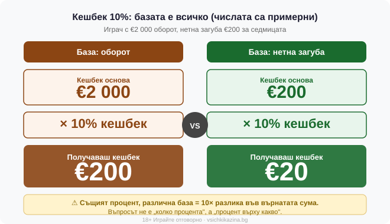

Title tag: Кешбек казино: как работят точките, нивата и връщането
Meta description: Кешбек казино и лоялни програми: как трупаш точки, как нивата дават перки и върху каква база се връща процентът. Уловките, преди да гониш VIP.

---

# Как работят кешбекът и лоялните програми в казиното

Лоялната програма възнаграждава едно нещо: това, че продължаваш да играеш. Механиката е почти една и съща навсякъде. Играеш с реални пари, трупаш точки, точките те качват по нива, а нивата отключват перки. Кешбекът е една от тези перки и вероятно най-търсената, защото звучи като пари обратно по сметката. Дали наистина е така зависи от няколко реда, които рядко стоят на банера и почти винаги стоят в общите условия.

## Точките са две валути, които лесно се бъркат

Почти всяка програма работи с два вида точки, макар банерът да ги нарича с едно име. Наградните, или комп точките, се обменят за стойност: бонус средства, безплатни завъртания, понякога друга дребна перка. Точките за ниво не се харчат за нищо; те само определят докъде си стигнал в клуба. Съотношението варира, но за да е нагледно: да речем 1 точка на всеки €10 заложени, а 100 точки струват €1 бонус средства.

Точките се трупат от оборота, тоест от заложеното, а не от спечеленото и не от размера на депозита. И тук се появява принос на игрите, същият механизъм като при превъртане. Ротативките обикновено дават пълен принос, докъм 100% от залога, докато игрите на маса и казиното на живо често се броят наполовина или изобщо не се броят. Тоест двама играчи с еднакъв бюджет може да трупат точки с много различна скорост само защото единият върти слот игри, а другият играе блекджек.

## Нивата и какво отключват

Стълбата обикновено върви Бронз, Сребро, Злато, Платина и някакъв VIP връх. По-нагоре означава по-висок процент кешбек, по-големи reload бонуси, по-бързи тегления и по-високи [лимити на теглене](/depoziti-i-teglenia/), а на върха и персонален мениджър. Само че повечето от тези перки не са чист кеш: reload бонусите и завъртанията, които идват с нивото, си носят собствено превъртане и се четат по същия начин като всеки друг бонус. Диапазонът на кешбека по нива в индустрията се движи горе-долу между 5 и 25%, но конкретният процент за конкретна програма се чете в нейните условия и в нашата [методология за оценяване](/kak-ocenyavame/), не се допуска по аналогия.

Едно нещо, което банерът не подчертава: нивото не винаги е завинаги. Много програми искат да поддържаш някакъв оборот за период, иначе те свалят надолу. Тоест VIP статусът, който си изкачил за месеци, може да се стопи, ако намалиш темпото, а това е тих натиск да продължиш да залагаш само за да не паднеш едно ниво.

## Кешбек: процент върху какво точно

10% кешбек върху €200 нетна загуба за седмицата прави €20 върнати. Капанът е в думата „база". Кешбекът е процент, който ти се връща за определен период, обикновено седмица или месец, и в повечето случаи се смята върху нетната загуба, тоест заложеното минус спечеленото за периода. Дотук просто.

Проблемът започва, когато базата се смени тихомълком. „10% кешбек върху загубата" и „10% кешбек върху оборота" изглеждат еднакво на банера и означават различни пари. Ако си завъртял €2 000 оборот и си на минус €200, десет процента върху оборота и десет процента върху загубата дават суми, които нямат нищо общо помежду си. Среща се и трета база, върху депозита, която пък изобщо не гледа дали си спечелил, или загубил. Същата логика важи и при превъртане: един и същ множител върху различна база е различно изискване. Затова първият въпрос към всяка кешбек оферта не е колко процента, а процент върху какво.

*Базата на кешбека определя реалната стойност: 10% върху оборот и 10% върху нетна загуба дават коренно различни суми при едни и същи резултати. Числата са примерни.* И дори най-честният вариант, пълен процент върху нетната загуба, си остава връщане на малка част: при 10% кешбек ти пак задържаш загуба от 90% от периода, само леко подплатена. Кешбекът е и различен вид насърчение спрямо [началния бонус за добре дошли](/bonus-category/welcome-bonus/), който ти дава средства предварително; кешбекът ти връща част, след като вече си загубил.

## Когато кешбекът носи превъртане и срок

Върнатата сума не винаги е теглим кеш. В част от програмите тя идва като бонус средства с превъртане. Ако €20 кешбек носят 3x превъртане само върху сумата на кешбека, дължиш €60 залози, преди €20-те да станат теглими. Базата е ключова и тук: само кешбекът, не депозит плюс кешбек.

За кешбек ниският множител е нормата, някъде между 1x и 5x; над 20x вече яде голяма част от стойността. Кешбек без превъртане съществува, но е рядкост и обикновено е запазен за високите нива. Срокът се пропуска лесно. Точките изтичат при неактивност, често някъде между 6 и 12 месеца, а самият кешбек може да е валиден само от 24 часа до няколко месеца, след което просто изгаря. Кешбек, който трябва да разиграеш до края на деня, върши работа на казиното повече, отколкото на теб.

Когато сравняваш две програми, водещият процент на банера почти нищо не значи сам по себе си. По-нисък процент върху нетната загуба спокойно може да връща повече от по-висок процент върху оборота, а кешбек без превъртане струва повече от двойно по-голям кешбек, който трябва да разиграеш. Реалната стойност е процентът, приложен върху истинската база, намалена с това, което превъртането и срокът ти отнемат обратно. Затова сравнението никога не е между две числа на банерите, а между няколко реда в общите условия.

## Откъде идват тези пари

Кешбекът и точките се финансират от собствената ти игра: колкото повече залагаш и губиш, толкова повече „връщане" ти се полага. Това е частично връщане на вече заложени пари, не отделен доход, и никоя програма не обръща игра с домашно предимство в печеливша. Кешбекът смалява загубата за периода, без да я прави печалба. Точно тук е и границата, която си струва да пазиш: ако перспективата за по-високо ниво те кара да залагаш повече, отколкото си заделил за забавление, статусът вече ти е струвал повече, отколкото ще ти върне. 18+ Хазартът може да пристрасти. Играйте отговорно. Лимитите за депозит и загуба, които си [задаваш предварително](/otgovorna-igra/), пазят бюджета по-надеждно от всеки кешбек.

## Три реда, които да прочетеш преди VIP клуба

Три реда в условията решават дали програмата струва. Върху каква база се смята кешбекът. Носи ли превъртане и с каква база. Кога изтичат точките и самият кешбек. Намериш ли ги ясни и в твоя полза, стойността е реална, макар играта да си остава платено забавление. Заровени ли са, банерът обещава повече от договора. Статусът е приятен, но се плаща от твоя оборот.

---

**Георги Тодоров**
Публикувано: 07.09.2026 · Последна редакция: 07.09.2026

[About Всички Казина boilerplate]

**Отговорна игра.** 18+ Хазартът може да пристрасти. Играйте отговорно. Ако усетиш, че играта излиза извън контрол или искаш да я ограничиш, виж [инструментите за отговорна игра](/otgovorna-igra/) и възможността за самоизключване чрез националния регистър на уязвимите лица към НАП (подава се писмено само от засегнатото лице). Национална информационна линия за наркотиците, алкохола и хазарта („Солидарност") 0888 99 18 66, делнични дни 10:00–17:00.

**Разкриване на партньорства.** Всички Казина съдържа партньорски (афилиейт) връзки; когато отвориш оферта през такава връзка, това може да финансира сайта, без да променя цената за теб и без да влияе на оценките ни. От 1 август 2026 г. дейността на афилиейт оператори в България се лицензира съгласно Закона за държавния бюджет за 2026 г. (ДВ, бр. 69 от 31.07.2026 г.). Всички Казина е подало заявление за лиценз пред Националната агенция по приходите и очаква издаването му.
