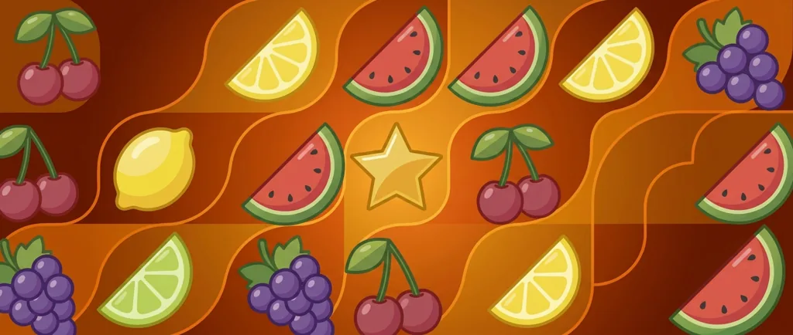
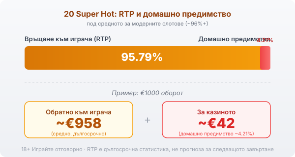

Title tag: 20 Super Hot: RTP и характеристики (EGT/Amusnet)
Meta description: Как работи 20 Super Hot на Amusnet (EGT): 5 барабана, 20 фиксирани линии, RTP 95.79%, Jackpot Cards и гембъл. Защо RTP е под средното и защо джакпотът не мени шансовете.

---

# 20 Super Hot: RTP и характеристики

20 Super Hot е една от онези плодови ротативки, които изглеждат така, сякаш са слезли директно от стар наземен автомат. Прави я Amusnet Interactive, компанията, която дълги години се казваше EGT и чиито машини с череши и седмици стоят из залите от години. [VERIFY: точната година на пускане се цитира различно; да се потвърди при публикуване.] Онлайн версията запазва същата семпла визия, а под нея работи специфична математика.

## Как е устроена играта

Барабаните са пет, а линиите двайсет и са фиксирани. Това означава, че при всяко завъртане залагаш и по двайсетте, без опция да ги намалиш. На барабаните са класическите плодове: череша, лимон, портокал, слива, грозде и диня. Седмицата играе ролята на wild и замества другите символи, за да допълни комбинация. Звездата е scatter и е единственият символ, който плаща, където и да падне, а не по линия.

## Звездата и голямата комбинация

Пет звезди някъде по барабаните са най-стойностното нещо в играта и носят до 500 пъти общия залог. При залог от €1 това са €500, само че вероятността да се подредят пет scatter-а е малка и това е рядко събитие, не сметка, на която да разчиташ. Останалите печалби идват от плодовете по двайсетте линии и са предимно дребни, което е типично за този клас ротативки.

## Jackpot Cards: как всъщност работи прогресивът

Освен обикновените печалби 20 Super Hot е включена в Jackpot Cards, емблематичната прогресивна система на Amusnet. Тя има четири нива, кръстени на боите карти: спатия, каро, купа и пика, като спатията е най-малка, а пиката най-голяма. Системата може да се задейства на случаен принцип след кое да е завъртане, при което ти обръщаш карти, докато събереш едно от нивата и печелиш неговата сума. Прогресивният джакпот се пълни от малка част от залозите на всички играчи, а активирането му е случайно и изключително рядко. Наличието на джакпот не подобрява шансовете ти в обикновената игра и не сваля домашното предимство; просто пренарежда част от парите към един голям, рядък изход.

## Гембъл функцията е монета, не стратегия

След печеливша комбинация играта предлага гембъл: показва обърната карта и трябва да познаеш дали е червена или черна, за да удвоиш печалбата. Познаеш ли, сумата се удвоява и можеш да опиташ пак; сгрешиш ли, губиш цялата печалба от този кръг. Шансът е горе-долу как да хвърлиш монета. Няколко успешни удвоявания изглеждат чудесно, но едно грешно познаване изтрива всичко. Гембълът не мени математиката на играта; той само увеличава люлките нагоре и надолу.

## RTP: числото, което издава класиката

Обявеният RTP на 20 Super Hot е 95.79%, което оставя домашно предимство от около 4.21%. При €1000 оборот това значи средно връщане от порядъка на €958 в дългосрочен план и около €42 за казиното. Тази стойност е под средното за модерните слотове, които често започват от 96% нагоре. Заради това в [методологията ни](/kak-ocenyavame/) гледаме RTP като реално число, а не като детайл, и препоръчваме да го провериш в инфо-панела на конкретното казино, защото операторите понякога пускат различни версии.

*Обявен RTP 95.79%: при €1000 оборот средно ~€958 се връщат на играча, ~€42 остават за казиното (домашно предимство ~4.21%, под средното за модерните слотове).*

## Преди да завъртиш

[Слот игрите](/slot-igri/) обикновено имат демо режим, в който да усетиш темпото, без да залагаш, а различните [ротативки](/kazino-igri/rotativki/) се сравняват най-честно точно по RTP. Задай си лимит за загуба и за време преди първото завъртане и провери реалния процент, преди да заложиш. 18+ Хазартът може да пристрасти. Играйте отговорно. Ако усетите, че играта излиза извън контрол, вижте [инструментите за отговорна игра](/otgovorna-igra/).

---

**Георги Тодоров**
Публикувано: 08.09.2026 · Последна редакция: 08.09.2026

[About Всички Казина boilerplate]

**Отговорна игра.** 18+ Хазартът може да пристрасти. Играйте отговорно. Ако усетиш, че играта излиза извън контрол или искаш да я ограничиш, виж [инструментите за отговорна игра](/otgovorna-igra/) и възможността за самоизключване чрез националния регистър на уязвимите лица към НАП (подава се писмено само от засегнатото лице). Национална информационна линия за наркотиците, алкохола и хазарта („Солидарност") 0888 99 18 66, делнични дни 10:00–17:00.

**Разкриване на партньорства.** Всички Казина съдържа партньорски (афилиейт) връзки; когато отвориш оферта през такава връзка, това може да финансира сайта, без да променя цената за теб и без да влияе на оценките ни. От 1 август 2026 г. дейността на афилиейт оператори в България се лицензира съгласно Закона за държавния бюджет за 2026 г. (ДВ, бр. 69 от 31.07.2026 г.). Всички Казина е подало заявление за лиценз пред Националната агенция по приходите и очаква издаването му.
