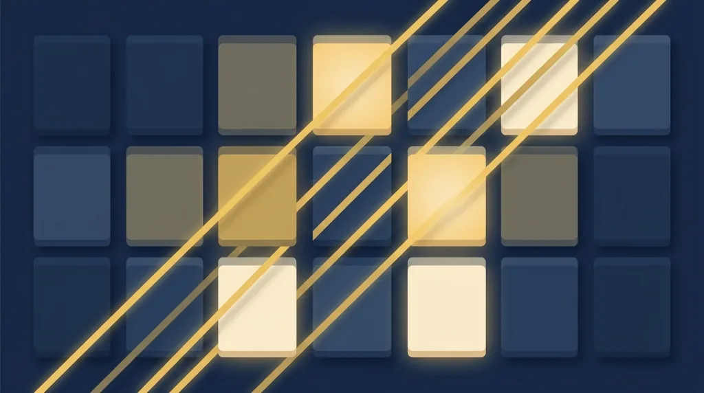
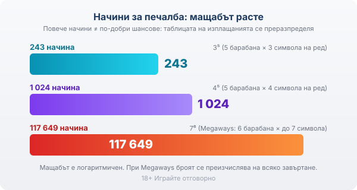
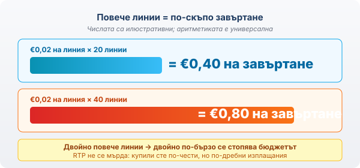

Title tag: Линии на печалба в ротативките: как печелите
Meta description: Линии на печалба и начини за печалба: какво значат 243 и 1024 начина, защо повече линии не подобряват шансовете и как да четете RTP и цената на завъртане.

---

# Линии на печалба в ротативките: как всъщност печелите

Линиите на печалба (paylines) са предварително начертани пътища през барабаните. Ротативката проверява всеки такъв път при завъртане и ако върху него паднат еднакви символи, започвайки от най-левия барабан и продължавайки върху съседните надясно, отчита печалба и я плаща по таблицата за съответния символ. Обикновено трябват поне три еднакви символа един до друг, а плащането расте с четвъртия и петия. Символ, който стои извън активна линия, не носи нищо, колкото и да ви радва групичката еднакви картинки някъде в ъгъла на екрана. Класическата ротативка е с пет барабана и определен брой линии; някои плащат и в двете посоки, тоест признават комбинация и отдясно наляво, но принципът остава един и същ. Линията е шаблон, който машината сверява, а не всичко, което окото приема за „почти подредено". Изключение правят разпръснатите (scatter) символи, които обикновено плащат или задействат бонус където и да паднат по екрана, без да им трябва линия.

## Фиксирани и избираеми линии

При фиксираните линии броят е един и същ на всяко завъртане, независимо от залога, и плащате за всички линии всеки път. При избираемите сами решавате колко да активирате, а залогът се смята на линия, не на цялото завъртане. Оттук тръгва едно често недоразумение. „Ще намаля линиите, за да пестя" на практика значи и „изключвам част от пътищата, по които иначе щях да получа изплащане". Пестите от залога, вярно е, но заедно с това се лишавате от комбинации, които машината няма да зачете, защото линията им не е активна. Затова повечето игри слагат бутон за максимален брой линии и го правят стойност по подразбиране: таблицата работи както е замислена, а вие плащате пълната цена на завъртането.

## Начини за печалба: когато линията изчезва

В един момент разработчиците спряха да рисуват линии и минаха на „начини за печалба". Тук фиксиран път няма. Плаща се, когато еднакви символи паднат върху съседни барабани, започвайки от левия, без значение на кой ред стоят. Затова един и същ набор символи може да образува десетки комбинации наведнъж, а по корицата се появяват едри числа.

243 начина е стандартна конфигурация: пет барабана по три символа на височина. Три по три по три по три по три прави 243 възможни комбинации. 1024 начина е същата идея, но с по четири символа на височина, тоест четири на пета степен. Megaways бута тавана нагоре с шест барабана, всеки от които показва между два и седем символа, а броят се преизчислява на всяко завъртане; паднат ли максималните седем на всеки барабан, излизат седем на шеста степен, тоест 117 649 начина. Има и разновидност, при която печелите с групи допрени символи вместо с линии, така наречените cluster-pays. Тези варианти ги разглеждаме там, където описваме [отделните слот игри](/kazino-igri/); тук държим на принципа, не на пълния каталог заглавия.

*243, 1024 и 117 649 начина — три различни конфигурации от статията, в нарастващ мащаб.*

За едрите числа обаче важи една скучна аритметика: колкото повече начини има играта, толкова по-малко плаща един отделен начин при равни други условия. Стойностите в таблицата се преразпределят, за да излезе математиката, а тя няма как да излезе иначе.

## Повече линии не значи по-добри шансове

Ето честната част, която банерът премълчава. Броят линии или начини не подобрява шансовете ви и не мръдва RTP. RTP е дългосрочният процент на връщане, зашит в математиката на самата игра, и не зависи от това колко линии сте активирали. Повече линии сменят само как е нарязан залогът: получавате по-чести, но по-дребни изплащания за същите пари, и играта изглежда „по-жива", когато въртите всички линии.

Цената на едно завъртане е залогът на линия, умножен по броя линии. При €0.02 на линия и 20 линии плащате €0.40 на завъртане. Активирате ли 40 линии при същия залог на линия, завъртането вече струва €0.80. Числата тук са илюстративни, но аритметиката е универсална и важи за всяка ротативка.

*Двойно повече линии → двойно по-скъпо завъртане, без промяна в RTP (числата са илюстративни).* Не сте купили по-добри шансове с втория вариант. Купили сте повече едновременни билета за едно и също теглене, а бюджетът ви се стопява двойно по-бързо на завъртане. Числото, което изпразва сметката, е общият залог. Играта с всички линии вдига честотата на дребните попадения, докато дългосрочното връщане си остава едно и също RTP, безразлично към това колко линии сте включили.

## Печалба, която е по-малка от залога

Тук ротативките с много линии стават психологически хлъзгави. Заложите €0.40 на 20 линии, една от тях „плаща" €0.20, екранът светва, звучи джингъл, брояч се завърта нагоре. За това завъртане обаче сте на минус €0.20. Загуба, облечена като печалба.

Изследователите я наричат буквално така, „loss disguised as win", и я срещат само при игра на много линии, защото залагате върху много пътища наведнъж и дребните частични попадения зачестяват. Механизмът е добре описан. Играчите реагират физиологично на такова изплащане като на истинска печалба, със същото покачване на кожната проводимост (Dixon и колектив, 2010). В едно проучване 58% от участниците предпочитат игрите, които им поднасят подобни „печалби", пред останалите (Graydon и колектив, 2018). А попитани след сесията, хората наричат същите загуби „печалби" и надценяват колко често всъщност са печелили (Jensen и колектив, 2013). Ефектът не е случаен и не е дефект. Светлината и звукът вършат работата, за която са сложени, а тя е да ви задържат на завъртане. Затова една сесия може да завърши на минус, а споменът от нея да е за „добра игра".

## Какво да гледате вместо броя линии

Числото „500 линии" на корицата не ви казва нищо за шансовете. Колко струва общо едно завъртане и какъв е RTP на играта: това са двете неща, които казват нещо. Как четем RTP като реално число, а не като обещание за конкретната сесия, сме описали в [метода си на оценяване](/kak-ocenyavame/), където законността и условията тежат повече от блясъка на анимацията. Отворете и таблицата с изплащанията, преди да завъртите: тя показва колко символа са нужни за печалба и колко плаща всеки, а това е по-полезно от всяко число на корицата. А ако искате да усетите темпото и волатилността на дадена игра, без да залагате, демо режимът е честният начин.

Хазартът не е финансова стратегия. Ротативката е платено забавление с предварително известна дългосрочна цена, а многото линии правят тази цена по-плавна за преглъщане, без да я смаляват. Задайте си лимит на депозита и на загубата преди първото завъртане, не след третото. Ако избирате игра по броя линии на банера, избирате по грешното число. 18+ Хазартът може да пристрасти. Играйте отговорно.

**Георги Тодоров**
Публикувано: 08.09.2026 · Последна редакция: 08.09.2026

[About Всички Казина boilerplate]

**Отговорна игра.** 18+ Хазартът може да пристрасти. Играйте отговорно. Ако усетиш, че играта излиза извън контрол или искаш да я ограничиш, виж [инструментите за отговорна игра](/otgovorna-igra/) и възможността за самоизключване чрез националния регистър на уязвимите лица към НАП (подава се писмено само от засегнатото лице). Национална информационна линия за наркотиците, алкохола и хазарта („Солидарност") 0888 99 18 66, делнични дни 10:00–17:00.

**Разкриване на партньорства.** Всички Казина съдържа партньорски (афилиейт) връзки; когато отвориш оферта през такава връзка, това може да финансира сайта, без да променя цената за теб и без да влияе на оценките ни. От 1 август 2026 г. дейността на афилиейт оператори в България се лицензира съгласно Закона за държавния бюджет за 2026 г. (ДВ, бр. 69 от 31.07.2026 г.). Всички Казина е подало заявление за лиценз пред Националната агенция по приходите и очаква издаването му.
