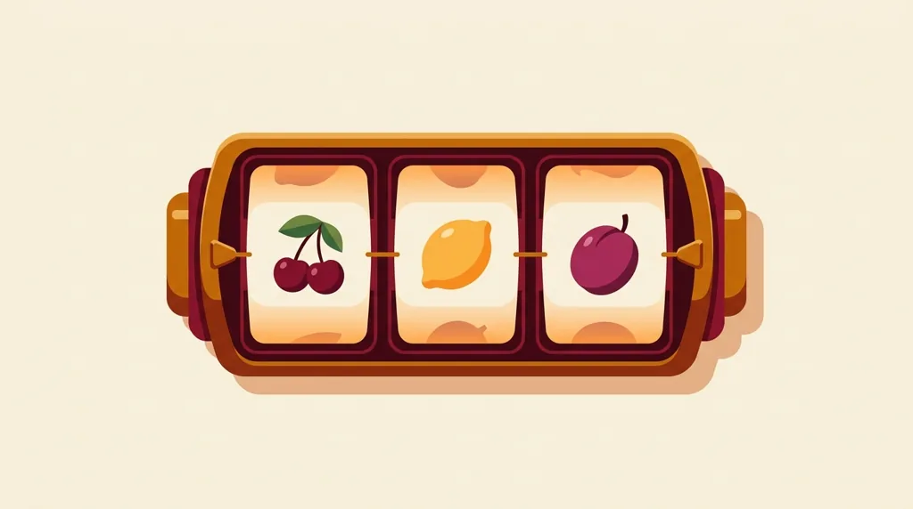
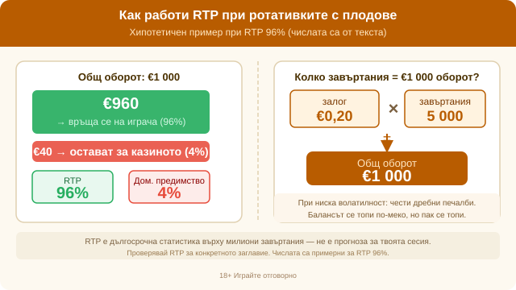

Title tag: Класически ротативки с плодове: как работят слотовете
Meta description: Плодовите (класически) ротативки обяснени: 3 барабана, платежни линии, RNG и RTP. Защо „горещи/студени" машини няма и колко струва RTP в евро.

---

# Класически ротативки с плодове: как работят и защо още се играят

Плодовите ротативки са най-простата машина в казиното: три барабана, шепа символи и една или няколко линии, по които трябва да паднат еднакви. Черешите, лимоните, сливите и гроздето стоят там от десетилетия, заедно с BAR, звънеца и червената седмица.

## Символите и откъде идват

Плодовете по барабаните не са случайни. Идват от ранните монетни машини отпреди повече от век, когато някои автомати са раздавали дъвки с вкус на плод, а символите са подсказвали кой вкус получаваш. BAR символът също е останал от онази епоха. Днес всичко това е чиста визуална традиция, но е причината един българин и един швед да разпознаят една и съща череша на екрана.

## Как всъщност се върти един барабан

Онлайн плодовата ротативка няма истински барабани. Това, което се върти на екрана, е анимация; резултатът се решава от генератор на случайни числа в момента, в който натиснеш копчето. Всяко завъртане е отделно събитие и не помни предишното. Машина, която не е плащала цял час, не е „назряла", а такава, която току-що е дала голяма печалба, не е „изстинала". Гореща или студена ротативка няма. Няма и модел за разчитане, защото софтуерът тегли ново число при всяко завъртане, независимо от предишните.

## Малко линии, ясна игра

Класическата ротативка обикновено има една платежна линия при оформление 3×1 или до пет при 3×3, с три хоризонтални и две диагонални. Печелиш, когато три еднакви символа паднат по активна линия. Един видео слот може да предлага стотици начини за печалба и цял екран от функции; тук няма какво толкова да следиш. Залагаш, натискаш копчето и чакаш да видиш дали трите символа са се подредили по линията.

## RTP и волатилност, преведени в пари

RTP показва какъв дял от заложеното една игра връща средно в дългосрочен план. При класическите ротативки обикновено пада между 94% и 96%, но варира по заглавие и се проверява за конкретната игра. Хипотетична ротативка с RTP 96% връща средно €960 от €1000 общ оборот в дългосрочен план, а €40 (4%) остават за казиното. Тези €40 са домашното предимство, разпределено върху хиляди завъртания. Заради това в [методологията ни](/kak-ocenyavame/) RTP се брои като реално число при оценката на игрите.

Волатилността определя колко често и колко едро плаща една игра. Много плодови ротативки дават чести, но дребни връщания, което държи баланса сравнително стабилен и позволява дълга сесия с малък залог. При €0,20 на завъртане ще завъртиш 5000 пъти, преди оборотът да стигне €1000, и през това време ще виждаш много малки печалби. Балансът пак се стапя, само по-меко, отколкото при висока волатилност. Има и по-агресивни класики с рядка голяма печалба, така че темпото се проверява за всяко заглавие.

## С какво се различават от модерните слотове

Модерните видео слотове са пет барабана, десетки или стотици линии и цяла машинария от бонуси: безплатни завъртания, мултипликатори, каскадни символи, мини-игри. Плодовата ротативка съзнателно ги няма. Който я избира, го прави заради простото темпо и заради носталгията по стария екран. По-ниският залог на завъртане и липсата на сложни правила я правят удобна за кратка, спокойна игра.

*Как работи RTP при 96%: €960 се връщат, €40 остават за казиното. При €0,20 на завъртане оборотът от €1000 изисква 5000 завъртания. Числата са примерни (от текста).*

## Пробвай я първо в демо

Демо режимът пуска класическата ротативка без депозит, с виртуален баланс, и е бързият начин да усетиш темпото и колко често пада нещо, преди да заложиш реални пари. В [казино игрите](/kazino-igri/) една класика се схваща за няколко минути. Ако ти хареса простотата, чак тогава има смисъл да минеш на реален залог, с бюджет, определен предварително.

## Проста игра, същата математика

Простият екран не значи по-изгодна математика. Малкото линии и липсата на бонуси не подобряват шансовете; софтуерът пак е настроен да връща под 100% в дългосрочен план. Играй с пари, които можеш да загубиш изцяло, задай си лимит за депозит и за загуба преди първото завъртане, и гледай на RTP като на дългосрочна цена, не като на прогноза за сесията. 18+ Хазартът може да пристрасти. Играйте отговорно. Ако усетите, че играта излиза извън контрол, вижте [инструментите за отговорна игра](/otgovorna-igra/).

---

**Георги Тодоров**
Публикувано: 08.09.2026 · Последна редакция: 08.09.2026

[About Всички Казина boilerplate]

**Отговорна игра.** 18+ Хазартът може да пристрасти. Играйте отговорно. Ако усетиш, че играта излиза извън контрол или искаш да я ограничиш, виж [инструментите за отговорна игра](/otgovorna-igra/) и възможността за самоизключване чрез националния регистър на уязвимите лица към НАП (подава се писмено само от засегнатото лице). Национална информационна линия за наркотиците, алкохола и хазарта („Солидарност") 0888 99 18 66, делнични дни 10:00–17:00.

**Разкриване на партньорства.** Всички Казина съдържа партньорски (афилиейт) връзки; когато отвориш оферта през такава връзка, това може да финансира сайта, без да променя цената за теб и без да влияе на оценките ни. От 1 август 2026 г. дейността на афилиейт оператори в България се лицензира съгласно Закона за държавния бюджет за 2026 г. (ДВ, бр. 69 от 31.07.2026 г.). Всички Казина е подало заявление за лиценз пред Националната агенция по приходите и очаква издаването му.
