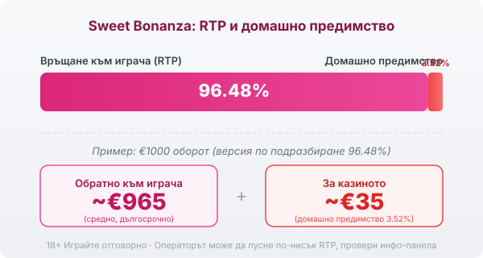

Title tag: Sweet Bonanza: RTP, волатилност и как се играе
Meta description: Как работи Sweet Bonanza на Pragmatic Play: pay-anywhere, tumble, множители 2x–100x, безплатни завъртания и RTP 96.48%. Защо RTP се проверява и защо bonus buy не сваля предимството.

---

# Sweet Bonanza: RTP, волатилност и как се играе

Sweet Bonanza е слот на Pragmatic Play от 2019 г., който изглежда като витрина на сладкарница: бонбони, плодове и близалки върху мрежа от 6 колони и 5 реда. Играта стана една от най-разпознаваемите в казината, и то не заради класически линии на печалба, а защото няма такива. Печелиш, когато на екрана се съберат достатъчно еднакви символи, независимо къде стоят.

## Как се печели без линии

Символите не трябва да лягат в редица. Механиката е „pay anywhere": ако 8 или повече еднакви символа се появят някъде из мрежата, комбинацията плаща. Заради това погледът не следи линии, а брои цвят. Колкото повече от един и същ символ падне, толкова по-голяма е печалбата за този символ, а понеже полето е широко, често се засичат по няколко групи наведнъж.

## Tumble: едно завъртане, няколко удара

Печелившите символи не остават на екрана. След като платят, изчезват и на тяхно място падат нови отгоре. Ако новите допълнят следваща печеливша група, тя също плаща и процесът се повтаря. Тази каскада, наречена tumble, продължава, докато дойде завъртане без нова печалба. Едно завъртане така може да донесе верига от няколко печалби подред, преди да спре. Tumble не добавя пари извън RTP-то на играта; това е начинът, по който тя разпределя вече заложената печалба.

## Безплатните завъртания и множителите

Специалният символ е близалката, който служи за scatter. Съберат ли се 4 или повече от тях някъде на екрана, играта дава 10 безплатни завъртания. По време на тези завъртания на полето падат бонбони-бомби със стойност от 2x до 100x. Когато веригата приключи, стойностите на всички бомби на екрана се събират и умножават общата печалба от тези завъртания. Извън безплатния режим бомби няма. Затова обикновеното завъртане и попадналият бонус са две различни игри по размер на печалбата.

## RTP: число, което се проверява

Обявеният RTP на Sweet Bonanza е 96.48%, което оставя домашно предимство от около 3.52%. При €1000 оборот това означава средно връщане от порядъка на €965 в дългосрочен план и около €35 за казиното, разпределени върху много завъртания. Pragmatic Play обаче доставя играта в няколко версии с различен RTP: освен 96.48% съществуват и по-ниски конфигурации като 95.47% и около 94.45%, а операторът избира коя да пусне. Една и съща игра при две казина може да ти връща различен процент. Заради това в [методологията ни](/kak-ocenyavame/) гледаме реалния RTP, а не рекламния, и си струва да отвориш инфо-панела на конкретното казино и да провериш кое число работи там, преди да заложиш.

*Обявен RTP 96.48% (версия по подразбиране): при €1000 оборот средно ~€965 се връщат на играча, ~€35 остават за казиното. Възможни са и по-ниски конфигурации, затова провери инфо-панела.*

## Висока волатилност значи търпение

Sweet Bonanza е игра с висока волатилност. На практика това значи дълги периоди, в които балансът пада бавно през дребни или никакви печалби, прекъсвани рядко от голям удар, обикновено в безплатните завъртания. Максималната теоретична печалба е 21 100 пъти залога, но това е екстремно рядко събитие, не разумно очакване. Ако при €1 залог видиш 21 100x, това са €21 100, само че вероятността е нищожна и не бива да влиза в никаква сметка за бюджет.

## Bonus buy и ante bet: удобство, не предимство

Играта предлага два начина да ускориш достъпа до бонуса. Ante bet качва залога с 25% и в замяна увеличава шанса за scatter символи. Bonus buy отива по-далеч: срещу цена около 100 пъти общия залог купуваш директен вход в 10-те безплатни завъртания, без да ги чакаш. Купуването на бонус не сваля домашното предимство. Плащаш отпред за достъп до волатилния режим, а математиката в дългосрочен план остава същата или по-лоша при някои конфигурации. Наличността на самата функция пък зависи от юрисдикцията и оператора. [VERIFY: в някои пазари функцията е ограничена или забранена; потвърдете дали е налична при българските оператори при публикуване.] Ако е достъпна, третирай цената ѝ като реален залог, защото точно това е.

## Бързото темпо и как да го овладееш

Каскадите текат за секунди, а с bonus buy дори не чакаш scatter символите, така че оборотът се трупа бързо и без пауза за мислене. Преди реални пари [слот игрите](/slot-igri/) обикновено имат демо режим, в който да видиш темпото и колко рядко идва големият бонус, без да залагаш. Задай си лимит за загуба и за време преди първото завъртане и го спазвай, дори когато близалките са на екрана и ти се струва, че бонусът е на косъм. 18+ Хазартът може да пристрасти. Играйте отговорно. Ако усетите, че играта излиза извън контрол, вижте [инструментите за отговорна игра](/otgovorna-igra/).

## Ярка игра с ясна цена

Механиката е лесна за разбиране и щедра на напрежение, но зад нея стоят високо предимство за казиното и висока волатилност. Рекламният RTP може да не е този, който реално играеш, затова провери числото в инфо-панела, преди да заложиш. Максималната печалба е рядкост, а не цел, а бюджетът трябва да е пари, които можеш да загубиш изцяло.

---

**Георги Тодоров**
Публикувано: 08.09.2026 · Последна редакция: 08.09.2026

[About Всички Казина boilerplate]

**Отговорна игра.** 18+ Хазартът може да пристрасти. Играйте отговорно. Ако усетиш, че играта излиза извън контрол или искаш да я ограничиш, виж [инструментите за отговорна игра](/otgovorna-igra/) и възможността за самоизключване чрез националния регистър на уязвимите лица към НАП (подава се писмено само от засегнатото лице). Национална информационна линия за наркотиците, алкохола и хазарта („Солидарност") 0888 99 18 66, делнични дни 10:00–17:00.

**Разкриване на партньорства.** Всички Казина съдържа партньорски (афилиейт) връзки; когато отвориш оферта през такава връзка, това може да финансира сайта, без да променя цената за теб и без да влияе на оценките ни. От 1 август 2026 г. дейността на афилиейт оператори в България се лицензира съгласно Закона за държавния бюджет за 2026 г. (ДВ, бр. 69 от 31.07.2026 г.). Всички Казина е подало заявление за лиценз пред Националната агенция по приходите и очаква издаването му.
