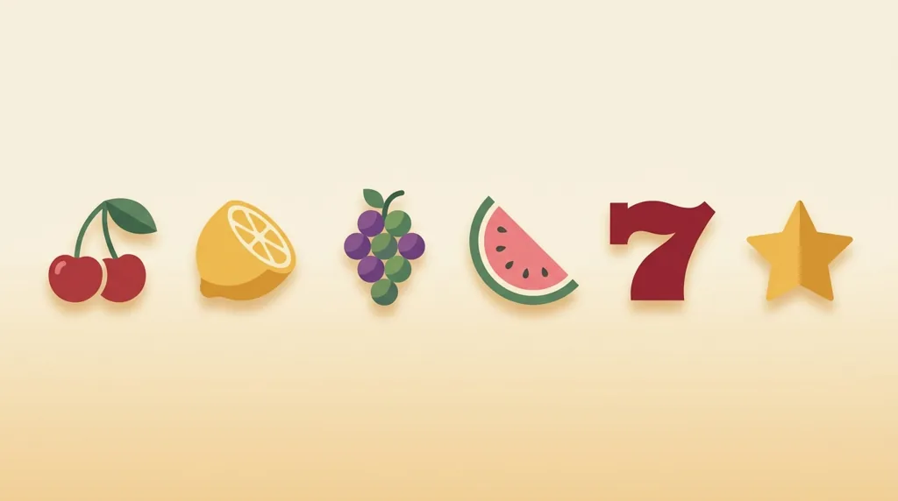
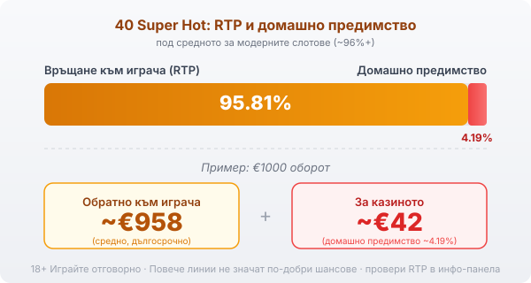

# 03 — Humaniser pass — 40 Super Hot
# Verdict: HUMAN-LIKE. Light touch: varied rhythm, asymmetric close, no signposting. Numbers/links/RG/flags UNCHANGED.

# 40 Super Hot: RTP и джакпот функции

40 Super Hot е класическа плодова ротативка на Amusnet, компанията, която дълги години се казваше EGT, и излезе през 2014 г. Тя е по-голямата сестра на 20 Super Hot: същата визия с череши и седмици, но с двойно повече линии. Тъкмо тези линии обаче водят до най-честото недоразумение около играта, което си струва да разчистим с числата.

## Как е устроена играта

Играта има пет барабана и четирийсет фиксирани линии, като при всяко завъртане залагаш на всичките четирийсет наведнъж. На барабаните са класическите плодове: череша, лимон, портокал, слива, грозде и диня. Седмицата играе ролята на wild и замества другите символи, за да допълни комбинация, но не замества scatter-а. Звездата е scatter и е единственият символ, който плаща, където и да падне, а не по линия.

## Звездата и голямата комбинация

Пет звезди някъде по барабаните са най-стойностното нещо в играта. Освен тях максималната печалба по линия достига 1000 пъти залога на линията, което звучи внушително, но е рядко събитие, а не сметка, на която да разчиташ. Останалите печалби идват от плодовете по четирийсетте линии и са предимно дребни, което е типично за този клас ротативки.

## 40 линии срещу 20: повече линии, същите шансове

Тук е важната разлика спрямо 20 Super Hot. Повече линии не значат по-добри шансове: обявеният RTP на 40 Super Hot е 95.81%, почти същият като на по-малката версия, защото и двете стъпват на еднаква математика. Четирийсетте линии променят само две неща, размера на залога, който правиш на завъртане, и колко често падат дребни печалби. Усещането е за по-жива игра с повече попадения, но всяко от тях е по-малко, а дългосрочното връщане остава същото. Ако очакваш, че повече линии значат по-голямо предимство, числото те опровергава.

## Jackpot Cards: как работи прогресивът

Освен обикновените печалби 40 Super Hot е включена в Jackpot Cards, прогресивната система на Amusnet. Тя има четири нива, кръстени на боите карти: спатия, каро, купа и пика, като спатията е най-малка, а пиката най-голяма. Системата може да се задейства на случаен принцип след кое да е завъртане, при което ти обръщаш карти, докато събереш три от една боя и печелиш неговата сума. Прогресивният джакпот се пълни от малка част от залозите на играчите, а активирането му е случайно и рядко. Наличието на джакпот не подобрява шансовете ти в обикновената игра и не сваля домашното предимство; просто пренарежда част от парите към един голям, рядък изход.

## Гембъл функцията е монета, не стратегия

След печеливша комбинация играта предлага гембъл: показва обърната карта и трябва да познаеш дали е червена или черна, за да удвоиш печалбата. Познаеш ли, сумата се удвоява и можеш да опиташ пак; сгрешиш ли, губиш цялата печалба от този кръг. Шансът е горе-долу как да хвърлиш монета. Няколко успешни удвоявания изглеждат чудесно, но едно грешно познаване изтрива всичко. Гембълът не мени математиката на играта, а само води до по-резки колебания в банката.

## RTP: числото под средното

Обявеният RTP на 40 Super Hot е 95.81%, което оставя домашно предимство от около 4.19%. При €1000 оборот това значи средно връщане от порядъка на €958 в дългосрочен план и около €42 за казиното. Тази стойност е под средното за модерните слотове, които често започват от 96% нагоре. [VERIFY: операторите понякога пускат различни версии с различен RTP; реалният процент да се провери в инфо-панела на конкретното казино.] Заради това в [методологията ни](/kak-ocenyavame/) гледаме RTP като реално число, а не като детайл.

*Обявен RTP 95.81%: при €1000 оборот средно ~€958 се връщат на играча, ~€42 остават за казиното (домашно предимство ~4.19%, под средното за модерните слотове).*

## Преди да завъртиш

[Слот игрите](/slot-igri/) обикновено имат демо режим, в който да усетиш темпото, без да залагаш, а различните [ротативки](/kazino-igri/rotativki/) се сравняват най-честно точно по RTP. Задай си лимит за загуба и за време преди първото завъртане и провери реалния процент, преди да заложиш. 18+ Хазартът може да пристрасти. Играйте отговорно. Ако усетите, че играта излиза извън контрол, вижте [инструментите за отговорна игра](/otgovorna-igra/).

---

**Георги Тодоров**
Публикувано: 09.09.2026 · Последна редакция: 09.09.2026

[About Всички Казина boilerplate]

**Отговорна игра.** 18+ Хазартът може да пристрасти. Играйте отговорно. Ако усетиш, че играта излиза извън контрол или искаш да я ограничиш, виж [инструментите за отговорна игра](/otgovorna-igra/) и възможността за самоизключване чрез националния регистър на уязвимите лица към НАП (подава се писмено само от засегнатото лице). Национална информационна линия за наркотиците, алкохола и хазарта („Солидарност") 0888 99 18 66, делнични дни 10:00–17:00.

**Разкриване на партньорства.** Всички Казина съдържа партньорски (афилиейт) връзки; когато отвориш оферта през такава връзка, това може да финансира сайта, без да променя цената за теб и без да влияе на оценките ни. От 1 август 2026 г. дейността на афилиейт оператори в България се лицензира съгласно Закона за държавния бюджет за 2026 г. (ДВ, бр. 69 от 31.07.2026 г.). Всички Казина е подало заявление за лиценз пред Националната агенция по приходите и очаква издаването му.
