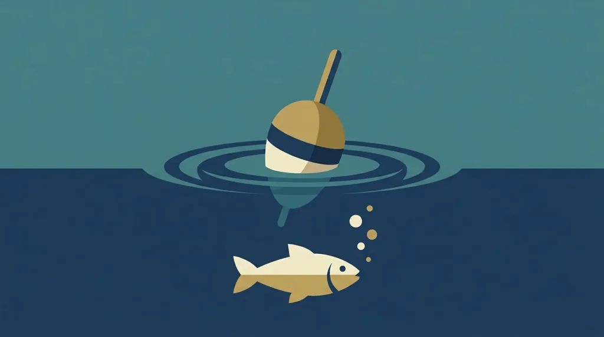
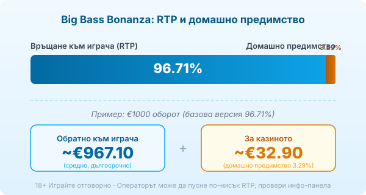
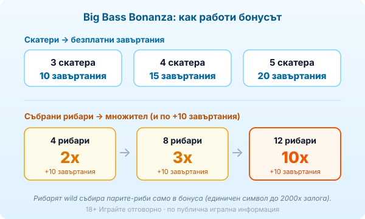

Title tag: Big Bass Bonanza: RTP, волатилност и как се играе
Meta description: Как работи Big Bass Bonanza на Pragmatic Play: рибарят wild събира парите-риби, безплатни завъртания с множители до 10x, RTP 96.71% и висока волатилност.

---

# Big Bass Bonanza: RTP, волатилност и как се играе

Big Bass Bonanza е риболовен слот на Pragmatic Play от края на 2020 г., станал толкова успешен, че покрай него израсна цяла поредица. Основната игра е скромна: пет барабана, три реда, десет фиксирани линии и рибки по екрана. Големите пари обаче се случват в безплатните завъртания, където рибарят започва да събира. Който разбере тази част, разбира и защо балансът често пада дълго, преди играта да гръмне.

## Кой я прави

Играта идва от студиото Reel Kingdom, което е част от Pragmatic Play и излиза под нейната марка. Big Bass Bonanza от декември 2020 г. постави началото на едно от най-разпознаваемите семейства слотове на компанията, с продължения като Bigger Bass Bonanza и Big Bass Splash. Тук говорим за оригиналното заглавие.

## Базовата игра

Полето е 5x3 с 10 фиксирани линии, отляво надясно. Залогът тръгва от €0.10 и стига до €250 на завъртане. В основния режим печелиш по стандартния начин, чрез еднакви символи на линия, но именно тук играта е най-скучна и най-суха. Рибарят и парите-риби, заради които всъщност се играе, работят пълноценно едва в бонуса.

## Скатерът и безплатните завъртания

Скатер символът е подскачащата риба и той отваря бонуса. Три скатера дават 10 безплатни завъртания, четири дават 15, а пет дават 20. Точно тези завъртания са сърцето на играта, защото само в тях се активира механиката на събиране, която прави Big Bass Bonanza това, което е.

## Рибарят wild и събирането

По време на безплатните завъртания на екрана падат символи-пари, тоест риби с прикачена стойност в кратно на залога, като единичен такъв символ може да носи до 2000 пъти залога. Дивият символ е рибарят и той се появява само в бонуса. Всеки път, когато рибар кацне на барабаните, той събира стойността на всички видими пари-риби в момента. Затова един добър спин в бонуса може да навърже няколко риби наведнъж под един рибар.

## Множителят и ретригерите

Тук е и надстройката, която дава на играта нейния таван. На всеки 4 събрани рибари бонусът се рестартира с още 10 безплатни завъртания и множителят към парите-риби се качва. След първите 4 рибари множителят става 2x, след 8 става 3x, а след 12 скача на 10x. Комбинацията от натрупани риби с висока стойност и множител 10x е това, което ражда огромните печалби в клиповете. Случва се рядко и изисква дълга, щедра поредица от безплатни завъртания.

## RTP: 96.71%, но зависи от казиното

Обявеният RTP на Big Bass Bonanza е 96.71%, което оставя домашно предимство около 3.29%. При €1000 оборот това е средно връщане от порядъка на €967.10 в дългосрочен план и около €32.90 за казиното, разпределени върху много завъртания. Pragmatic Play обаче доставя играта в няколко RTP версии и операторът избира коя да пусне. Освен 96.71% в обращение се срещат и по-ниски конфигурации (например около 95.67% и 94.02%), а разликата е изцяло за твоя сметка. Отвори инфо-панела на конкретното казино и провери кое число работи там, преди да заложиш. [Методологията ни](/kak-ocenyavame/) гледа реалния RTP, а не рекламния.

*Примерно разпределение на €1000 оборот при базов RTP 96.71%. Операторът може да пусне по-ниска конфигурация.*

## Как работи бонусът накратко

*Скатери и завъртания: 3 → 10, 4 → 15, 5 → 20. Множител по събрани рибари: 4 → 2x (+10), 8 → 3x (+10), 12 → 10x (+10). Числата са по публична игрална информация.*

## Висока волатилност и какъв е таванът

Big Bass Bonanza е игра с висока волатилност, оценена на 4 от 5 по скалата на Pragmatic Play. Балансът пада бавно през дребни или никакви печалби в основния режим, а рядкото попадане в бонуса носи повечето от възвръщаемостта. Максималната печалба е 2100 пъти залога и се случва изключително рядко, при идеална поредица от събрани риби с висок множител. При €1 залог това са €2100, но вероятността е нищожна и не бива да влиза в никаква сметка за бюджет.

Преди реални пари [слот игрите](/slot-igri/) обикновено имат демо режим, в който да усетиш колко рядко идва бонусът, без да залагаш. Задай си лимит за загуба и за време преди първото завъртане и ги спазвай, включително когато рибарите започнат да падат и ти се струва, че големият спин е на косъм. 18+ Хазартът може да пристрасти. Играйте отговорно. Ако усетите, че играта излиза извън контрол, вижте [инструментите за отговорна игра](/otgovorna-igra/).

## Ясна сметка зад риболова

Провери реалния RTP в инфо-панела, защото конфигурацията може да е под обявените 96.71%. Гледай на максимума от 2100 пъти като на рядкост, а не на цел, и залагай със сума, която можеш да загубиш изцяло, защото при висока волатилност сухите серии са дълги.

---

**Георги Тодоров**
Публикувано: 09.09.2026 · Последна редакция: 09.09.2026

[About Всички Казина boilerplate]

**Отговорна игра.** 18+ Хазартът може да пристрасти. Играйте отговорно. Ако усетиш, че играта излиза извън контрол или искаш да я ограничиш, виж [инструментите за отговорна игра](/otgovorna-igra/) и възможността за самоизключване чрез националния регистър на уязвимите лица към НАП (подава се писмено само от засегнатото лице). Национална информационна линия за наркотиците, алкохола и хазарта („Солидарност") 0888 99 18 66, делнични дни 10:00–17:00.

**Разкриване на партньорства.** Всички Казина съдържа партньорски (афилиейт) връзки; когато отвориш оферта през такава връзка, това може да финансира сайта, без да променя цената за теб и без да влияе на оценките ни. От 1 август 2026 г. дейността на афилиейт оператори в България се лицензира съгласно Закона за държавния бюджет за 2026 г. (ДВ, бр. 69 от 31.07.2026 г.). Всички Казина е подало заявление за лиценз пред Националната агенция по приходите и очаква издаването му.
