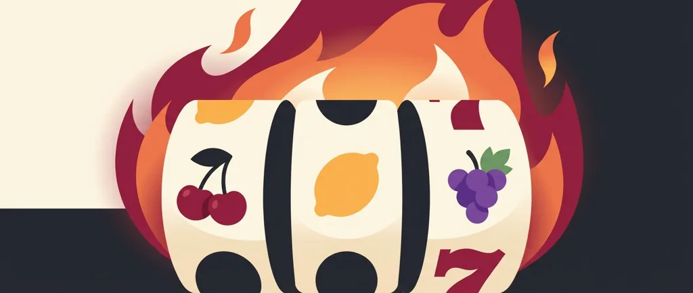
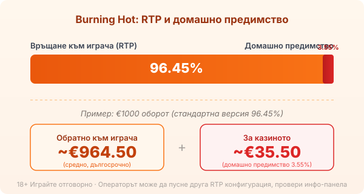

Title tag: Burning Hot: RTP и характеристики (EGT/Amusnet)
Meta description: Как работи Burning Hot на EGT/Amusnet: 5 фиксирани линии, разширяващ се wild, два скатера, Jackpot Cards прогресив и RTP 96.45%. Защо прогресивът не сваля предимството.

---

# Burning Hot: RTP и характеристики (EGT/Amusnet класика)

Burning Hot е една от най-разпознаваемите класически ротативки в българските казина: пет барабана, три реда, огнена тема с плодове, звънци и червени седмици. Играта е от 2014 г. и носи ДНК-то на цяло семейство слотове с думата „hot" в името. Механиката ѝ е нарочно опростена, но зад плодовете стоят няколко детайла, които решават колко ти струва всяко завъртане.

## От EGT до Amusnet: кой я прави

Играта идва от студиото, което дълги години познавахме като EGT Interactive, онлайн подразделението на българската Euro Games Technology от София. През юни 2022 г. EGT Interactive смени името си на Amusnet Interactive. Компанията е същата, само табелата е нова, така че в едно казино ще видиш Burning Hot като заглавие на EGT, а в друго под марката Amusnet. Самата игра е по-стара от смяната на името.

## Как се играе

Полето е 5x3 с 5 фиксирани линии на печалба. Не можеш да включваш и изключваш линии, играеш винаги петте, отляво надясно. Символите са класически: череши, лимони, портокали, сливи, грозде, дини, звънец и червената седморка. Седморката е най-ценният символ; пет от нея на линия плащат 3000 пъти залога на линия, което е таванът на играта в основния режим.

## Разширяващият се wild

Дивият символ е четирилистната детелина. Появява се само на средните три барабана, тоест втори, трети и четвърти, и когато влезе в игра, се разширява, за да покрие целия барабан. Замества всеки стандартен символ, освен скатерите, и точно разширяването е основният начин играта да сглоби печеливша линия от плодове, които иначе не биха се подредили.

## Двата скатера

Burning Hot има два скатер символа, които плащат от произволна позиция, без да е нужно да лягат на линия. Знакът долар се появява навсякъде по полето и пет от него носят до 100 пъти общия залог. Лилавата звезда се среща само на първи, трети и пети барабан и плаща 20 пъти общия залог. Скатерите тук не задействат безплатни завъртания, а просто изплащат директно, което е типично за старите EGT класики.

## Хазарт за удвояване

След всяка печалба играта предлага да я вземеш или да я заложиш на функцията за удвояване. На екрана се показва обърната карта и трябва да познаеш цвета ѝ, червено или черно. Познаеш ли, печалбата се удвоява; сбъркаш ли, губиш я цялата. Шансът е горе-долу равен на хвърляне на монета и в дългосрочен план удвояването не добавя стойност над RTP-то на играта. То разбърква резултата ти нагоре или надолу, без да мести математиката.

## Jackpot Cards: прогресивът

Много EGT казина въртят Burning Hot заедно с мистерийния прогресив Jackpot Cards. Той се задейства на случаен принцип, не при конкретна комбинация, и има четири нива, вързани към боите на картите: спатия, каро, купа и пика, като пиката е най-големият джакпот. Когато се активира, виждаш дванадесет обърнати карти и обръщаш, докато събереш три от една боя, което определя кой джакпот печелиш.

Важното за бюджета: шансът да влезеш в Jackpot Cards зависи от размера на залога, не от умение или стратегия. По-големите залози дават по-голям шанс, но и харчат по-бързо. Прогресивът прави играта по-вълнуваща, без да подобрява базовите шансове на завъртанията.

## RTP: 96.45%, но проверявай

Обявеният RTP на Burning Hot е 96.45%, което оставя домашно предимство около 3.55%. При €1000 оборот това е средно връщане от порядъка на €964.50 в дългосрочен план и около €35.50 за казиното, разпределени върху много завъртания. Числото важи за стандартната версия; EGT/Amusnet е известен с това, че доставя заглавията си в няколко RTP конфигурации и операторът избира коя да пусне. Публично няма ясен списък с точните алтернативни проценти конкретно за оригиналния Burning Hot [VERIFY], затова единственият сигурен начин е да отвориш инфо-панела на самата игра в конкретното казино и да провериш кое число работи там. При съмнение [методологията ни](/kak-ocenyavame/) гледа реалния RTP, а не рекламния.

*Обявен RTP 96.45% (стандартна версия): при €1000 оборот средно ~€964.50 се връщат на играча, ~€35.50 остават за казиното. Възможни са и други конфигурации, затова провери инфо-панела.*

## Волатилност и какво да очакваш

Burning Hot е игра с ниска до средна волатилност, оценена на 2 от 5 по скалата на разработчика. На практика балансът се движи с чести дребни печалби и без дълги сухи серии, но и без огромните удари, които предлагат модерните волатилни слотове. Максимумът от 3000 пъти залога на линия е рядкост, а не разумно очакване за сесия. Това е ротативка за спокойно, класическо въртене, чийто чар е в носталгията по плодовете и седморките, не в лова на екстремни печалби.

Преди реални пари [слот игрите](/slot-igri/) обикновено имат демо режим, в който да усетиш темпото, без да залагаш. Задай си лимит за загуба и за време преди първото завъртане и ги спазвай. 18+ Хазартът може да пристрасти. Играйте отговорно. Ако усетите, че играта излиза извън контрол, вижте [инструментите за отговорна игра](/otgovorna-igra/).

## Класика с ясна сметка

Burning Hot дължи популярността си на простата класическа механика и на носталгичната огнена тема. Зад тях стои под-средно за модерните слотове RTP, който при това може да е още по-нисък според конфигурацията на казиното, плюс прогресив и удвояване, които вълнуват, но не менят базовата математика. Провери реалния RTP в инфо-панела, гледай на джакпота като на бонус, а не на план, и залагай със сума, която можеш да загубиш изцяло.

---

**Георги Тодоров**
Публикувано: 09.09.2026 · Последна редакция: 09.09.2026

[About Всички Казина boilerplate]

**Отговорна игра.** 18+ Хазартът може да пристрасти. Играйте отговорно. Ако усетиш, че играта излиза извън контрол или искаш да я ограничиш, виж [инструментите за отговорна игра](/otgovorna-igra/) и възможността за самоизключване чрез националния регистър на уязвимите лица към НАП (подава се писмено само от засегнатото лице). Национална информационна линия за наркотиците, алкохола и хазарта („Солидарност") 0888 99 18 66, делнични дни 10:00–17:00.

**Разкриване на партньорства.** Всички Казина съдържа партньорски (афилиейт) връзки; когато отвориш оферта през такава връзка, това може да финансира сайта, без да променя цената за теб и без да влияе на оценките ни. От 1 август 2026 г. дейността на афилиейт оператори в България се лицензира съгласно Закона за държавния бюджет за 2026 г. (ДВ, бр. 69 от 31.07.2026 г.). Всички Казина е подало заявление за лиценз пред Националната агенция по приходите и очаква издаването му.
