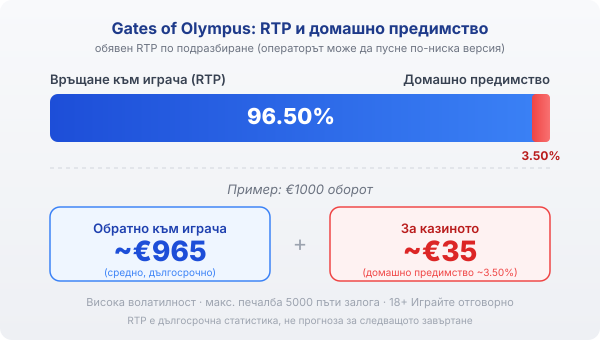

Title tag: Gates of Olympus: RTP, волатилност и как се играе
Meta description: Как работи Gates of Olympus на Pragmatic Play: мрежа 6x5, печалби от 8 символа, каскади, множителите на Зевс до 500x, RTP 96.50% и защо високата волатилност значи дълги сухи серии.

---

# Gates of Olympus: RTP, волатилност и как се играе

Gates of Olympus на Pragmatic Play излезе през 2021 г. и бързо стана едно от най-разпознаваемите заглавия на компанията, с антична гръцка тема и образа на Зевс над барабаните. Играта изглежда ефектно, но зад мълниите стои конкретна математика с висока волатилност, която е добре да разбираш, преди да заложиш.

## Как е устроена играта

Gates of Olympus няма класически линии. Мрежата е от шест колони и пет реда, а печалба се образува, когато поне осем еднакви символа паднат някъде по екрана, без значение къде точно. Този модел се нарича „pay anywhere" и замества фиксираните линии: броят на еднаквите символи е това, което плаща, а не подредбата им по определен път. Заради това не се налага да следиш линии, а само колко от даден символ са се събрали.

## Каскади и множителите на Зевс

След всяка печалба печелившите символи изчезват, а на тяхно място падат нови отгоре. Този каскаден механизъм (tumble) значи, че едно завъртане може да донесе няколко последователни печалби, докато спрат да се събират комбинации. По време на въртенето Зевс пуска светещи сфери с множители, чиято стойност варира от 2 до 500 пъти залога. Когато сфера падне заедно с печеливша комбинация, множителят се прилага към нея. Тези множители са причината играта да може да плаща големи суми, но и причината повечето завъртания да минават без нищо.

## Безплатните завъртания

Четири или повече scatter символа отключват рунд от петнайсет безплатни завъртания. Разликата спрямо основната игра е в множителите: в бонуса стойностите на всички сфери, които паднат, се събират в общ множител, който расте през целия рунд и се прилага към печалбите. Точно тук се случват големите резултати на Gates of Olympus, но и тук важи същото: рундът може да завърши скромно, ако сферите не дойдат. Максималната печалба в играта е 5000 пъти залога, което е таван, а не очаквание.

## RTP и волатилност

Обявеният RTP на Gates of Olympus по подразбиране е 96.50%, което оставя домашно предимство от около 3.50%. При €1000 оборот това значи средно връщане от порядъка на €965 в дългосрочен план и около €35 за казиното. Pragmatic Play обаче доставя играта и в няколко версии с по-нисък RTP (в порядъка на 95.5% и 94.5%), а операторът избира коя да пусне. Коя точно работи при теб проверяваш в инфо-панела на играта в конкретното казино, защото именно там пише реалната стойност. По-важното число тук е волатилността: тя е висока, тоест печалбите са редки, но потенциално големи. На практика това значи дълги серии без печалба, прекъсвани от отделни по-едри попадения, и банка, която трябва да издържи на тези сухи периоди.

*Обявен RTP 96.50% по подразбиране: при €1000 оборот средно ~€965 се връщат на играча, ~€35 остават за казиното (домашно предимство ~3.50%). Волатилността е висока, а максималната печалба е 5000 пъти залога.*

## Ante bet и купуването на бонуса

Играта предлага два начина да ускориш достигането до безплатните завъртания. Опцията ante bet вдига залога с 25% и повишава шанса да паднат scatter символи. Функцията за купуване на бонуса пък дава директно рунда безплатни завъртания срещу цена от 100 пъти залога. И двете плащаш веднага, а нито една не мени дългосрочното домашно предимство на играта: купуваш си по-бърз достъп до вариацията, не по-добри шансове. Дали купуването на бонуса изобщо е налично, зависи от пазара и от конкретния оператор, затова провери дали опцията присъства в самата игра, преди да разчиташ на нея.

## Преди да завъртиш

[Слот игрите](/slot-igri/) на Pragmatic Play обикновено имат демо режим, в който да усетиш темпото и волатилността, без да залагаш, а ако искаш да сравниш доставчици, [прегледът ни на доставчиците](/blog/games-providers/) стъпва на същата логика. Различните [ротативки](/kazino-igri/rotativki/) се сравняват най-честно по RTP, затова в [методологията ни](/kak-ocenyavame/) гледаме реалния процент на конкретното казино. Задай си лимит за загуба и за време преди първото завъртане, особено при толкова волатилна игра. 18+ Хазартът може да пристрасти. Играйте отговорно. Ако усетите, че играта излиза извън контрол, вижте [инструментите за отговорна игра](/otgovorna-igra/).

---

**Георги Тодоров**
Публикувано: 09.09.2026 · Последна редакция: 09.09.2026

[About Всички Казина boilerplate]

**Отговорна игра.** 18+ Хазартът може да пристрасти. Играйте отговорно. Ако усетиш, че играта излиза извън контрол или искаш да я ограничиш, виж [инструментите за отговорна игра](/otgovorna-igra/) и възможността за самоизключване чрез националния регистър на уязвимите лица към НАП (подава се писмено само от засегнатото лице). Национална информационна линия за наркотиците, алкохола и хазарта („Солидарност") 0888 99 18 66, делнични дни 10:00–17:00.

**Разкриване на партньорства.** Всички Казина съдържа партньорски (афилиейт) връзки; когато отвориш оферта през такава връзка, това може да финансира сайта, без да променя цената за теб и без да влияе на оценките ни. От 1 август 2026 г. дейността на афилиейт оператори в България се лицензира съгласно Закона за държавния бюджет за 2026 г. (ДВ, бр. 69 от 31.07.2026 г.). Всички Казина е подало заявление за лиценз пред Националната агенция по приходите и очаква издаването му.
