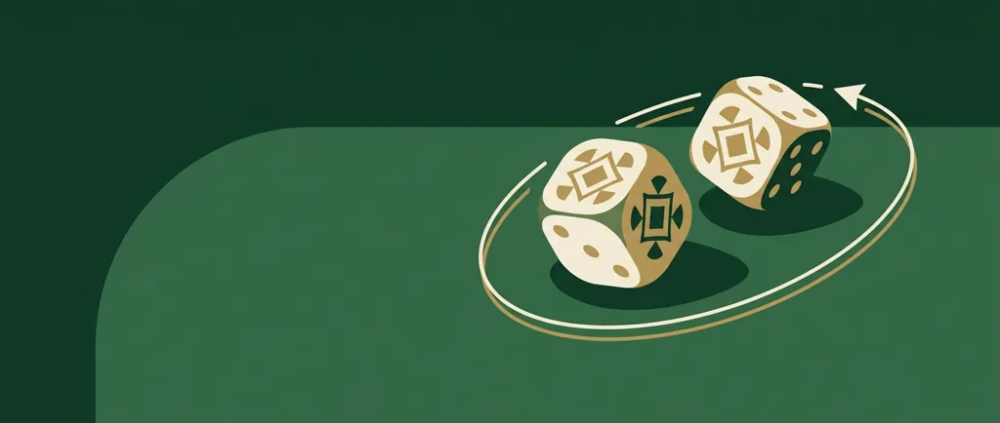
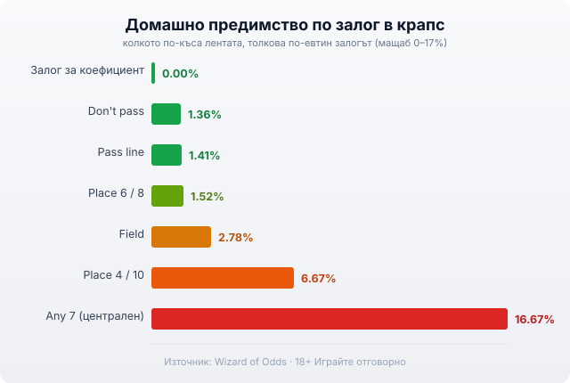

Title tag: Крапс: правила и кои залози си струват
Meta description: Как се играе крапс: come-out хвърляне, точка, pass line и don't pass, залогът за коефициент с 0% предимство и кои централни залози да избягвате.

---

# Крапс: как се играе и кои залози си струват

Масата за крапс изглежда като най-шумното и объркващо място в казиното: тълпа около едно поле, десетки квадратчета с непознати надписи, някой хвърля два зара и всички наоколо реагират наведнъж. Отдолу обаче стои една доста проста игра, а по-голямата част от онези квадратчета изобщо не ти трябват. Ако разбереш кой е основният залог и защо повечето от останалите са капан, крапс се превръща в една от игрите с най-ниско домашно предимство в цялото казино.

## Стрелецът, come-out хвърлянето и точката

Играе се с два шестстенни зара. Играчът, който ги хвърля, е стрелецът, но всеки около масата залага, не само той. Рундът започва с първото хвърляне, наречено come-out.

На come-out има три възможности. Сборът 7 или 11 е моментална печалба за основния залог. Сборът 2, 3 или 12 е загуба и точно това лошо хвърляне дава името на играта (craps). Всяко друго число, тоест 4, 5, 6, 8, 9 или 10, става твоята точка. Крупието слага маркер върху нея и стрелецът продължава да хвърля.

Оттук нататък въпросът е кой ще дойде пръв. Ако точката се повтори преди да падне 7, основният залог печели. Ако 7 излезе първо (seven-out), рундът приключва със загуба и заровете минават към следващия стрелец. Цялата драма около масата се върти около това едно число.

## Pass line: залогът, с който започваш

Pass line е стандартният залог и следва рунда точно както го описах: печелиш на 7 или 11 при come-out, губиш на 2, 3 или 12, а при поставена точка чакаш тя да се повтори преди седмицата. Домашното предимство е 1.41%. За залагане с толкова ниско предимство това е сред най-добрите числа, които ще срещнеш на маса в казино.

Какво значи 1.41% на практика: при €10 на pass line казиното задържа средно около 14 стотинки на решен залог в дългосрочен план. Една вечер може да си далеч над или под това, защото вариацията е голяма, но математиката, върху която залагаш, е много по-щадяща от повечето ротативки.

## Don't pass: залог срещу стрелеца

Огледалният залог е don't pass. Тук залагаш, че седмицата ще дойде преди точката, тоест печелиш, когато повечето на масата губят. При come-out печелиш на 2 или 3, губиш на 7 или 11, а сборът 12 е равен (в казиното го виждаш изписано като „bar 12"). Това равенство е малката хитрост, с която казиното запазва предимството си, вместо да го обърне в полза на играча.

Домашното предимство на don't pass е 1.364%, тоест мъничко по-ниско от pass line. Разликата е символична и повечето играчи предпочитат pass line просто защото е по-забавно да си на страната на масата. И двата залога са добри.

## Залогът за коефициент: единственият с нула предимство

След като има поставена точка, можеш да добавиш втори залог зад pass или don't pass, наречен залог за коефициент (odds). Той се изплаща по истинските шансове на числото, което означава домашно предимство от 0.00%. Няма друг залог в казиното, който да не носи предимство за къщата.

Истинските коефициенти зависят от точката: 4 и 10 се изплащат 2:1, числата 5 и 9 се изплащат 3:2, а 6 и 8 се изплащат 6:5. Понеже тази добавка е без предимство, тя разрежда общото предимство върху двата залога взети заедно. Pass line с двоен залог за коефициент сваля комбинираното предимство до около 0.57%, а don't pass с двоен коефициент до около 0.46%. Колкото по-голям коефициент позволява казиното, толкова по-надолу отива числото.

Практическото правило е кратко: залагай минимума на pass или don't pass и слагай останалите пари като залог за коефициент зад него. Така държиш най-голямата част от парите си на залог без предимство.

## Come и don't come

Come и don't come работят точно като pass и don't pass, само че ги правиш след като вече има поставена точка. Всеки come залог получава собствено come-out хвърляне и собствена точка, което позволява да имаш няколко активни числа наведнъж. Предимството е същото: 1.41% за come, 1.36% за don't come, и пак можеш да добавиш залог за коефициент върху тях.

## Place залозите: удобни, но по-скъпи

Place залогът избира конкретно число и печели, ако то падне преди седмицата, без да минаваш през come-out механиката. Удобно е, но цената се вижда в предимството, което зависи силно от числото. За 6 и 8 предимството е 1.52%, съвсем близо до pass line. За 5 и 9 скача на 4%. За 4 и 10 стига 6.67%, което вече е много по-скъпо от основните залози.

Ако изобщо играеш place залози, 6 и 8 са единствените с разумно число. Останалите ти струват няколко пъти повече на всеки заложен лев.

## Field и централните залози: тук се крие капанът

Полето (field) е залог за едно хвърляне върху 2, 3, 4, 9, 10, 11 или 12. Изглежда привлекателно, защото покрива много числа, но предимството е между 2.78% и 5.56% според това как казиното изплаща 12 (при 3:1 е по-добрият вариант, при 2:1 е доста по-лош). Провери таблицата преди да заложиш.

В центъра на масата са залозите с най-лоша математика в цялата игра. Any 7 (залог, че следващото хвърляне е седмица) носи домашно предимство 16.67%, което го прави един от най-скъпите залози в казиното изобщо. Any Craps е 11.11%. Hardways, тоест дубли като две тройки за твърдо 6, вървят между 9.09% и 11.11%. Тези квадратчета са ярки, крупието ги подканя и печалбите изглеждат големи, но в дългосрочен план изяждат банкрола ти в пъти по-бързо от pass line.

*Домашно предимство по залог (Wizard of Odds). Разликата между добрия и лошия избор на маса за крапс е огромна: pass line с коефициент е под 1%, а Any 7 в центъра струва близо 17%.*

## Стратегия, честно казано

Стратегията в крапс не бие домашното предимство, защото заровете нямат памет и всяко хвърляне е независимо. Единственото, което наистина управляваш, е кои залози избираш. Остани на pass или don't pass, добавяй залог за коефициент колкото позволява масата, и подмини целия шумен център. Това е разликата между игра с предимство под 1% и игра с предимство над 15%.

Темпото на живата маса е бързо и социалната енергия те бута да залагаш на всяко хвърляне. Задай си бюджет и лимит за загуба преди да пипнеш заровете и ги спазвай, независимо колко наелектризирана е масата. Разгледай и [как оценяваме казината](/kak-ocenyavame/) и другите [казино игри](/kazino-igri/), за да сравниш предимствата, преди да седнеш някъде. 18+ Хазартът може да пристрасти. Играйте отговорно. Ако усетите, че играта излиза извън контрол, вижте [инструментите за отговорна игра](/otgovorna-igra/).

## Накратко

Крапс изглежда сложен заради масата, но опира до едно число и няколко залога. Pass line и don't pass са около 1.4% предимство, залогът за коефициент е без предимство и сваля общото под 1%, а централните залози са скъпи капани, водени от Any 7 с близо 17%. Играй с бюджет, който можеш да загубиш изцяло, и стой далеч от средата на масата.

---

**Георги Тодоров**
Публикувано: 09.09.2026 · Последна редакция: 09.09.2026

[About Всички Казина boilerplate]

**Отговорна игра.** 18+ Хазартът може да пристрасти. Играйте отговорно. Ако усетиш, че играта излиза извън контрол или искаш да я ограничиш, виж [инструментите за отговорна игра](/otgovorna-igra/) и възможността за самоизключване чрез националния регистър на уязвимите лица към НАП (подава се писмено само от засегнатото лице). Национална информационна линия за наркотиците, алкохола и хазарта („Солидарност") 0888 99 18 66, делнични дни 10:00–17:00.

**Разкриване на партньорства.** Всички Казина съдържа партньорски (афилиейт) връзки; когато отвориш оферта през такава връзка, това може да финансира сайта, без да променя цената за теб и без да влияе на оценките ни. От 1 август 2026 г. дейността на афилиейт оператори в България се лицензира съгласно Закона за държавния бюджет за 2026 г. (ДВ, бр. 69 от 31.07.2026 г.). Всички Казина е подало заявление за лиценз пред Националната агенция по приходите и очаква издаването му.
