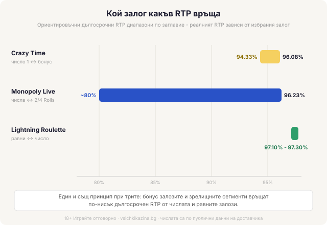

# 04 — SEO — vk-0011

## SEO AUDIT — Live game shows: как се играят Crazy Time, Monopoly Live и рулетката с множители
Target query: Live game shows (Crazy Time, Monopoly Live): как се играят | Intent: informational | Format match: yes (форматен обяснител; дефиницията е в първото изречение, всяко заглавие има секция).

Relevance score: 94/100
(Query alignment 24/25 | Entity coverage 34/35 | Subtopic completeness 24/25 | On-page 12/15)

PRIMARY KEYWORDS placement: „live game show" в H1, първото изречение, title и meta; „Crazy Time", „Monopoly Live", „Lightning Roulette" всяко в H1/title и в собствена H2; естествено повторени в тялото и таблицата. Без пренасищане (заглавията на игрите са описателни етикети, не стъфинг).
SECONDARY TERMS coverage: „казино на живо", „колело на парите / Money Wheel", „множител", „бонус игра", „Top Slot", „Cash Hunt / Pachinko / Coin Flip", „Chance", „2 Rolls / 4 Rolls", „късметлийски числа", „домашно предимство", „волатилност", „демо режим" — всички присъстват естествено.
MISSING ENTITIES: няма съществени. Сегментното разпределение на Crazy Time (21 сегмента за числото 1), таванът 20 000x и 29:1 срещу 35:1 разширяват темата над повечето източници с конкретика.
SEMANTIC GAPS: покрити (какво е форматът, механика на рунда, трите заглавия поотделно, RTP по залог vs по игра, домашно предимство/волатилност, RG рамка).
FLOODING/OVER-OPTIMISATION: няма; синонимно поле (колело/Money Wheel; множител/мултипликатор-ефект; залог/чипове; водещ/dealer) използвано умерено.
ON-PAGE FIXES: title 58 знака (≤60), meta 151 знака (≤155), H1 един, H2 логични без прескочени нива; alt текстовете на hero и инфографика описателни (зададени verbatim по брифа).
INTERNAL LINKS (потвърдени, 3 от одобрения набор): /kak-ocenyavame/ (в „Кой залог какъв RTP връща"), /kazino-igri/ и /otgovorna-igra/ (в финалната секция). Анкорите са описателни, не exact-match. НЕ се линква /kazino-na-zhivo/ (анти-канибализация със съществуващия търговски листинг).
SCHEMA: Article + Person (author Георги Тодоров). Без FAQPage (няма Q&A блок).
TABLE: компактната RTP-сравнителна таблица през 3-те заглавия е истинска сравнителна работа (помага за scan и за featured snippet потенциал) — задържана.

NUMBER DIFF 03→04: идентичен (нищо числово не е пипано; SEO промените са само title/meta и потвърждаване на връзки). [VERIFY] флагът в секция 4 запазен.

---

Title tag: Live game shows: Crazy Time, Monopoly Live, Lightning
Meta description: Как се играят live game shows Crazy Time, Monopoly Live и Lightning Roulette: механика, бонус игри, множители и честната истина за RTP по залог.

---

# Live game shows: как се играят Crazy Time, Monopoly Live и рулетката с множители

Live game show е хибрид между телевизионно шоу и казино маса: истински водещ в студио върти голямо колело, ти залагаш върху сегмент преди завъртането, а част от рундовете отварят отделна бонус игра с множители. За разлика от ротативка тук няма барабани и печеливши линии, а едно голямо колело и решение кой сегмент да подкрепиш. Форматът го наложи Evolution, а Crazy Time, Monopoly Live и рулетките с мълнии го превърнаха в най-гледаната част на казиното на живо. Изглежда като предаване по телевизията, с водещ, светлини и шум, и точно това е залогът на дизайна: лесно за гледане, трудно за печелене в дългосрочен план.

## Как протича един рунд

Механиката е почти една и съща при всички заглавия. Преди водещият да завърти, имаш няколко секунди да сложиш чипове върху наличните сегменти: числа, бонус игри или специални полета. Колелото спира на един сегмент и плаща само залозите върху него, а всичко останало изгаря. Масите вървят денонощно в реално време, а щом таймерът за залози стигне нула, вече нищо не можеш да добавиш. При Crazy Time и Monopoly Live отгоре работи още един механизъм, Top Slot при едното и картата Chance при другото, който закача случаен множител върху някое поле преди или по време на завъртането. Спре ли колелото на бонус сегмент, влизаш в отделна мини игра с по-големите множители, но само ако си заложил върху точно този сегмент предварително. Ако не си, гледаш бонуса отстрани, докато други печелят.

## Crazy Time: колелото с 54 сегмента

Crazy Time върти колело с 54 сегмента. Повечето са числа (1, 2, 5 и 10), а девет водят към четирите бонус игри: Cash Hunt, Pachinko, Coin Flip и самата Crazy Time. Всяка от тях раздава множителите по свой начин: Coin Flip хвърля монета между червена и синя стойност, Cash Hunt е стена от 108 скрити множителя, по чиито символи стреляш, Pachinko пуска диск по табло от щифтове, а Crazy Time отваря отделно голямо виртуално колело с три цветни стрелки. Числото 1 заема двадесет и един сегмента и пада най-често, затова плаща най-малко; десетката е рядка и връща повече на попадение. Всеки рунд Top Slot завърта два барабана и може да закачи множител до 50x върху число или бонус. Големите числа живеят в бонусите: Crazy Time сегментът, с виртуалното колело зад червената врата, стига до 20 000x, но заема само един сегмент от 54 и пада съвсем рядко. Дългосрочният RTP зависи изцяло от залога ти. Върху числото 1 е най-висок, около 96.08%, а върху бонус залозите слиза към 94.33%, тоест най-зрелищните залози връщат най-малко.

## Monopoly Live: колелото на парите и разходката с Mr. Monopoly

Monopoly Live тръгва от подобно колело на парите с числа (1, 2, 5, 10) и два бонус сегмента, 2 Rolls и 4 Rolls. Случайната карта Chance хвърля в играта допълнителни множители или директни печалби. Разликата между двата бонус сегмента е само в броя завъртания на зара: 4 Rolls дава повече ходове от 2 Rolls, тоест по-дълга обиколка и повече натрупани множители по пътя. Паднеш ли на Rolls сегмент и си заложил върху него, камерата се прехвърля към триизмерна версия на дъската на Monopoly, по която анимираният Mr. Monopoly обикаля полетата и събира къщи, хотели и множители вместо теб. Колкото повече завъртания на зара ти се паднат, толкова по-дълга е разходката и по-голям потенциалният множител. Върхът на RTP е около 96.23% на залозите върху числата. На бонус залозите, 2 Rolls и 4 Rolls, процентът на връщане е чувствително по-нисък, по публични оценки към 80-те процента. [VERIFY: точната долна граница на RTP по залог при Monopoly Live се сочи различно в публичните игрови бази; стабилно потвърден е върхът около 96.23%.]

## Lightning Roulette: рулетка с мълнии

Lightning Roulette е европейска рулетка с едно зеро, върху която е сложен слой множители. Преди всяко завъртане между едно и пет „късметлийски" числа получават случаен множител от 50x до 500x. Уцелиш ли право число, което е светнало, печалбата ти се умножава по него. Множителите се раздават на случаен принцип, не от дилъра, и важат само за правите залози върху число; равните залози никога не светват. Цената за тази възможност е скрита в изплащането: право число тук плаща 29:1, а не стандартните 35:1 на обикновената рулетка. Редовните попадения връщат по-малко, за да финансират редките големи множители, така че подаръкът е по-скоро счетоводство. На равните залози (червено или черно, чет или нечет) RTP остава като при европейска рулетка, около 97.30%. На залозите върху отделно число е малко по-нисък, около 97.10%.

## Кой залог какъв RTP връща

| Заглавие | RTP диапазон (дългосрочен) | Най-висок RTP | Най-нисък RTP |
|---|---|---|---|
| Crazy Time | ~94.33%–96.08% | залог върху числото 1 | бонус залозите |
| Monopoly Live | ~80-те %–96.23% | залозите върху числата | бонус залозите (2 Rolls / 4 Rolls) |
| Lightning Roulette | ~97.10%–97.30% | равните залози | залог върху отделно число |

*Ориентировъчни RTP диапазони по заглавие; реалният RTP зависи от избрания залог (числата са по публични данни на доставчика).*

Таблицата показва едно и също при трите заглавия: няма един RTP на играта, има RTP на залога. Най-търсените и най-зрелищните залози, бонус игрите и сегментите с големите множители, почти винаги са с по-нисък процент на връщане от скучните числа и равните залози. Точно тези залози обаче са примамката на формата, защото никой не сяда на Crazy Time заради числото 1. Домашното предимство при game show форматите е по-голямо от това на обикновена рулетка или блекджек с базова стратегия, а волатилността е висока: дълги сухи серии, прекъсвани от рядко голямо попадение. Числата връщат стабилно по малко, докато бонус залозите може да мълчат десетки рундове, преди да върнат всичко наведнъж, или изобщо да не върнат. RTP-то във всички тези числа е дългосрочна статистика над милиони рундове, не обещание за твоята вечер. Как гледаме на условията около игрите и бонусите е описано открито в [начина ни на оценяване](/kak-ocenyavame/).

## Развлечение, не стратегия

Game show заглавията са построени да те задържат пред екрана: водещ, светлини, шум и рядко огромно число горе вдясно. Това е платено забавление с позната цена, не източник на доходи. Хазартът не е финансова стратегия: всяко от тези колела е настроено операторът да печели в дългосрочен план, а големият множител е по-скоро реклама, отколкото план. Ако ще сядаш на такава маса, задай си лимит за депозит и загуба преди първия залог, пусни играта първо в демо режим, за да усетиш темпото ѝ без пари, и залагай само със суми, които можеш да загубиш изцяло. Live game shows са една част от [казино игрите](/kazino-igri/), не отделна вселена с по-добри правила. 18+ Хазартът може да пристрасти. Играйте отговорно. Ако усетиш, че гониш множителя повече, отколкото си планирал, виж [инструментите за отговорна игра](/otgovorna-igra/). Зрелището е истинско. Големият множител почти сигурно не е за теб, и бюджетът ти не бива да го чака.

---

[EDITORIAL — подпис Георги Тодоров]
[BRAND BOILERPLATE]
[18+ / RG LINE — footer block]

INTERNAL-LINK SUGGESTIONS:
[LINK: начина ни на оценяване → /kak-ocenyavame/]
[LINK: казино игрите → /kazino-igri/]
[LINK: инструментите за отговорна игра → /otgovorna-igra/]
