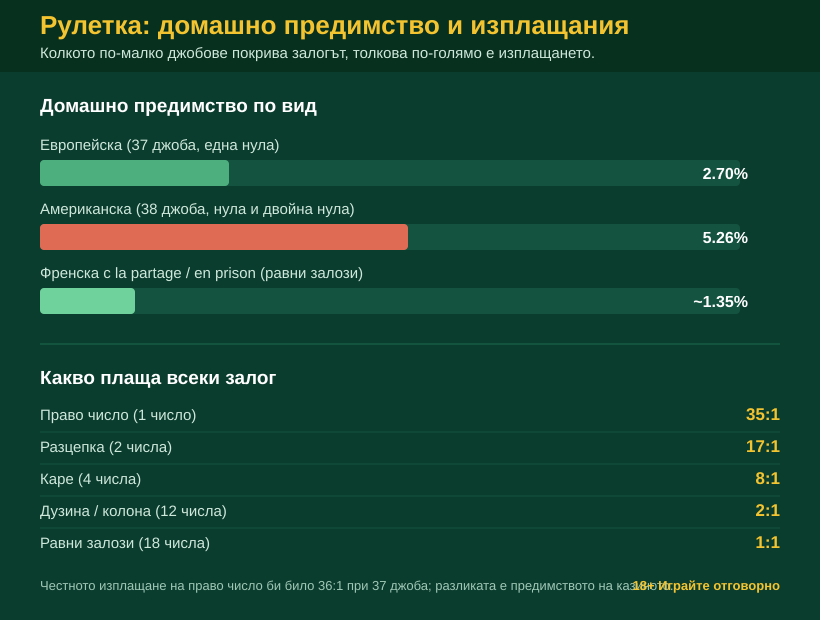

Title tag: Рулетка: правила и стратегии (вкл. Мартингейл)
Meta description: Как се играе рулетка, какво плащат залозите и защо Мартингейл и другите системи не бият домашното предимство. Правилата и честната сметка.

---

# Рулетка: правилата, залозите и защо нито една „система" не бие масата

Рулетката се учи за няколко минути и точно затова около нея се върти толкова шум. Правилата се побират на една страница: залагаш, крупието пуска топчето, то спира в някой джоб и печелившите залози се изплащат. Всичко останало е домашното предимство, което е фиксирано предварително и не помръдва, независимо колко залагаш и в какъв ред. Популярните системи за рулетка обещават да надхитрят точно това число. Не могат. Причината е в аритметиката, не в късмета.

## Как се играе рулетка: колелото и масата

Колелото има номерирани джобове и топче, което обикаля обратно на въртенето, докато не изгуби скорост и не падне в един от тях. При европейската рулетка джобовете са 37, с числата от 0 до 36. При американската са 38, защото към нулата е добавена и двойна нула (00). Числата са разделени поравно на червени и черни, по 18 от всеки цвят, а нулата (и двойната нула при американската) е зелена и не принадлежи на нито един от равните залози. Масата е просто картата, върху която нареждаш чиповете си: всяко число има квадратче, а около него са полетата за по-едрите залози. Един рунд минава бързо. Залагаш, крупието обявява край на залозите, топчето спира и сметката се прави веднага. Губещите чипове се прибират, печелившите се изплащат по фиксирана ставка, и всичко започва наново.

## Вътрешни и външни залози

Най-едрото изплащане носят вътрешните залози, които нареждаш право в решетката с числата, върху конкретно число или малка съседна група; плащат много именно защото уцелването им е рядко. Обратното важи за външните залози, които покриват големи части от масата наведнъж, например половината числа или цяла дузина. Плащат малко, но уцелват често. Между тях стоят междинните, улица върху три съседни числа или линия върху шест, които плащат по-малко от правото число, но излизат по-често. Колкото по-малко джобове покрива залогът, толкова по-голямо е изплащането.

## Какво плаща всеки залог

*Домашно предимство и основни изплащания при рулетка (числата са за стандартните правила).*

| Залог | Покрива | Изплащане |
|---|---|---|
| Право число (straight) | 1 число | 35:1 |
| Разцепка (split) | 2 съседни числа | 17:1 |
| Каре (corner) | 4 числа | 8:1 |
| Дузина / колона | 12 числа | 2:1 |
| Равни залози (червено/черно, чет/нечет, 1-18/19-36) | 18 числа | 1:1 |

Домашното предимство се крие в изплащанията. Уцелиш ли право число, масата ти плаща 35:1. Но джобовете са 37, не 36. Честното изплащане, при което нито казиното, нито играчът печели в дългосрочен план, би било 36:1. Разликата между 36 и 35 е цялата печалба на оператора, разпъната върху всяко завъртане. Същата дупка стои скрита във всеки друг залог на масата, включително равните: нулата не е нито червена, нито черна, така че залогът на „червено" губи и при нея.

## Европейска, американска, френска: една нула или две

На европейско колело домашното предимство е 2.70% на всеки залог. Американската рулетка добавя втора нула и с нея предимството скача на 5.26%, почти двойно. Нищо в играта не става по-вълнуващо от двойната нула, просто цената за играча е по-висока, затова при избор европейската маса е очевидно по-разумната. Френската рулетка ползва същото колело с 37 джоба, но добавя правило в полза на играча. При la partage, падне ли топчето на нула, си връщаш половината от равния залог вместо да загубиш всичко. При en prison залогът се „затваря" за едно завъртане и при следваща печалба се освобождава. И в двата случая домашното предимство на равните залози пада до около 1.35%. Това е най-изгодната рулетка, която ще срещнеш, и пак не е на твоя страна.

## Системата Мартингейл: удвояваш, докато не можеш

Мартингейл е най-известната рулетка стратегия и логиката ѝ звучи солидно, докато не я сметнеш. Залагаш на равен шанс, да речем червено, с база €10. Загубиш ли, удвояваш: следващият залог е €20, после €40, €80, €160, €320. Идеята е, че първата печалба покрива всички натрупани загуби и отгоре връща първоначалните €10. При къс лош период работи и създава приятно усещане за контрол. Проблемът е, че лошите периоди не идват по разписание. Шест последователни червени на черно, напълно нормално събитие, и седмият ти залог трябва да е €640, за да продължиш схемата. Повечето маси имат лимит, който го забранява, а дори да нямаха, банкролът свършва експоненциално бързо. Лимитът на масата не е случаен: казината го слагат точно за да не може никой да удвоява безкрай и да си върне всичко с един голям залог. Дотук рискуваш €630 натрупани загуби, за да гониш печалба от €10.

## Защо никоя прогресия не променя сметката

Работата е в аритметиката. Всяко едно завъртане има отрицателна очаквана стойност заради домашното предимство, а една система е просто последователност от такива завъртания. Събереш ли много отрицателни числа, в какъвто и ред или размер, сборът остава отрицателен. Прогресията размества кога печелиш и кога губиш, не колко струва играта. Отгоре стои и грешката на комарджията: всяко завъртане е независимо от предишните, топчето няма памет, и пет поредни червени не правят черното „назряло". Шансът на следващото завъртане е същият, какъвто беше и на първото. Рулетката не е финансова стратегия; тя е игра, построена така, че операторът да печели в дългосрочен план, и никое нареждане на залозите не обръща това. Ако искаш да видиш как изобщо гледаме на условията около игрите, [начинът ни на оценяване](/kak-ocenyavame/) го описва открито.

## Д'Аламбер, Фибоначи, Лабушер: същата математика

Останалите прочути системи само сменят формата на прогресията. Д'Аламбер качва залога с една единица след загуба и сваля с една след печалба, по-плавно от Мартингейл. Фибоначи следва познатата редица, Лабушер зачерква числа от списък. Всяка звучи по-умна от предишната и нито една не докосва домашното предимство, защото всички залагат на същите джобове със същата цена. По-бавната прогресия просто губи по-бавно, което за някои е по-приятно, но не е победа.

## Рулетката като забавление с известна цена

Разумният подход, преди да завъртиш, е да решиш колко си готов да загубиш изцяло и да зададеш лимит за депозит и загуба още преди първото завъртане. Демо режимът пък дава начин да усетиш темпото ѝ без залог. Така една вечер на рулетка си остава вечер забавление, а не сметка, която се опитваш да изравниш. Рулетката е само една част от [казино игрите](/kazino-igri/), не отделна вселена с други правила, и същата математика важи за всички тях. 18+ Хазартът може да пристрасти. Играйте отговорно. Ако усетиш, че играта тегли повече, отколкото си планирал, виж [инструментите за отговорна игра](/otgovorna-igra/).

---

**Георги Тодоров**
Публикувано: 09.09.2026 · Последна редакция: 09.09.2026

[About Всички Казина boilerplate]

**Отговорна игра.** 18+ Хазартът може да пристрасти. Играйте отговорно. Ако усетиш, че играта излиза извън контрол или искаш да я ограничиш, виж [инструментите за отговорна игра](/otgovorna-igra/) и възможността за самоизключване чрез националния регистър на уязвимите лица към НАП (подава се писмено само от засегнатото лице). Национална информационна линия за наркотиците, алкохола и хазарта („Солидарност") 0888 99 18 66, делнични дни 10:00–17:00.

**Разкриване на партньорства.** Всички Казина съдържа партньорски (афилиейт) връзки; когато отвориш оферта през такава връзка, това може да финансира сайта, без да променя цената за теб и без да влияе на оценките ни. От 1 август 2026 г. дейността на афилиейт оператори в България се лицензира съгласно Закона за държавния бюджет за 2026 г. (ДВ, бр. 69 от 31.07.2026 г.). Всички Казина е подало заявление за лиценз пред Националната агенция по приходите и очаква издаването му.
