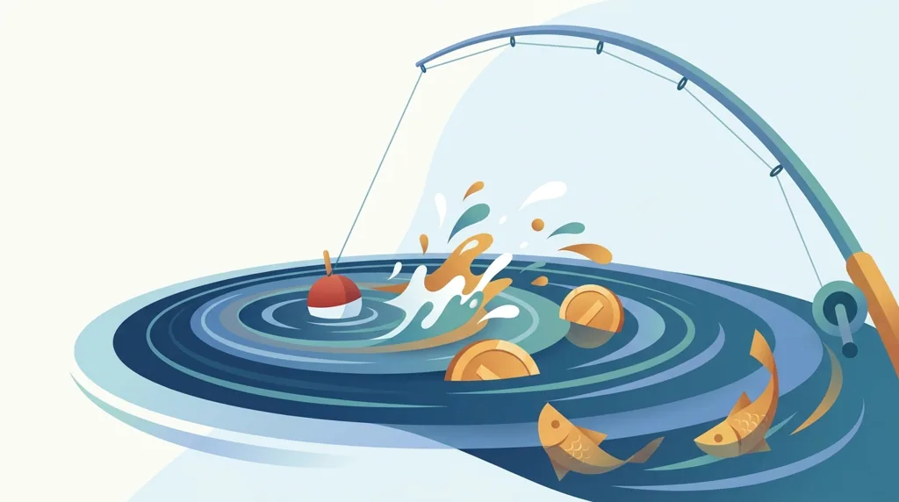
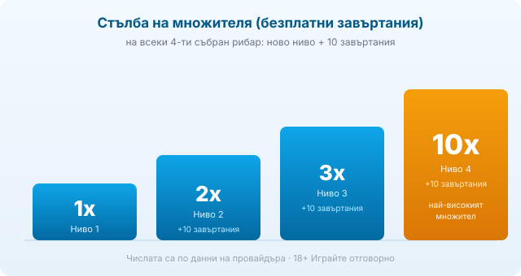

Title tag: Big Bass Splash: RTP, волатилност и как се играе
Meta description: Big Bass Splash на Pragmatic Play: 5x3, 10 линии, RTP 96.71%, много висока волатилност, макс. 5,000x. Как рибарят събира парите и как множителят стига до 10x в безплатните завъртания.

---

# Big Bass Splash: RTP, волатилност и как се играе

Big Bass Splash е по-буйният брат от риболовната серия на [Pragmatic Play](/blog/pragmatic-play-provajdar/) и Reel Kingdom. Същият рибар, същите монети с перки, само че тук темпото е по-рязко и таванът е вдигнат високо. Ако сте пускали Big Bass Bonanza, ще разпознаете почти всичко; разликите са в математиката на бонуса и в това колко търпение иска играта.

## Как е устроена играта

Пет барабана, три реда и десет фиксирани линии. По барабаните плуват рибните символи, а сред тях са двата, около които се върти всичко. Парична риба носи стойност в пари, изписана върху нея, от няколко пъти залога нагоре. Рибарят е wild и играе двойна роля: затваря линии в основната игра, а в безплатните завъртания се превръща в главния герой на кръга.

## Безплатните завъртания и стълбата на множителя

Три, четири или пет scatter-а пускат съответно 10, 15 или 20 безплатни завъртания, и тук играта сменя правилата. Всяко завъртане, в което падне рибар, той събира стойностите на всички парични риби, които се виждат на екрана, и ги прибавя към баланса. По-важното става с броенето: на всеки четвърти събран рибар се качвате едно ниво нагоре, получавате нови 10 завъртания и множителят се вдига. Нивата са четири и множителят по тях върви 1x, 2x, 3x и 10x. Достигането на последното ниво иска дванадесет събрани рибари в рамките на кръга, което обяснява защо големите резултати на Big Bass Splash са редки, но когато дойдат, идват наведнъж.

*На всеки 4-ти събран рибар: ново ниво, нови 10 завъртания, по-висок множител. Числата са по данни на провайдъра.*

## RTP и волатилност: добро число, тежък характер

Обявеният RTP на Big Bass Splash е 96.71%, което оставя домашно предимство от около 3.29% и го поставя горе-долу на средното за модерните слотове. Върху €1000 оборот това са средно около €967 обратно към играча в дългосрочен план и около €33 за казиното. Числото изглежда прилично, но до него стои етикет, който тежи повече от процента: волатилността е много висока. На практика значи дълги серии, в които почти нищо не се случва, прекъсвани рядко от кръг, който наваксва всичко наведнъж. [Начинът, по който оценяваме игрите](/kak-ocenyavame/), гледа RTP като реално число, но при толкова висока волатилност то се усеща едва след много завъртания, не в рамките на една сесия. Проверявайте процента в инфо-панела, защото Pragmatic пуска една и съща игра в няколко версии и операторът може да върви на по-ниска.

## Разликата с Big Bass Bonanza

От Big Bass Bonanza към Splash се сменят точно две неща, които променят усещането. Множителят вече не е просто число, което расте, а стълба с фиксирани стъпала до 10x, и максималната печалба е вдигната до 5,000 пъти общия залог. Заради това Splash е по-волатилен от оригинала: печели по-рядко, но с по-висок потенциален връх. Кой от двата подхожда е въпрос на бюджет и търпение, не на това кой е „по-добрият".

## Максимална печалба и бюджет

Провайдърът посочва таван от 5,000 пъти залога, който на практика се вижда изключително рядко и почти винаги минава през последното ниво на множителя в бонуса. Разчитането на този връх е грешен начин да се планира бюджет. За много висока волатилност работи същото просто правило: залагайте суми, които издържат дълги сухи серии, защото точно такива серии са нормалното състояние на играта между два бонуса.

## Преди да завъртите

Пуснете играта в демо режим, ако казиното предлага [слот игрите](/slot-igri/) за проба, за да усетите ритъма на дългите паузи, преди да заложите истински. Задайте си лимит за загуба и за време преди първото завъртане и проверете реалния RTP в конкретното казино. 18+ Хазартът може да пристрасти. Играйте отговорно. Ако усетите, че играта излиза извън контрол, вижте [инструментите за отговорна игра](/otgovorna-igra/).

---

**Георги Тодоров**
Публикувано: 10.09.2026 · Последна редакция: 10.09.2026

[About Всички Казина boilerplate]

**Отговорна игра.** 18+ Хазартът може да пристрасти. Играйте отговорно. Ако усетиш, че играта излиза извън контрол или искаш да я ограничиш, виж [инструментите за отговорна игра](/otgovorna-igra/) и възможността за самоизключване чрез националния регистър на уязвимите лица към НАП (подава се писмено само от засегнатото лице). Национална информационна линия за наркотиците, алкохола и хазарта („Солидарност") 0888 99 18 66, делнични дни 10:00–17:00.

**Разкриване на партньорства.** Всички Казина съдържа партньорски (афилиейт) връзки; когато отвориш оферта през такава връзка, това може да финансира сайта, без да променя цената за теб и без да влияе на оценките ни. От 1 август 2026 г. дейността на афилиейт оператори в България се лицензира съгласно Закона за държавния бюджет за 2026 г. (ДВ, бр. 69 от 31.07.2026 г.). Всички Казина е подало заявление за лиценз пред Националната агенция по приходите и очаква издаването му.
