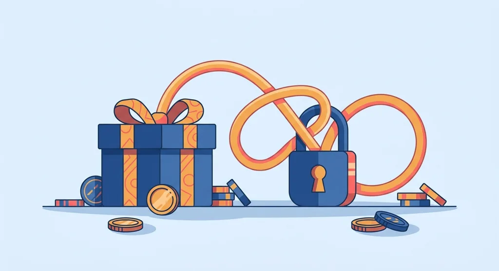
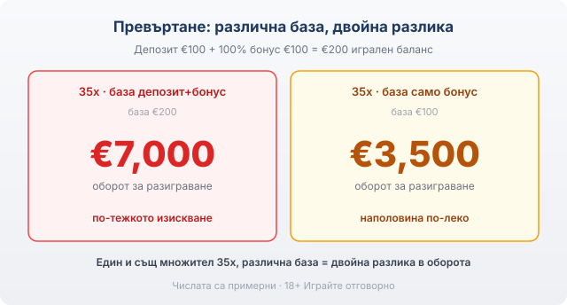

Title tag: Бонус при регистрация: как работи и условията
Meta description: Какво наистина получавате от бонус при регистрация: защо банерът „100% до €500" не е сумата на ръка, как превъртането, срокът, приносът на игрите и таванът на тегленето определят реалната цена.

---

# Бонус при регистрация: как работи и какви са условията

Бонусът при регистрация е първото нещо, което всяко казино показва на нов играч, и обикновено е написан с най-едрия шрифт на сайта: „100% до €500", „200 безплатни завъртания", „начален пакет до €1000". Числото на банера е маркетинг. Договорът е в общите условия отдолу, там, където е записано колко пъти трябва да завъртите парите, за колко дни и с кои игри.

Начален бонус, депозитен бонус, бонус за първи депозит, welcome бонус: това са имена на едно и също нещо. Казиното добавя средства към първия ви депозит по предварителна формула, най-често като процент от внесената сума до определен таван. Внасяте €100 при оферта „100% до €500" и балансът ви става €200, но дори да внесете €600, бонусът пак спира на €500, защото таванът е таван. Бонусът без депозит е друга категория, при която получавате малка сума или няколко завъртания, без изобщо да внасяте; тук не го разглеждаме, защото условията му се държат по различен начин.

## Превъртане: колко пъти трябва да завъртите бонуса

Парите от бонуса не са ваши в момента, в който се появят в баланса. Свързани са с изискване за превъртане (на английски wagering): сумарен оборот от залози, който трябва да направите, преди печалбата от бонуса да стане теглима. Изписва се като множител, например 35x или 40x, и повечето играчи го четат наполовина.

Множителят сам по себе си не значи нищо, докато не видите върху коя база се начислява. Има две често срещани бази и разликата между тях е огромна. Ако офертата иска 35x само върху бонуса при бонус €100, дължите €3,500 оборот. Ако иска 35x върху депозит+бонус при депозит €100 и бонус €100, базата е €200 и дължите €7,000, тоест същият множител тежи двойно повече заради по-голямата база. Затова [оценяваме условията на бонусите](/kak-ocenyavame/) по реалната им тежест, а не по числото на банера, и затова един бонус „40x само бонус" често е по-мек от „30x депозит+бонус".

*Един и същ множител 35x върху различна база дава двойна разлика в оборота. Числата са примерни.*

## Срокът може да обезсмисли добрия множител

До превъртането почти винаги има срок за разиграване: 7, 14 или 30 дни, в които трябва да завъртите целия оборот. Този ред тежи колкото самия множител, а често се пропуска. Оферта с 30x за 30 дни е спокойна. Същите 30x, свити в 7 дни, ви карат да залагате в темпо, което рядко върви заедно с бюджет. Изтече ли срокът с неизпълнено превъртане, бонусът и печалбата от него обикновено се анулират, а остава само това, което сте вложили от джоба си. Преди да приемете оферта, разделете оборота на дните и вижте колко излиза на ден при вашия залог.

## Приносът на игрите: €100 залог, който брои €10

Не всяка игра тежи еднакво към превъртането. Ротативките обикновено се броят 100 процента, тоест €10 залог сваля €10 от оставащия оборот. Масовите игри и [казиното на живо](/kazino-igri/) често се броят с 10 или 20 процента, а понякога изобщо не участват. При принос 10 процента €100, заложени на блекджек, свалят €10 от изискването, което значи, че ще ви трябва десетократно повече оборот, ако разигравате бонуса на маса вместо на слот. Ако планирате да завъртите бонус на рулетка или блекджек, тази клауза е първото, което трябва да проверите, защото тя мълчаливо променя цялата сметка.

## Максимален залог и таван на тегленето

Две числа в дребния шрифт спасяват казиното от играч, който иска да мине превъртането с една голяма ръка. Първото е максималният залог по време на разиграване, често около €5; заложите ли повече, докато бонусът е активен, казиното има право да анулира печалбата, дори да сте изпълнили всичко останало коректно. Второто е таванът на тегленето от бонус: горна граница колко изобщо може да изтеглите от спечеленото с бонусни средства, независимо колко сте натрупали. Оферта без такъв таван е рядкост, а когато го има, той е реалният покрив на печалбата ви. Тези две клаузи не се рекламират, но определят изхода повече от процента на банера.

## Как да прочетете офертата за две минути

Отворете общите условия на бонуса и намерете пет неща: множителя, базата (депозит+бонус или само бонус), срока в дни, приноса на игрите, които ще ползвате, и тавана на тегленето. С тези пет числа сметнете реалния оборот и колко на ден излиза той. Ако не намерите някое от тях изписано ясно, третирайте това като червен флаг за самата оферта, не като детайл. Добрият [начален бонус](/bonus-category/welcome-bonus/) издържа на четене; лошият разчита да не стигнете до дъното на страницата. Практиката по депозити и тегления е описана отделно в [раздела за депозити и тегления](/depoziti-i-teglenia/), защото първото теглене минава през верификация и е по-бавно независимо от бонуса.

Данъчното третиране на печалбите от хазарт зависи от конкретното ви положение и от актуалната уредба, затова за него се допитайте до счетоводител или до НАП, а не до форум. [VERIFY: данъчен режим на печалбите, да се потвърди с НАП/счетоводител, не се твърди в текста.]

Ако след сметката оборотът за срока излиза над това, което бихте заложили за удоволствие, най-разумният ход е да откажете бонуса и да играете с чист депозит. Заложете си лимит за загуба и за време, преди първия депозит, не след него. 18+ Хазартът може да пристрасти. Играйте отговорно. Ако усетите, че играта излиза извън контрол, вижте [инструментите за отговорна игра](/otgovorna-igra/).

---

**Георги Тодоров**
Публикувано: 10.09.2026 · Последна редакция: 10.09.2026

[About Всички Казина boilerplate]

**Отговорна игра.** 18+ Хазартът може да пристрасти. Играйте отговорно. Ако усетиш, че играта излиза извън контрол или искаш да я ограничиш, виж [инструментите за отговорна игра](/otgovorna-igra/) и възможността за самоизключване чрез националния регистър на уязвимите лица към НАП (подава се писмено само от засегнатото лице). Национална информационна линия за наркотиците, алкохола и хазарта („Солидарност") 0888 99 18 66, делнични дни 10:00–17:00.

**Разкриване на партньорства.** Всички Казина съдържа партньорски (афилиейт) връзки; когато отвориш оферта през такава връзка, това може да финансира сайта, без да променя цената за теб и без да влияе на оценките ни. От 1 август 2026 г. дейността на афилиейт оператори в България се лицензира съгласно Закона за държавния бюджет за 2026 г. (ДВ, бр. 69 от 31.07.2026 г.). Всички Казина е подало заявление за лиценз пред Националната агенция по приходите и очаква издаването му.
