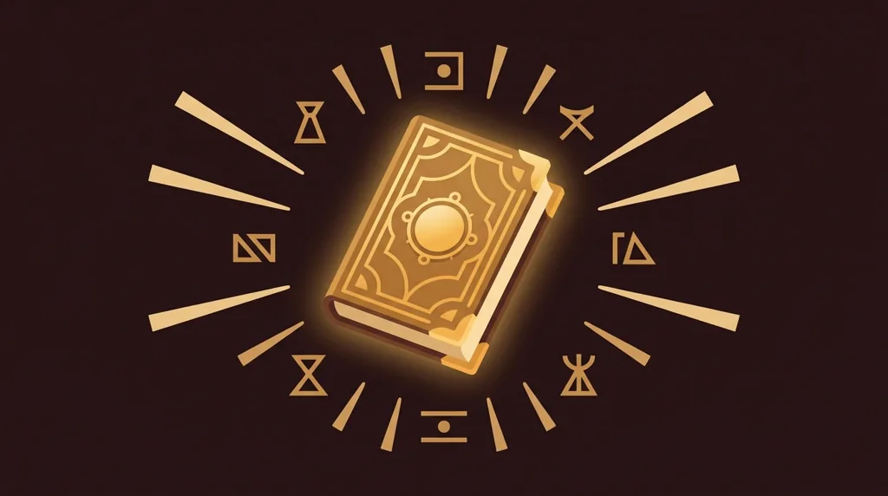
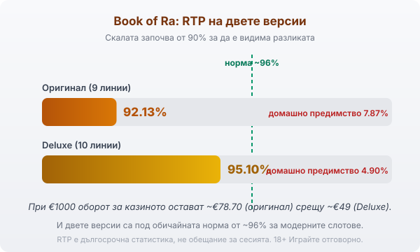

Title tag: Book of Ra: RTP, характеристики и как се играе
Meta description: Book of Ra на Novomatic/Greentube: разширяващият се символ, 10 безплатни игри и RTP под средното — 92.13% при оригинала и 95.10% при Deluxe. Честен поглед върху класиката.

---

# Book of Ra: RTP, характеристики и как се играе

Book of Ra е египетската класика на австрийския производител Novomatic, чиято онлайн версия излиза през Greentube, дигиталното подразделение на компанията. Играта е върху пет барабана и три реда и е родоначалникът на цял жанр слотове с книга. Цялата ѝ механика стъпва на един-единствен трик, който се отключва чак в безплатните игри, а извън него полето е сравнително сухо.

## Разширяващият се символ е цялата игра

Символът книга върши двойна работа: той е и скатер, и заместващ (wild) символ. Три или повече книги на екрана дават 10 безплатни игри, които могат да се презадействат отново по време на бонуса. Преди безплатните игри да започнат, се тегли на случаен принцип един от обикновените символи. През целия бонус този избран символ се разширява върху целия барабан, на който попадне, и плаща на всяка позиция, а не само по линия. Дали бонусът ще донесе нещо голямо, зависи почти изцяло от това кой символ е изтеглен и колко често пада.

## RTP: под средното за модерните слотове

Тук е и основната уговорка. Оригиналният Book of Ra връща 92.13% с 9 линии, което оставя домашно предимство от 7.87%, високо за слот. По-новият Book of Ra Deluxe качва процента до 95.10% с 10 линии, тоест домашно предимство 4.90%. И двете числа са под нормата от около 96%, която е обичайна за съвременните заглавия.

На €1000 оборот разликата се вижда ясно. При Deluxe с 95.10% средно около €49 остават за казиното и €951 се връщат към играча в дългосрочен план. При оригинала с 92.13% сумата за казиното скача до около €78.70 при същия оборот. Когато казиното предлага и двете, [методологията ни](/kak-ocenyavame/) е проста: Deluxe версията връща осезаемо повече, а кое число работи при конкретния оператор се вижда в инфо-панела на играта.

*RTP на двете версии: оригинал 92.13% (домашно предимство 7.87%) и Deluxe 95.10% (домашно предимство 4.90%). При €1000 оборот това са ~€78.70 срещу ~€49 за казиното. И двете са под обичайната норма от ~96%.*

## Волатилност и какво плащат символите

Book of Ra е игра с висока волатилност и в двете версии. На практика балансът често пада бавно през дребни или никакви печалби, докато не дойде добър бонус с щедро разширяващ се символ. Най-скъпият редовен символ, авантюристът, плаща 5,000 пъти залога на линия при пет в редица. Голямите резултати обаче почти винаги минават през безплатните игри, където разширеният символ може да покрие цял барабан наведнъж. Заради това основната игра рядко държи темпото сама и сесията опира до това колко бързо ще паднат три книги.

## Оригинал и Deluxe: кои са разликите

Двете версии са едно и също заглавие в две поколения. Оригиналът има 9 линии и RTP 92.13%. Deluxe добавя десета линия и качва RTP на 95.10%, като запазва същия разширяващ се символ и бонус от 10 игри. Визуално Deluxe е по-изгладен, но истинската разлика за играча е в процента на връщане. Когато операторът предлага и двете, изборът на Deluxe е по-евтиният вариант за същата игра.

## Кой е Novomatic (Greentube)

Novomatic е австрийски производител с дълга история в наземните игрални зали, а Greentube е неговото онлайн подразделение. Много от заглавията, които българските играчи разпознават от игралните зали, идват от тази компания, а Book of Ra е може би най-известното от тях. За разлика от EGT/Amusnet и Pragmatic Play, чиито игри разглеждаме отделно в [слот игрите](/slot-igri/), тук говорим за друг доставчик с различен каталог и различна школа в дизайна.

## Как да го играеш разумно

Ниският RTP и високата волатилност правят Book of Ra игра, в която сухите серии могат да са дълги, а голямото зависи от един бонус, който идва рядко. Преди реални пари демо режимът показва точно това темпо, без да залагаш, и си струва да минеш през него, за да видиш колко често всъщност падат три книги. Задай си лимит за загуба и за време още преди първото завъртане и ги спазвай, особено при заглавие с толкова висока дисперсия. 18+ Хазартът може да пристрасти. Играйте отговорно. Ако усетите, че играта излиза извън контрол, вижте [инструментите за отговорна игра](/otgovorna-igra/).

---

**Георги Тодоров**
Публикувано: 10.09.2026 · Последна редакция: 10.09.2026

*Георги Тодоров тества лицензирани в България казино сайтове от 2024 г. със собствен бюджет и проверява лиценза в публичния регистър на НАП преди регистрация. Пише за Всички Казина за реалната цена на бонусите, скоростта на тегленията и математиката зад игрите.*

**Отговорна игра.** 18+ Хазартът може да пристрасти. Играйте отговорно. Ако усетиш, че играта излиза извън контрол или искаш да я ограничиш, виж [инструментите за отговорна игра](/otgovorna-igra/) и възможността за самоизключване чрез националния регистър на уязвимите лица към НАП (подава се писмено само от засегнатото лице). Национална информационна линия за наркотиците, алкохола и хазарта („Солидарност") 0888 99 18 66, делнични дни 10:00–17:00.

**Разкриване на партньорства.** Всички Казина съдържа партньорски (афилиейт) връзки; когато отвориш оферта през такава връзка, това може да финансира сайта, без да променя цената за теб и без да влияе на оценките ни. От 1 август 2026 г. дейността на афилиейт оператори в България се лицензира съгласно Закона за държавния бюджет за 2026 г. (ДВ, бр. 69 от 31.07.2026 г.). Всички Казина е подало заявление за лиценз пред Националната агенция по приходите и очаква издаването му.
