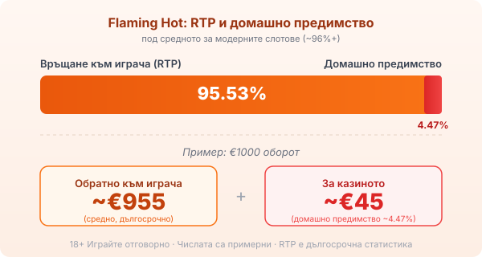

Title tag: Flaming Hot: RTP и характеристики (EGT/Amusnet)
Meta description: Flaming Hot на Amusnet (EGT): 5 барабана, 40 фиксирани линии, RTP 95.53%, wild „7", долар scatter, гембъл и Jackpot Cards. Защо RTP е под средното и защо джакпотът не мени шансовете.

---

# Flaming Hot: RTP и характеристики

Flaming Hot е от плодовите ротативки, с които Amusnet (по-рано EGT) напълни залите и после и онлайн казината. Огнена версия на класическата плодова тема, със същите череши и седмици, само че върху малко по-широк екран. Годината на пускане се цитира по различен начин на различни места, затова няма да я заковаваме; важното е под визията, а там работи конкретна математика, която си струва да прочетете преди първото завъртане.

## Как е устроена играта

Пет барабана, четири реда символи и четиридесет фиксирани линии. Фиксирани значи, че при всяко завъртане залагате и на четиридесетте, без опция да свалите броя им, така че залогът на линия се умножава по четиридесет за общия облог. По барабаните падат плодовете от класическата серия, а два символа се държат по-особено. Седмицата е wild и замества плод, за да затвори линия. Знакът долар е scatter и плаща, независимо къде се появи, без да се съобразява с линиите.

## RTP: числото под огнената визия

Обявеният RTP на Flaming Hot е 95.53%, което оставя домашно предимство от около 4.47%. Върху €1000 оборот това са средно около €955 обратно към играча в дългосрочен план и около €45 за казиното. Тази стойност стои под средното за модерните слотове, които обикновено тръгват от 96% нагоре, и я слагаме на масата честно, защото [начинът, по който оценяваме игрите](/kak-ocenyavame/), гледа RTP като реално число, а не като дребен шрифт. Проверявайте процента в инфо-панела на конкретното казино: един и същ слот понякога върви в няколко версии с различен RTP, а операторът може да е сложил по-ниската.

*RTP 95.53%, домашно предимство ~4.47%: под средното за модерните слотове. Числата са примерни.*

## Гембъл функцията е монета

След печеливша комбинация играта предлага гембъл: познайте цвета на скритата карта, червено или черно, и удвоявате печалбата. Познаете ли пак, удвоявате отново, докъдето ви държи смелостта. Един грешен цвят връща целия натрупан кръг на нула. Шансът при всяко познаване е горе-долу колкото при хвърляне на монета, а няколко поредни удвоявания изглеждат страхотно ровно до първата грешка. Гембълът не пипа домашното предимство на играта; той просто прави колебанията в баланса по-резки.

## Jackpot Cards: прогресивът, който не мени шансовете ти

Освен обикновените печалби по линиите Flaming Hot е включена в Jackpot Cards, прогресивната система на Amusnet. Има четири нива, кръстени на боите карти: спатия, каро, купа и пика, като спатията е най-малка, а пика най-голяма. Системата се задейства на случаен принцип след кое да е завъртане, независимо колко залагате, и ви праща на екран, където обръщате карти, докато съберете едно ниво и печелите неговата сума. Пуловете растат от малка част от залозите на всички играчи в мрежата. Наличието на такъв джакпот често се използва като аргумент „защо да играя точно тук", но то не подобрява шансовете ви в обикновената игра и не сваля домашното предимство. Пренарежда част от парите към един голям и много рядък изход.

## Волатилност и максимална печалба

Волатилността на Flaming Hot обикновено се описва като средна, тоест печалбите идват сравнително равномерно, без дългите сухи серии на високоволатилните слотове и без огромните редки удари. Провайдърът посочва максимум до 1000 пъти залога на линия, което е таван за рядко събитие, не очаквана стойност. За бюджет това означава по-спокойно темпо от агресивните заглавия, но същото под-средно RTP работи върху всяко завъртане.

## Преди да завъртите

Разгледайте [слот игрите](/slot-igri/) в демо режим, ако казиното го предлага, за да усетите темпото без залог, а различните [ротативки](/kazino-igri/rotativki/) сравнявайте по RTP, не по визия. Задайте си лимит за загуба и за време преди първото завъртане и проверете реалния процент в конкретното казино. 18+ Хазартът може да пристрасти. Играйте отговорно. Ако усетите, че играта излиза извън контрол, вижте [инструментите за отговорна игра](/otgovorna-igra/).

---

**Георги Тодоров**
Публикувано: 10.09.2026 · Последна редакция: 10.09.2026

[About Всички Казина boilerplate]

**Отговорна игра.** 18+ Хазартът може да пристрасти. Играйте отговорно. Ако усетиш, че играта излиза извън контрол или искаш да я ограничиш, виж [инструментите за отговорна игра](/otgovorna-igra/) и възможността за самоизключване чрез националния регистър на уязвимите лица към НАП (подава се писмено само от засегнатото лице). Национална информационна линия за наркотиците, алкохола и хазарта („Солидарност") 0888 99 18 66, делнични дни 10:00–17:00.

**Разкриване на партньорства.** Всички Казина съдържа партньорски (афилиейт) връзки; когато отвориш оферта през такава връзка, това може да финансира сайта, без да променя цената за теб и без да влияе на оценките ни. От 1 август 2026 г. дейността на афилиейт оператори в България се лицензира съгласно Закона за държавния бюджет за 2026 г. (ДВ, бр. 69 от 31.07.2026 г.). Всички Казина е подало заявление за лиценз пред Националната агенция по приходите и очаква издаването му.
