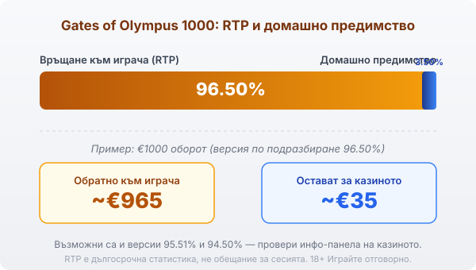
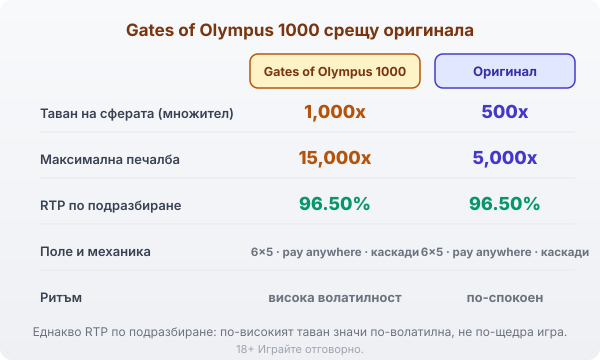

Title tag: Gates of Olympus 1000: какво променя версията 1000
Meta description: Gates of Olympus 1000 качва тавана на множителите на Зевс от 500x на 1,000x и максимума от 5,000x на 15,000x. Домашното предимство остава 96.50% — защо това е по-волатилна, а не по-щедра игра.

---

# Gates of Olympus 1000: какво променя версията 1000

Gates of Olympus 1000 е версия на Pragmatic Play от 2024 г. върху същото поле 6×5, което познаваш от оригиналния Gates of Olympus. Двигателят е идентичен: няма линии, плаща се при 8 или повече еднакви символа където и да е по екрана, а печелившите изчезват и отгоре падат нови. Числото 1000 сочи новия таван на множителите, който тази версия качва над стария.

## Множителите на Зевс: 1,000× вместо 500×

По време на игра Зевс пуска случайни сфери с множител. В оригинала най-високата възможна стойност на една сфера е 500×. Тук таванът се вдига до 1,000×. Механизмът е същият: сферите падат случайно, а когато завъртането е печелившо, стойностите им се събират и се прилагат върху печалбата. В безплатните завъртания събраните множители се трупат през целия рунд, затова по-едрите печалби идват почти изцяло в бонуса.

## Как се печели: pay anywhere и каскади

Позицията няма значение. Достатъчно е на екрана да се съберат 8 или повече еднакви символа, за да платят, без значение къде са попаднали. След всяка печалба символите се махат, останалите падат надолу и отгоре идват нови, което може да върже няколко печалби от едно завъртане. Безплатните завъртания се задействат от 4 или повече символа скатер със Зевс. Парите за каскадите вече са част от RTP-то; каскадата само ги разпределя на порции.

## RTP: същото домашно предимство като оригинала

Версията по подразбиране на Gates of Olympus 1000 връща 96.50%, точно колкото и оригиналът. По-високият таван не пипа този процент. Операторът обаче може да зареди и по-нисък билд: освен 96.50% съществуват версии от 95.51% и 94.50%, а кое число работи при конкретното казино се вижда в инфо-панела на играта.

При 96.50% домашното предимство е 3.50%: на €1000 оборот това са средно около €35 за казиното и €965 обратно към играча в дългосрочен план. При най-ниската версия сумата за казиното при същия оборот почти се удвоява. Затова в [методологията ни](/kak-ocenyavame/) гледаме реалния RTP на конкретния оператор, а не рекламния.

*Обявен RTP по подразбиране 96.50% (домашно предимство 3.50%): при €1000 оборот средно ~€965 се връщат на играча, ~€35 остават за казиното. Възможни са и версии 95.51% и 94.50% — провери инфо-панела.*

## Таванът 15,000× и високата волатилност

Максималната печалба тук е 15,000 пъти залога, три пъти повече от 5,000× на оригинала. При €1 залог това са €15,000. Такъв резултат изисква множителите в бонуса да се струпат почти идеално, което се случва изключително рядко. Честотата на печелившите завъртания е около 28.57%, тоест по-малко от едно на три завъртания връща нещо, а между тях идват дълги сухи серии. Волатилността е висока: балансът често пада бавно, а голямото идва рядко и почти винаги в безплатните завъртания. По-високият таван удължава разстоянието до върха, без да мести домашното предимство.

## Gates of Olympus 1000 срещу оригинала

Двете игри споделят полето 6×5, механиката pay anywhere и каскадите, така че се играят почти еднакво. Разликите са в две числа: таванът на сферата е 1,000× вместо 500×, а максимумът е 15,000× вместо 5,000×. RTP-то по подразбиране е едно и също, 96.50%, затова изборът е въпрос на темперамент, не на очаквано връщане. Ако предпочиташ по-кратко разстояние между добрите завъртания, оригиналният [Gates of Olympus](/slot-igri/) остава по-спокойната версия; 1000 е за играч, който съзнателно търси рядкото голямо завъртане.

*Gates of Olympus 1000 срещу оригиналния Gates of Olympus: същата основа 6×5 (pay anywhere, каскади) и същото RTP по подразбиране 96.50%, но по-висок таван на сферата (1,000x срещу 500x) и максимум (15,000x срещу 5,000x).*

## Как да го играеш разумно

Каскадите и падащите сфери правят Gates of Olympus 1000 бърза игра, а струпаните на екрана множители създават усещане за близка голяма печалба. Всяко следващо завъртане обаче тръгва от същата математика, колкото и близо да изглежда бонусът. Преди реални пари [слот игрите](/slot-igri/) обикновено имат демо режим, в който да усетиш колко рядко идва плътният рунд със сфери, без да залагаш. Задай си лимит за загуба и за време още преди първото завъртане и ги спазвай. 18+ Хазартът може да пристрасти. Играйте отговорно. Ако усетите, че играта излиза извън контрол, вижте [инструментите за отговорна игра](/otgovorna-igra/).

---

**Георги Тодоров**
Публикувано: 10.09.2026 · Последна редакция: 10.09.2026

*Георги Тодоров тества лицензирани в България казино сайтове от 2024 г. със собствен бюджет и проверява лиценза в публичния регистър на НАП преди регистрация. Пише за Всички Казина за реалната цена на бонусите, скоростта на тегленията и математиката зад игрите.*

**Отговорна игра.** 18+ Хазартът може да пристрасти. Играйте отговорно. Ако усетиш, че играта излиза извън контрол или искаш да я ограничиш, виж [инструментите за отговорна игра](/otgovorna-igra/) и възможността за самоизключване чрез националния регистър на уязвимите лица към НАП (подава се писмено само от засегнатото лице). Национална информационна линия за наркотиците, алкохола и хазарта („Солидарност") 0888 99 18 66, делнични дни 10:00–17:00.

**Разкриване на партньорства.** Всички Казина съдържа партньорски (афилиейт) връзки; когато отвориш оферта през такава връзка, това може да финансира сайта, без да променя цената за теб и без да влияе на оценките ни. От 1 август 2026 г. дейността на афилиейт оператори в България се лицензира съгласно Закона за държавния бюджет за 2026 г. (ДВ, бр. 69 от 31.07.2026 г.). Всички Казина е подало заявление за лиценз пред Националната агенция по приходите и очаква издаването му.
