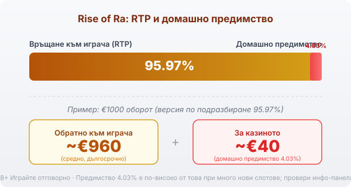

Title tag: Rise of Ra: RTP, характеристики и Jackpot Cards
Meta description: Как работи Rise of Ra на EGT/Amusnet: 5 барабана, 15 линии, утроени печалби в безплатните завъртания и мистичният джакпот Jackpot Cards. Защо RTP 95.97% носи по-високо предимство и какво реално е прогресивният джакпот.

---

# Rise of Ra: RTP, характеристики и Jackpot Cards

Rise of Ra е класически слот на EGT (днес Amusnet) от 2014 г. с египетска тема, който и до днес стои в много зали. Върху 5 барабана и 15 линии се редят скарабеи, саркофази, вази и фараони, а над барабаните виси нещо, което няма общо със самата игра: четирите символа на прогресивния джакпот Jackpot Cards.

## Основата: 5 барабана, 15 линии и скарабеят

Печалбите се четат по 15 фиксирани линии отляво надясно, като по-скъпите символи са фараонът и другите египетски образи, а картовите знаци носят по-малко. Най-ценният символ е златният скарабей. Той е wild и заменя всички останали освен скатера, а когато в една печалба участва повече от един скарабей, тя се удвоява. Скатерът пък не се нуждае от линия: достатъчно е да падне на достатъчно места по екрана.

## Безплатните завъртания утрояват печалбите

Три или повече скатера отключват 15 безплатни завъртания. Докато траят, всяка спечелена сума се умножава по три. Същите комбинации, които в основната игра дават скромно, тук плащат тройно, което превръща бонуса в основния потенциал на играта. Умножението важи само за завъртанията в бонуса, не и след него.

## Jackpot Cards: какво всъщност е прогресивният джакпот

Четирите символа отгоре са отделна игра, наречена Jackpot Cards, и тя не е част от самите барабани. Джакпотът е мистичен: включва се на случаен принцип след завъртане, без значение колко залагаш или дали печелиш в момента. Когато се задейства, избираш от 12 обърнати карти, докато откриеш три от една боя, и печелиш джакпота за тази боя. Спатиите носят най-малкия, а пиките най-големия. Този джакпот се пълни от малка част от залозите на всички играчи и се дава на случаен принцип, така че не подобрява шансовете ти в основната игра и не е стратегия. Той е допълнителен слой отгоре, а не начин да надвиеш математиката на слота.

## RTP: обявеното число и реалното

Обявеният RTP на Rise of Ra е 95.97%, което оставя домашно предимство от 4.03%. При €1000 оборот това означава средно връщане от порядъка на €960 в дългосрочен план и около €40 за казиното, разпределени върху много завъртания. Това предимство е чувствително по-високо от онова при доста нови слотове, където числото често започва с 96 нагоре, така че разликата се усеща при по-дълга игра. Както при други заглавия, играта може да се лицензира в повече от една RTP версия и операторът избира коя да зареди. В [методологията ни](/kak-ocenyavame/) гледаме реалния RTP, а не рекламния, затова отвори инфо-панела на конкретното казино и провери кое число работи там.

*Обявен RTP 95.97% (версия по подразбиране): при €1000 оборот средно ~€960 се връщат на играча, ~€40 остават за казиното. Домашното предимство 4.03% е по-високо от това при много нови слотове.*

## Gamble функцията: удвояване или нула

След печалба под определен размер играта предлага хазарт с карта. Появява се обърната карта и трябва да познаеш цвета ѝ, за да удвоиш сумата; сгрешиш ли, губиш цялата печалба от завъртането. Функцията е достъпна за печалби под 10 500 монети и по същество е монета на две страни без никакво предимство за теб. Всеки натиск рискува вече спечеленото срещу равен шанс.

## Волатилност и как да го играеш разумно

Rise of Ra е със средна до висока волатилност: печалбите не идват съвсем равномерно, но и не са толкова резки, колкото при най-острите модерни слотове. Преди реални пари [слот игрите](/slot-igri/) обикновено имат демо режим, в който да усетиш ритъма и да видиш колко рядко идват тройните бонуси, без да залагаш. Задай си лимит за загуба и за време преди първото завъртане и го спазвай. 18+ Хазартът може да пристрасти. Играйте отговорно. Ако усетите, че играта излиза извън контрол, вижте [инструментите за отговорна игра](/otgovorna-igra/).

## Класика с по-висока цена

Rise of Ra е от заглавията, които оцеляват с проста игра и обещанието за мистичен джакпот отгоре. Дългосрочно обаче домашното предимство от 4.03% е по-високо от това при много по-нови слотове, и това число тежи повече от темата, ако играеш често. Провери на инфо-панела кой RTP е зареден и залагай със сума, която можеш да загубиш изцяло.

---

**Георги Тодоров**
Публикувано: 10.09.2026 · Последна редакция: 10.09.2026

[About Всички Казина boilerplate]

**Отговорна игра.** 18+ Хазартът може да пристрасти. Играйте отговорно. Ако усетиш, че играта излиза извън контрол или искаш да я ограничиш, виж [инструментите за отговорна игра](/otgovorna-igra/) и възможността за самоизключване чрез националния регистър на уязвимите лица към НАП (подава се писмено само от засегнатото лице). Национална информационна линия за наркотиците, алкохола и хазарта („Солидарност") 0888 99 18 66, делнични дни 10:00–17:00.

**Разкриване на партньорства.** Всички Казина съдържа партньорски (афилиейт) връзки; когато отвориш оферта през такава връзка, това може да финансира сайта, без да променя цената за теб и без да влияе на оценките ни. От 1 август 2026 г. дейността на афилиейт оператори в България се лицензира съгласно Закона за държавния бюджет за 2026 г. (ДВ, бр. 69 от 31.07.2026 г.). Всички Казина е подало заявление за лиценз пред Националната агенция по приходите и очаква издаването му.
