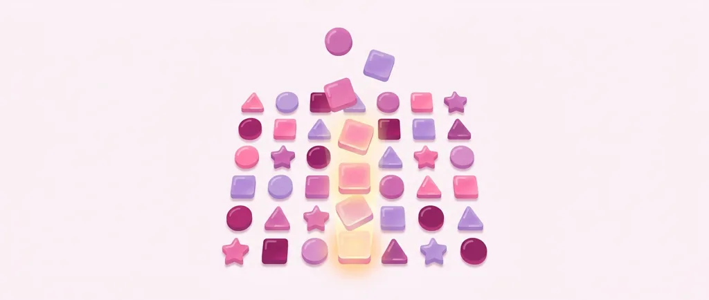
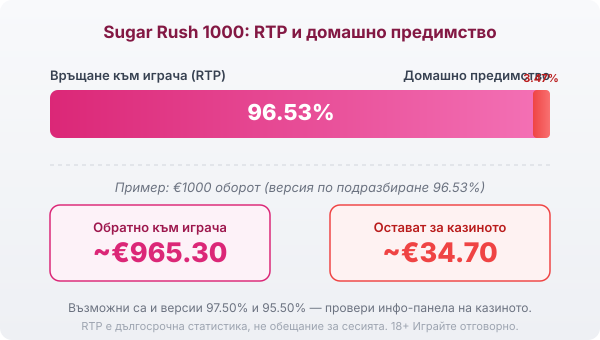
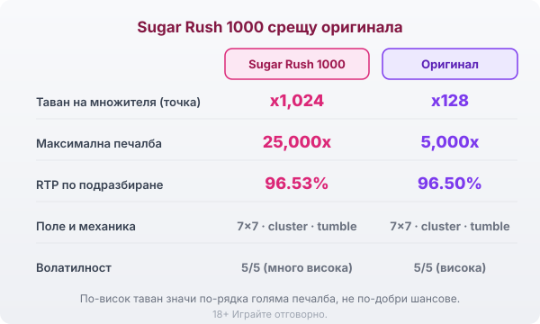

Title tag: Sugar Rush 1000: какво променя версията 1000
Meta description: Sugar Rush 1000 качва тавана на точките от x128 на x1,024 и максимума от 5,000x на 25,000x. Защо това значи повече волатилност, а не по-добри шансове, и кой RTP реално получаваш.

---

# Sugar Rush 1000: какво променя версията 1000

Sugar Rush 1000 е версия на Pragmatic Play от 2024 г. върху същия квадрат 7×7 с бонбони, който познаваш от оригиналния Sugar Rush. Механиката е една и съща: няма линии, печели се на групи от допрели се символи, а печелившите падат и отгоре идват нови. Числото 1000 в името сочи по-високия таван на печалбата, който тази версия добавя върху познатата основа.

## x1,024 вместо x128: същинската разлика

Единственото, което наистина отличава тази версия, са множителите по клетките. Когато на дадено място се спечели повторно, върху него се появява множител x2, а всяка следваща печалба на същата клетка го удвоява. В оригинала таванът на едно такова петно е x128. Тук се качва до x1,024, тоест същият механизъм може да стигне осем пъти по-нагоре, преди да опре в границата си. Клетките и стойностите им не се нулират до края на бонуса, затова плътно завъртане в безплатните игри може да натрупа няколко високи множителя наведнъж върху едно поле.

## Безплатните завъртания идват на порции

Скатерът е символ близалка и броят му в едно tumble подреждане решава колко завъртания получаваш. Три близалки отварят 10 завъртания, а всяка следваща качва наградата нагоре до 30 при седем: междинните стъпки са 12, 15 и 20. Множителите остават активни през целия бонус, докато в базовата игра се изчистват на всяко ново завъртане. Заради това по-едрите печалби на Sugar Rush 1000 се падат почти само в безплатните завъртания, а обикновеното завъртане и попадналият бонус са две различни игри по размер на възможната печалба.

## RTP: рекламните 97.50% и това, което обикновено получаваш

Sugar Rush 1000 се предлага в няколко конфигурации на RTP. Най-високата сертифицирана версия връща 97.50%, но операторът може да зареди и по-ниска: често посочваната стойност по подразбиране е 96.53%, а съществува и билд от 95.50%. Едно и също заглавие при две казина може да ти връща различен процент, а рекламираните 97.50% рядко са това, което сядаш да играеш.

При версия 96.53% домашното предимство е 3.47%: на €1000 оборот това са средно около €34.70 за казиното и €965.30 обратно към играча в дългосрочен план. При билда от 95.50% сумата за казиното при същия оборот почти се удвоява. Затова в [методологията ни](/kak-ocenyavame/) гледаме реалния RTP на конкретния оператор, не рекламния, и преди първия залог си струва да отвориш инфо-панела и да провериш коя версия работи там.

*Обявен RTP по подразбиране 96.53% (домашно предимство 3.47%): при €1000 оборот средно ~€965.30 се връщат на играча, ~€34.70 остават за казиното. Възможни са и версии 97.50% и 95.50% — провери инфо-панела.*

## Таванът 25,000× и колко рядко идва

Максималната печалба тук е 25,000 пъти залога, пет пъти повече от 5,000× на оригинала. При €1 залог това са €25,000. Върхът обаче се удря изключително рядко: вероятността за максималната печалба е около едно на 12,800,000 завъртания. Волатилността е пет от пет по вътрешната скала, най-високата възможна. На практика балансът често пада бавно през дребни или никакви печалби, а голямото идва рядко и почти винаги в бонуса. По-големият таван не подобрява шансовете ти; той просто увеличава разстоянието между добрите завъртания.

## Sugar Rush 1000 срещу оригинала

Двете игри стъпват на едно и също поле 7×7 с cluster pays и tumble, така че усещането от играта е близко. Разликите са в числата: таванът на точката e x1,024 вместо x128, максимумът е 25,000× вместо 5,000×, а версията по подразбиране връща 96.53% вместо 96.50%. Ако предпочиташ по-спокоен ритъм със същата механика, оригиналният [Sugar Rush](/slot-igri/) остава по-меката версия; 1000 е за играч, който съзнателно гони рядкото голямо завъртане и е готов да плати за това с търпение.

*Sugar Rush 1000 срещу оригиналния Sugar Rush: същата основа 7×7 (cluster pays, tumble), но по-висок таван на точката (1,024x срещу 128x) и максимум (25,000x срещу 5,000x); RTP по подразбиране 96.53% срещу 96.50%.*

## Как да го играеш разумно

Каскадите и растящите множители правят Sugar Rush 1000 бърза игра с високо темпо, а натрупаните на екрана числа създават усещане за близка голяма печалба. Всяко следващо завъртане обаче тръгва от същата математика, независимо колко пълна изглежда мрежата. Преди реални пари [слот игрите](/slot-igri/) обикновено имат демо режим, в който да усетиш колко рядко идва плътният бонус, без да залагаш. Задай си лимит за загуба и за време още преди първото завъртане и ги спазвай. 18+ Хазартът може да пристрасти. Играйте отговорно. Ако усетите, че играта излиза извън контрол, вижте [инструментите за отговорна игра](/otgovorna-igra/).

---

**Георги Тодоров**
Публикувано: 10.09.2026 · Последна редакция: 10.09.2026

*Георги Тодоров тества лицензирани в България казино сайтове от 2024 г. със собствен бюджет и проверява лиценза в публичния регистър на НАП преди регистрация. Пише за Всички Казина за реалната цена на бонусите, скоростта на тегленията и математиката зад игрите.*

**Отговорна игра.** 18+ Хазартът може да пристрасти. Играйте отговорно. Ако усетиш, че играта излиза извън контрол или искаш да я ограничиш, виж [инструментите за отговорна игра](/otgovorna-igra/) и възможността за самоизключване чрез националния регистър на уязвимите лица към НАП (подава се писмено само от засегнатото лице). Национална информационна линия за наркотиците, алкохола и хазарта („Солидарност") 0888 99 18 66, делнични дни 10:00–17:00.

**Разкриване на партньорства.** Всички Казина съдържа партньорски (афилиейт) връзки; когато отвориш оферта през такава връзка, това може да финансира сайта, без да променя цената за теб и без да влияе на оценките ни. От 1 август 2026 г. дейността на афилиейт оператори в България се лицензира съгласно Закона за държавния бюджет за 2026 г. (ДВ, бр. 69 от 31.07.2026 г.). Всички Казина е подало заявление за лиценз пред Националната агенция по приходите и очаква издаването му.
