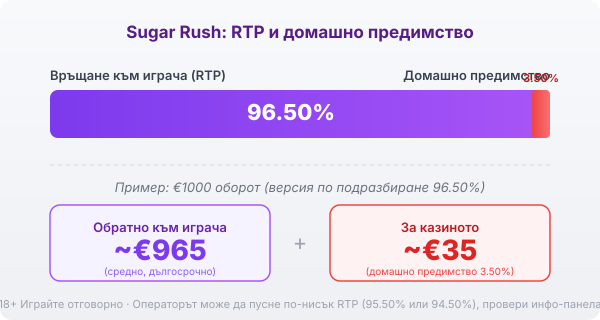

Title tag: Sugar Rush: RTP, волатилност и как се играе
Meta description: Как работи Sugar Rush на Pragmatic Play: мрежа 7×7, cluster pays, tumble, точки с множители до 128x и безплатни завъртания. Защо RTP 96.50% се проверява и защо таванът 5000x е рядкост.

---

# Sugar Rush: RTP, волатилност и как се играе

Sugar Rush е слот на Pragmatic Play от 2022 г. върху квадрат от 7 колони и 7 реда, отрупан с желирани бонбони. На пръв поглед прилича на игра за деца, но под захарта стои механика, която мнозина срещат за пръв път: тук няма линии на печалба. Печелиш, когато достатъчно еднакви символа се допрат някъде на мрежата, а не когато легнат в редица. Заради това още първото завъртане се гледа по друг начин.

## Как се печели на мрежа 7×7

Групите се броят по допир, не по линия. Ако 5 или повече еднакви символа се докосват хоризонтално или вертикално, групата плаща. Няма значение в кой ъгъл са. Колкото по-голяма е групата, толкова повече носи символът, а при поле от 49 клетки често се засичат по няколко групи в едно завъртане. Свикваш да търсиш цветни петна, вместо да следиш пътечки.

## Tumble: едно завъртане, няколко печалби

Печелившите символи не остават. След като платят, изчезват и отгоре падат нови на тяхно място. Ако новите оформят следваща група, и тя плаща, а падането се повтаря. Каскадата, наречена tumble, спира чак когато дойде подреждане без печалба. Едно завъртане така може да върже няколко печалби подред. Парите за тези вериги вече са част от RTP-то на играта, tumble само ги разпределя на порции, не добавя нищо отгоре.

## Точките с множители са сърцето на бонуса

Тук е истинската разлика на Sugar Rush. Когато печеливш символ напусне някоя клетка, клетката остава маркирана. Спечели ли се втори път на същото място, върху него се ражда множител x2. Всяка следваща печалба на тази клетка удвоява множителя нагоре: 2x, 4x, 8x и така до таван от 128x. Важното е, че маркираните клетки и множителите им не се нулират до края на бонуса, а се трупат завъртане след завъртане. В обикновената игра тези точки се изчистват на всяко ново завъртане, затова големите множители живеят почти само в безплатните завъртания.

## Безплатните завъртания идват на порции

Скатерът е символ близалка. Броят му в едно tumble подреждане решава колко завъртания получаваш: 3 близалки дават 10 завъртания, 4 дават 12, 5 дават 15, 6 дават 20, а 7 близалки дават 30. По време на бонуса маркираните точки и множителите остават, така че колкото по-дълго върви, толкова по-плътна става мрежата от множители. Точно затова обикновеното завъртане и попадналият бонус са две различни игри по размер на печалбата, и е лесно да гониш втория по-дълго, отколкото си планирал.

## RTP: обявеното число и реалното

Обявеният RTP на Sugar Rush е 96.50%, което оставя домашно предимство от 3.50%. При €1000 оборот това значи средно връщане от порядъка на €965 в дългосрочен план и около €35 за казиното, разсипани върху много завъртания. Pragmatic Play обаче предлага играта в няколко версии: освен 96.50% съществуват конфигурации от 95.50% и 94.50%, а операторът избира коя да зареди. Едно и също заглавие при две казина може да ти връща различен процент. Заради това в [методологията ни](/kak-ocenyavame/) гледаме реалния RTP, а не рекламния, и преди да заложиш си струва да отвориш инфо-панела на конкретното казино и да провериш кое число работи там.

*Обявен RTP 96.50% (версия по подразбиране): при €1000 оборот средно ~€965 се връщат на играча, ~€35 остават за казиното. Възможни са и версии 95.50% и 94.50%, затова провери инфо-панела.*

## Висока волатилност и таванът от 5000x

Sugar Rush е игра с висока волатилност, пет от пет по вътрешната скала. На практика балансът често пада бавно през дребни или никакви печалби, а голямото идва рядко и обикновено в бонуса, когато множителите се струпат. Максималната печалба е 5000 пъти залога, но вероятността ѝ е около едно на 2.34 милиона завъртания. При €1 залог 5000x са €5000, само че шансът е толкова малък, че не бива да влиза в никаква сметка за бюджет. Гледай на този таван като на рядкост, не като на цел.

## Как да го играеш разумно

Каскадите и растящите множители правят Sugar Rush бърза игра, в която едно завъртане вика следващото. Преди реални пари [слот игрите](/slot-igri/) обикновено имат демо режим, в който да усетиш темпото и да видиш колко рядко идва плътният бонус, без да залагаш. Задай си лимит за загуба и за време още преди първото завъртане и го спазвай, дори когато мрежата се е напълнила с множители и ти се струва, че големият удар е на косъм. 18+ Хазартът може да пристрасти. Играйте отговорно. Ако усетите, че играта излиза извън контрол, вижте [инструментите за отговорна игра](/otgovorna-igra/).

## Накратко

Sugar Rush дължи популярността си на механика, която се разбира бързо и предлага моменти на истинско напрежение в бонуса. Зад тях стоят високо домашно предимство, висока волатилност и RTP, който операторът може да свали под обявеното число. Провери реалния процент на инфо-панела, приеми 5000x като рядкост и залагай със сума, която можеш да загубиш изцяло.

---

**Георги Тодоров**
Публикувано: 10.09.2026 · Последна редакция: 10.09.2026

[About Всички Казина boilerplate]

**Отговорна игра.** 18+ Хазартът може да пристрасти. Играйте отговорно. Ако усетиш, че играта излиза извън контрол или искаш да я ограничиш, виж [инструментите за отговорна игра](/otgovorna-igra/) и възможността за самоизключване чрез националния регистър на уязвимите лица към НАП (подава се писмено само от засегнатото лице). Национална информационна линия за наркотиците, алкохола и хазарта („Солидарност") 0888 99 18 66, делнични дни 10:00–17:00.

**Разкриване на партньорства.** Всички Казина съдържа партньорски (афилиейт) връзки; когато отвориш оферта през такава връзка, това може да финансира сайта, без да променя цената за теб и без да влияе на оценките ни. От 1 август 2026 г. дейността на афилиейт оператори в България се лицензира съгласно Закона за държавния бюджет за 2026 г. (ДВ, бр. 69 от 31.07.2026 г.). Всички Казина е подало заявление за лиценз пред Националната агенция по приходите и очаква издаването му.
