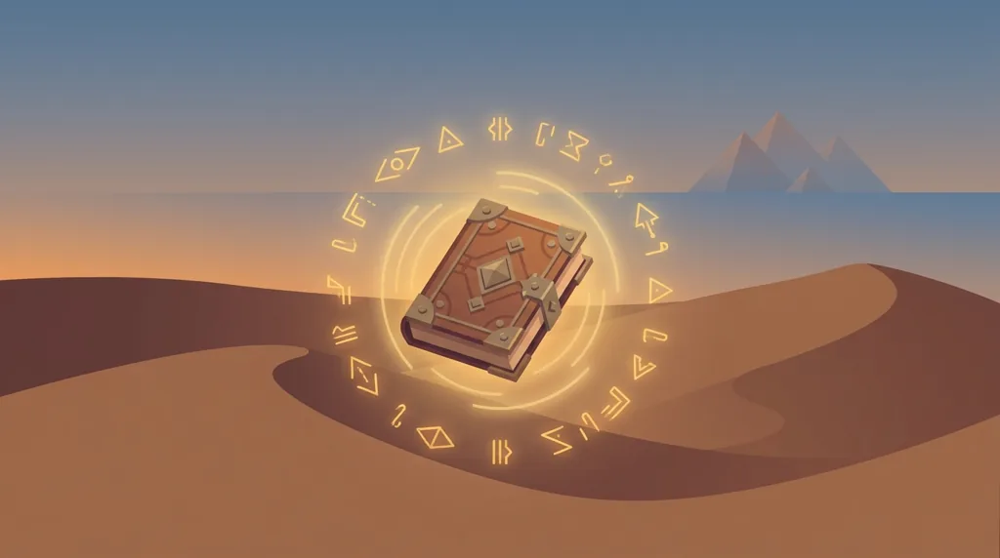
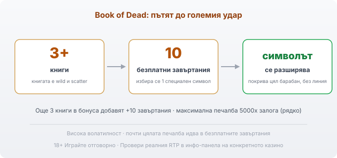

Title tag: Book of Dead: RTP, характеристики и как се играе
Meta description: Как работи Book of Dead на Play'n GO: разширяващ се символ в 10-те безплатни завъртания, RTP 96.21% в няколко версии, висока волатилност и максимум 5000x. Защо да провериш процента.

---

# Book of Dead: RTP, характеристики и как се играе

Book of Dead е слотът, който направи Play'n GO разпознаваема, и вероятно първото заглавие, което ти хрумва, щом стане дума за египетски ротативки. Излиза през 2016 г. и оттогава седи в почти всяко българско онлайн казино. Отдолу е класическа схема: пет барабана, три реда, десет линии и една книга, която движи цялата игра.

## Египет и Rich Wilde

Темата е позната: гробници, йероглифи и авантюристът Rich Wilde, който Play'n GO развива в цяла поредица. Високите символи са самият Rich Wilde, фараонът, Анубис и Хор, а ниските са картите от 10 до асо. Играта се върти на пет барабана и три реда с десет линии, чийто брой можеш да намалиш, но повечето играят с всичките. Визията е ретро, а темпото зависи изцяло от това дали удариш безплатните завъртания.

## Книгата е и wild, и scatter

Символът с книгата върши две неща наведнъж. Като wild замества всеки друг символ, за да допълни комбинация по линия. Като scatter плаща, където и да падне на екрана, и отваря бонуса. Тъкмо това двойно поведение прави книгата най-ценния символ: тя едновременно ти помага да завършиш печалба сега и е ключът към режима, в който се случват големите удари.

## Безплатните завъртания и разширяващият се символ

Три или повече книги на екрана дават 10 безплатни завъртания. Преди да започнат, играта избира на случаен принцип един обикновен символ и го прави специален за целия бонус. Ако този символ се появи по време на завъртанията, той се разширява и покрива целия барабан, на който е паднал, и плаща все едно стои на съседни позиции, без значение дали е на линия. Ако се падне високоплатен символ, например Rich Wilde, един добър екран може да върне стотици пъти залога. Ако е ниска карта, същите завъртания минават кротко. Бонусът се презарежда, когато вътре в него отново паднат три книги, което добавя още 10 завъртания. Тук е и почти цялата печалбоносна тежест на играта.

*Пътят до големия удар: 3+ книги → 10 безплатни завъртания → един случаен символ се разширява на цял барабан. Три книги вътре в бонуса добавят още 10 завъртания.*

## RTP: провери коя версия въртиш

Обявеният RTP на Book of Dead по подразбиране е 96.21%, което оставя домашно предимство от около 3.79%. Play'n GO обаче доставя играта в няколко конфигурации и операторът избира коя да пусне: освен 96.21% съществуват версии с 94.25%, 91.25%, 87.25% и чак 84.18%. Разликата е огромна. При най-ниската версия предимството на казиното е около четири пъти по-голямо, отколкото при най-високата. Затова в [методологията ни](/kak-ocenyavame/) гледаме реалния RTP на конкретното казино, а не рекламния. Отвори инфо-панела на играта и виж кой процент работи там, преди да заложиш; ако е далеч под 96%, потърси казино с по-добрата версия.

## Висока волатилност и максимумът от 5000x

Book of Dead е игра с висока волатилност. На практика балансът пада бавно през дълги серии дребни или никакви печалби, а рядкият голям удар идва почти винаги в безплатните завъртания, когато разширяващият се символ легне удачно. Максималната печалба е 5000 пъти залога. При €1 залог това са €5000, но е екстремно рядко събитие, не разумно очакване, и не бива да влиза в никаква сметка за бюджет. Ако волатилността не ти понася, ниската честота на печалбите ще личи бързо в демо режима.

## Гембъл: удвои или загуби

След печеливш кръг играта предлага гембъл: показва обърната карта и трябва да познаеш цвета ѝ, за да удвоиш сумата, или боята, за да я умножиш по четири. Сгрешиш ли, губиш печалбата от кръга. Това е чист късмет, който не мени RTP-то на играта; само добавя резки колебания в банката. Ако търсиш по-спокойно темпо, пропускай го и прибирай печалбата.

## Преди да завъртиш

[Слот игрите](/slot-igri/) на Play'n GO обикновено имат демо режим, в който да усетиш темпото и колко рядко идва бонусът, без да залагаш; за самата марка виж профила на [Play'n GO](/blog/playn-go-provajdar/), а различните [ротативки](/kazino-igri/rotativki/) се сравняват най-честно по реалния им RTP. Задай си лимит за загуба и за време преди първото завъртане и го спазвай, дори когато книгите са на екрана и бонусът изглежда на косъм. 18+ Хазартът може да пристрасти. Играйте отговорно. Ако усетите, че играта излиза извън контрол, вижте [инструментите за отговорна игра](/otgovorna-igra/).

---

**Георги Тодоров**
Публикувано: 11.09.2026 · Последна редакция: 11.09.2026

[About Всички Казина boilerplate]

**Отговорна игра.** 18+ Хазартът може да пристрасти. Играйте отговорно. Ако усетиш, че играта излиза извън контрол или искаш да я ограничиш, виж [инструментите за отговорна игра](/otgovorna-igra/) и възможността за самоизключване чрез националния регистър на уязвимите лица към НАП (подава се писмено само от засегнатото лице). Национална информационна линия за наркотиците, алкохола и хазарта („Солидарност") 0888 99 18 66, делнични дни 10:00–17:00.

**Разкриване на партньорства.** Всички Казина съдържа партньорски (афилиейт) връзки; когато отвориш оферта през такава връзка, това може да финансира сайта, без да променя цената за теб и без да влияе на оценките ни. От 1 август 2026 г. дейността на афилиейт оператори в България се лицензира съгласно Закона за държавния бюджет за 2026 г. (ДВ, бр. 69 от 31.07.2026 г.). Всички Казина е подало заявление за лиценз пред Националната агенция по приходите и очаква издаването му.
