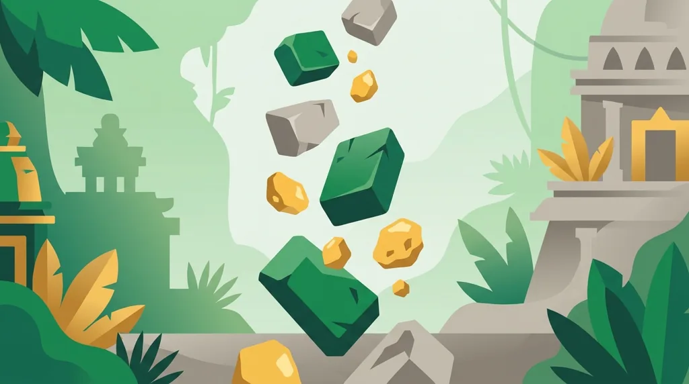
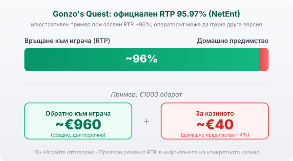

Title tag: Gonzo's Quest: RTP, Avalanche механика и как се играе
Meta description: Gonzo's Quest на NetEnt с RTP 95.97%, каскади (Avalanche) и растящ множител до 15х в бонуса. Как работят падащите блокове и какво да очакваш реалистично.

---

# Gonzo's Quest: RTP, Avalanche механика и как се играе

Gonzo's Quest излиза през 2010 г. и е играта, която направи каскадите нещо обичайно в слотовете. Вместо въртящи се барабани тук блокове падат отгоре, а идеята се оказа толкова сполучлива, че NetEnt по-късно я кръсти Avalanche и я преповтори в десетки заглавия. Темата е конкистадор, тръгнал за Ел Дорадо, но истинската причина играта да остане популярна е механиката.

## Avalanche: падащи блокове вместо въртящи барабани

При всяко завъртане каменни блокове със символи се подреждат на поле 5 на 3 с 20 линии. Съберат ли се достатъчно еднакви на линия, печелившите блокове се пръсват и на тяхно място падат нови отгоре. Ако новите също образуват комбинация, процесът се повтаря в рамките на същото завъртане. Една сполучлива подредба понякога дава три или четири последователни печалби, преди лавината да спре.

## Множителят, който расте

Тук е тръпката на играта. Всяка поредна лавина в едно завъртане вдига множителя с едно стъпало, до 5 пъти в основната игра. Щом лавините спрат без нова печалба, множителят се нулира и следващото завъртане тръгва отначало. Затова дългата верига е ценна не само заради самите печалби, а защото качва множителя, докато още трупаш. В бонуса таванът е по-висок и стига до 15 пъти.

## Free Fall бонусът

Три символа Free Fall на екрана отключват 10 безплатни завъртания, в които множителят се качва по-агресивно и достига въпросните 15 пъти. Ако по време на бонуса паднат още Free Fall символи, той се презадейства и получаваш допълнителни завъртания. Тук се случват по-едрите резултати в играта, защото високият множител се съчетава с веригите от лавини. Стигането до бонуса обаче зависи от късмета в конкретните завъртания, не от натрупано право.

## RTP и волатилност

Обявеният RTP на Gonzo's Quest е 95.97% по данни на NetEnt, което е малко под средните за индустрията около 96%. Волатилността е средна, така че играта не е нито от най-спокойните, нито от най-резките: има сухи серии, но и завъртания, в които лавините се навържат. Много заглавия се доставят в няколко RTP версии и операторът избира коя да пусне, затова в [методологията ни](/kak-ocenyavame/) гледаме реалния RTP на конкретното казино, а не рекламния. При обявен RTP около 96% и €1000 оборот средно се връщат около €960 в дългосрочен план, а към €40 остават за казиното.

*Илюстративен пример при обявен RTP ~96%: €1000 оборот връща средно ~€960, ~€40 остават за казиното. Официалният RTP на Gonzo's Quest е 95.97%, но операторът може да пусне друга версия, затова се проверява в инфо-панела.*

## Какво да очакваш реалистично

Растящият множител създава усещане, че печалбите се трупат сами, но той се нулира в мига, в който една лавина спре без комбинация, и това се случва често. Максималната печалба стига до 2 200 пъти залога по данни на NetEnt, което е прилично, но се случва рядко и почти винаги минава през бонуса. Средната волатилност значи, че балансът ти ще се люлее: ще има завъртания на нула и такива, които наведнъж връщат част от загубеното. Играй я заради механиката и темпото, а не защото очакваш точно бонусът да дойде тази вечер.

## Демо режим, лимити и реален RTP

[Слот игрите](/slot-igri/) на NetEnt обикновено имат демо режим, в който да видиш как падат лавините, без да залагаш, а ако искаш да сравниш студиата, [прегледът ни на доставчиците](/blog/games-providers/) стъпва на същата логика. Задай си лимит за загуба и за време, преди да отвориш играта, и провери реалния RTP на конкретното казино в инфо-панела. Хазартът не е начин да си върнеш пари или да изкараш доход; в дългосрочен план математиката работи за казиното, колкото и приятно да падат блоковете. 18+ Хазартът може да пристрасти. Играйте отговорно. Ако усетиш, че играта излиза извън контрол, виж [инструментите за отговорна игра](/otgovorna-igra/).

---

**Георги Тодоров**
Публикувано: 11.09.2026 · Последна редакция: 11.09.2026

[About Всички Казина boilerplate]

**Отговорна игра.** 18+ Хазартът може да пристрасти. Играйте отговорно. Ако усетиш, че играта излиза извън контрол или искаш да я ограничиш, виж [инструментите за отговорна игра](/otgovorna-igra/) и възможността за самоизключване чрез националния регистър на уязвимите лица към НАП (подава се писмено само от засегнатото лице). Национална информационна линия за наркотиците, алкохола и хазарта („Солидарност") 0888 99 18 66, делнични дни 10:00–17:00.

**Разкриване на партньорства.** Всички Казина съдържа партньорски (афилиейт) връзки; когато отвориш оферта през такава връзка, това може да финансира сайта, без да променя цената за теб и без да влияе на оценките ни. От 1 август 2026 г. дейността на афилиейт оператори в България се лицензира съгласно Закона за държавния бюджет за 2026 г. (ДВ, бр. 69 от 31.07.2026 г.). Всички Казина е подало заявление за лиценз пред Националната агенция по приходите и очаква издаването му.
