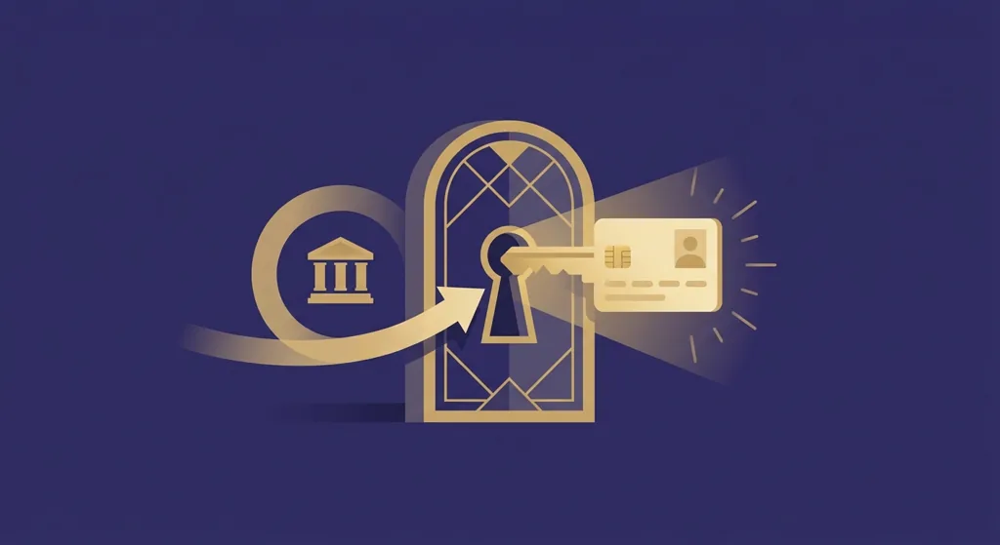
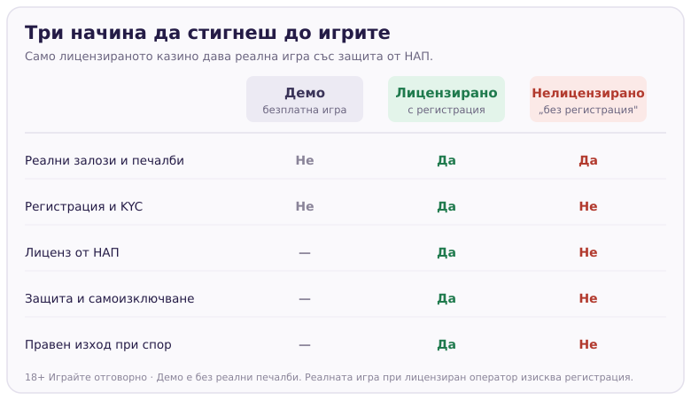

Title tag: Казино без регистрация: какво реално значи в България
Meta description: „Казино без регистрация" звучи удобно, но при легалните казина в България регистрацията и верификацията са задължителни по закон. Кое е реалната игра без акаунт, какво е Pay N Play и кои обещания издават нелицензиран сайт.

---

# Казино без регистрация: какво реално значи

Хората, които търсят „казино без регистрация", обикновено искат да завъртят няколко игри веднага, без формуляри и без снимки на документи. При казината с валиден лиценз за България обаче такъв бърз вход с реални пари просто няма. Регистрацията и проверката на самоличността са част от закона, не каприз на конкретния оператор, и всеки лицензиран сайт ще поиска данните ти, преди да приеме първия депозит.

## Законът иска да знае кой играе

Онлайн хазартът у нас е регулиран и всяко казино, което го предлага законно, работи с лиценз от НАП. Част от този режим е верификацията, позната като KYC („познай своя клиент"): при откриване на сметка операторът трябва да установи кой си, обикновено чрез документ за самоличност. Проверката спира прането на пари и играта на непълнолетни, но пази и самия играч. Националният регистър на уязвимите лица към НАП, чрез който човек може да се самоизключи от всички лицензирани казина наведнъж, работи именно защото сметките са поименни. Анонимната сметка не може да бъде спряна, когато потрябва.

Затова „без регистрация" при легален оператор на практика не съществува за реална игра. Можеш да смениш казиното, метода на плащане или устройството, но не и изискването да се идентифицираш.

## Демо режимът е истинската игра без акаунт

Има един режим, който наистина не иска регистрация, и той е демо версията. Почти всяка [ротативка](/kazino-igri/rotativki/) и голяма част от [безплатните казино игри](/blog/bezplatni-kazino-igri/) се въртят с виртуален баланс, без да отваряш сметка и без да въвеждаш карта. Играеш със същата математика, същите символи и същите функции като в реалната версия, но нито залогът, нито печалбата са истински.

За какво върши работа това: да усетиш темпото и волатилността на дадена игра, да видиш колко бързо се топи виртуалният баланс във висока волатилност и да решиш дали заглавието изобщо ти допада, преди да рискуваш свои пари. Единственото, което демото не може да ти даде, е реално теглене. Щом поискаш да изтеглиш печалба, верификацията става задължителна, защото парите излизат към банкова сметка на конкретно име.

## Pay N Play: регистрацията е скрита, не липсва

На някои европейски пазари, предимно скандинавските, се среща механизъм на име Pay N Play, изграден върху услугата за банкови плащания Trustly. Идеята е гладък вход: натискаш „играй", избираш банката си, влизаш в онлайн банкирането и депозитът минава. В същия момент казиното отваря сметка вместо теб и попълва верификацията с данните, които банката вече е потвърдила при откриването на твоята банкова сметка.

Изглежда като игра без регистрация, но не е. Регистрацията се случва на заден план за секунди, а KYC е свършен от банката ти по-рано. Затова и тегленията при такива казина са бързи: сметката ти вече е вързана към банката. Важното за българския играч е, че Pay N Play е модел от други пазари и не е характерен за лицензираното предлагане у нас. Ако някъде го срещнеш насочен към България, провери лиценза, преди да въведеш каквото и да е.

## Кои обещания издават нелицензиран сайт

Когато реклама предлага истинска игра с реални пари „без регистрация, без документи, веднага", това почти винаги значи, че сайтът е извън българския лиценз. Такива казина не са вписани в регистъра на НАП, не подлежат на местен контрол и не участват в системата за самоизключване. Ако възникне спор за печалба или блокирана сметка, нямаш регулатор, към когото да се обърнеш, а анонимността, която звучи като удобство, работи срещу теб в мига на проблема.

Няколко сигнала, които заслужават предпазливост: обещание за теглене без никаква верификация; настояване да платиш само с анонимни методи; липса на ясно посочен лиценз и оператор; и език, който набляга на скоростта и тайната вместо на условията. В [методологията ни](/kak-ocenyavame/) законността тежи най-много именно защото без нея всичко останало е без покритие.

*Демо е единствената реална игра без акаунт, но не носи печалба. Реалната игра със защита минава през регистрация при лицензиран оператор.*

## Разумният подход

Настрой очакванията си още преди да отвориш казино. Реалната игра върви с акаунт и това няма да се промени при лицензираните оператори у нас, така че въпросът не е как да прескочиш регистрацията, а при кого да я направиш. Демото стои насреща безплатно, когато искаш само да пробваш игрите. А петте минути за данни и проверката на документа при [лицензирано казино](/zakonno-li-e/) ти носят нещо, което нелицензираните сайтове не дават: регулатор зад гърба ти и работещ бутон за самоизключване, ако някога потрябва.

Задай си лимит за депозит и за време още преди да отвориш сметка. 18+ Хазартът може да пристрасти. Играйте отговорно. Ако усетите, че играта излиза извън контрол, вижте [инструментите за отговорна игра](/otgovorna-igra/).

---

**Георги Тодоров**
Публикувано: 11.09.2026 · Последна редакция: 11.09.2026

[About Всички Казина boilerplate]

**Отговорна игра.** 18+ Хазартът може да пристрасти. Играйте отговорно. Ако усетиш, че играта излиза извън контрол или искаш да я ограничиш, виж [инструментите за отговорна игра](/otgovorna-igra/) и възможността за самоизключване чрез националния регистър на уязвимите лица към НАП (подава се писмено само от засегнатото лице). Национална информационна линия за наркотиците, алкохола и хазарта („Солидарност") 0888 99 18 66, делнични дни 10:00–17:00.

**Разкриване на партньорства.** Всички Казина съдържа партньорски (афилиейт) връзки; когато отвориш оферта през такава връзка, това може да финансира сайта, без да променя цената за теб и без да влияе на оценките ни. От 1 август 2026 г. дейността на афилиейт оператори в България се лицензира съгласно Закона за държавния бюджет за 2026 г. (ДВ, бр. 69 от 31.07.2026 г.). Всички Казина е подало заявление за лиценз пред Националната агенция по приходите и очаква издаването му.
