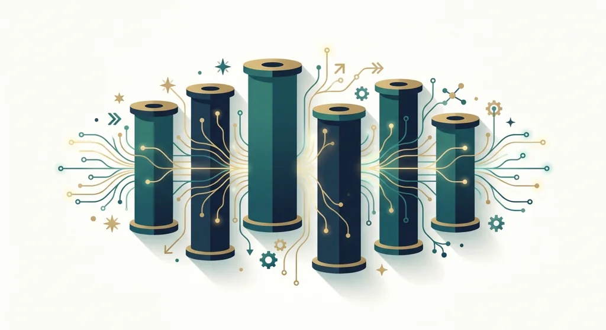
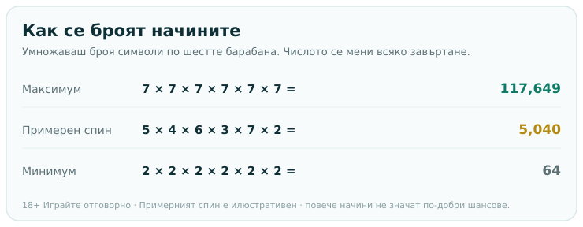
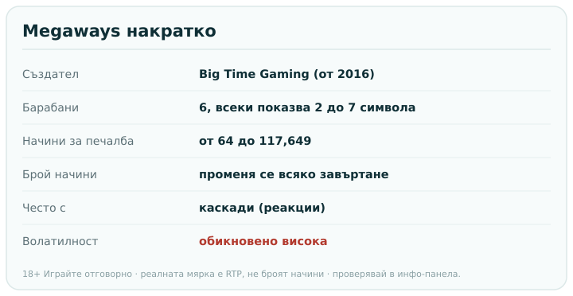

Title tag: Megaways: как работят и защо броят на начините се променя
Meta description: Megaways дават до 117,649 начина за печалба, защото всеки от шестте барабана показва между 2 и 7 символа при всяко завъртане. Как се брои числото и защо повече начини не значи по-добри шансове.

---

# Megaways: как работят и защо броят на начините се променя

Ако си отварял ротативка, в която пише „117,649 начина за печалба" и числото се мени при всяко завъртане, си играл на Megaways. Това е механика, създадена от студиото Big Time Gaming и представена през 2016 година, която после беше лицензирана на десетки други разработчици. Затова етикетът се среща под много марки, включително заглавия на Pragmatic Play. Идеята ѝ е проста за описание и любопитна в детайла: броят начини не е фиксиран, а се преизчислява на всяко завъртане.

## Откъде идват 117,649 начина

Класическата Megaways решетка е шест барабана, но за разлика от обикновената ротативка височината им не е постоянна. При всяко завъртане всеки барабан показва между два и седем символа, като точният брой се тегли от генератора на случайни числа. Начините за печалба се получават, като умножиш броя символи по всички барабани един през друг. Когато и шестте барабана се разгънат докрай и покажат по седем символа, сметката е 7×7×7×7×7×7, което прави 117,649 начина. Това е горната граница, рекламна и рядка.

Повечето завъртания стоят далеч под нея. При среден спин барабаните може да покажат например 5, 4, 6, 3, 7 и 2 символа, което дава 5,040 начина. А в най-свитата възможна позиция, всеки барабан по два символа, остават само 64. Числото на банера е таванът, не средното.

*Броят начини е произведение на символите по барабаните. Максимумът е рядък, примерният спин е илюстративен.*

## Защо решетката „диша"

Тъкмо променливата височина на барабаните прави Megaways различни от играта с [фиксирани линии на печалба](/slot-igri/). При линиите комбинацията се брои само по предварително зададени пътеки. Тук няма линии, а начини: щом еднакви символи паднат на съседни барабани отляво надясно, комбинацията плаща, независимо на кой ред стоят. Много заглавия слагат и допълнителен хоризонтален ред отгоре, който добавя символи към средните барабани и помага да се стигне до максималния брой начини.

Заедно с това повечето Megaways игри въртят и каскади. Печелившите символи изчезват, отгоре падат нови и ако подредят нова комбинация, тя също плаща в рамките на същото завъртане. Каскадите не са част от самата дефиниция на механиката, но вървят с нея толкова често, че мнозина ги приемат за едно цяло.

## Повече начини не значи по-добри шансове

Големите числа лесно се разчитат като по-щедра игра, а това е капанът. Дългосрочният резултат на всяка ротативка се определя от нейния RTP и от волатилността ѝ, не от това колко начини изписва на екрана. Заглавие със 117,649 начина може да има същия или по-нисък RTP от скромна игра с двадесет линии. Отделните печалби при толкова много начини често са дребни, а голямата сума идва рядко, обикновено в бонус игра с натрупани множители. Затова Megaways заглавията почти винаги са с висока волатилност: дълги серии без нищо, накъсани от редки резки скокове.

Числото начини казва как е устроена решетката. Колко се връща в дългосрочен план го казва RTP, който проверяваш в инфо-панела на конкретната игра, както предлага и [методологията ни](/kak-ocenyavame/).

*Броят начини е диапазон, не константа. Максимумът е рядък, средното е далеч под него.*

## Преди да завъртиш

Пусни всяко Megaways заглавие първо в демо режим и виж колко бързо се движи банката, преди да сложиш реални пари, защото профилът е висока волатилност и играта може да мълчи дълго. Големият брой начини е ефектен, но реалната мярка за играта остава RTP заедно с волатилността, а не цифрата на банера. Задай си лимит за загуба и за време предварително. 18+ Хазартът може да пристрасти. Играйте отговорно. Ако усетите, че играта излиза извън контрол, вижте [инструментите за отговорна игра](/otgovorna-igra/).

---

**Георги Тодоров**
Публикувано: 11.09.2026 · Последна редакция: 11.09.2026

[About Всички Казина boilerplate]

**Отговорна игра.** 18+ Хазартът може да пристрасти. Играйте отговорно. Ако усетиш, че играта излиза извън контрол или искаш да я ограничиш, виж [инструментите за отговорна игра](/otgovorna-igra/) и възможността за самоизключване чрез националния регистър на уязвимите лица към НАП (подава се писмено само от засегнатото лице). Национална информационна линия за наркотиците, алкохола и хазарта („Солидарност") 0888 99 18 66, делнични дни 10:00–17:00.

**Разкриване на партньорства.** Всички Казина съдържа партньорски (афилиейт) връзки; когато отвориш оферта през такава връзка, това може да финансира сайта, без да променя цената за теб и без да влияе на оценките ни. От 1 август 2026 г. дейността на афилиейт оператори в България се лицензира съгласно Закона за държавния бюджет за 2026 г. (ДВ, бр. 69 от 31.07.2026 г.). Всички Казина е подало заявление за лиценз пред Националната агенция по приходите и очаква издаването му.
