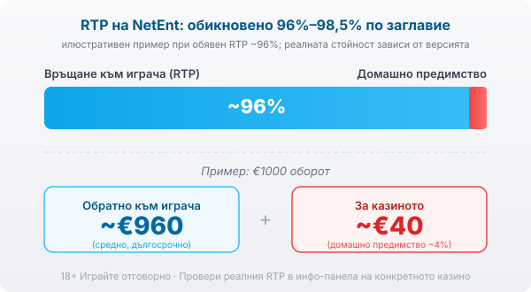

Title tag: NetEnt: профил на доставчика, механики и топ слотове
Meta description: Кой е NetEnt, какви механики направи популярни (Avalanche, разширяващ се wild) и кои са топ слотовете му. Защо RTP се чете в инфо-панела, а не в рекламата.

---

# NetEnt: профил на доставчика, механики и топ слотове

Отвориш ли каталога на почти всяко българско онлайн казино, някъде между новите заглавия ще стои игра на NetEnt, дори да не си забелязал логото. Шведското студио прави слотове от 1996 г. и част от механиките, които днес приемаш за даденост, тръгнаха именно оттам.

## Швед с дълга биография

NetEnt се основава през 1996 г. в Стокхолм под името Net Entertainment и се отделя от Cherryföretagen, шведски оператор на наземни казина. През 2005 г. взема лиценз от Malta Gaming Authority, а по-късно и от Британската комисия по хазарта. През 2020 г. Evolution купува компанията за около 2,1 милиарда долара и до края на годината държи близо 96,8% от нея, така че днес NetEnt е част от групата на Evolution. За теб като играч тази биография не значи нищо магическо: дълголетието подсказва, че игрите минават през редовни проверки, не че връщат повече.

## Не само слотове

Активното портфолио е около 300 слота, а от 1996 г. насам са издадени над 500 заглавия. Слотовете са ядрото, но NetEnt прави и игри на живо с дилъри, както и слотове с прогресивни джакпоти. Заглавията се въртят: старите остават в каталозите, новите идват отгоре, и точно затова срещаш името толкова често. Голямото портфолио е удобство за оператора, който има какво да предложи, а не предимство за сметката ти.

## Механиките, които NetEnt направи разпознаваеми

Няколко механики се повтарят през каталога и вече се ползват от половината индустрия. Каскадите, които NetEnt нарича Avalanche, махат печелившите символи и пускат нови на тяхно място, така че едно завъртане понякога носи няколко печалби подред. Разширяващият се wild покрива цял барабан и дава повторно завъртане, докато се задържа. Cluster Pays плаща за групи от еднакви символи, долепени един до друг, вместо по фиксирани линии. При прогресивите като Mega Fortune залозите на много играчи пълнят общ джакпот на три нива, който се печели през бонус колело. Всичко това променя усещането за играта, но не и вградената математика: механиката прави въртенето по-интересно, не по-щедро.

## Лиценз и какво всъщност гарантира

Игрите на NetEnt се тестват от независими лаборатории, а компанията работи под регулатори като MGA и Британската комисия. Сертификатът потвърждава, че генераторът на случайни числа е честен и че обявеният RTP отговаря на реалната математика на играта. Той обаче гарантира честност спрямо правилата на играта, не че тези правила са в твоя полза. Домашното предимство си остава вградено; проверката само доказва, че е точно такова, каквото пише. Лицензиран доставчик значи предвидима, проверена игра, не игра, която накрая ти връща повече.

## Топ заглавия (и защо известността не е шанс)

Няколко игри направиха NetEnt разпознаваем. Starburst остана години наред сред най-пусканите слотове заради простата си механика с разширяващи се wild символи. Gonzo's Quest популяризира каскадите и подготви почвата за цяло поколение подобни игри. Dead or Alive е познат с високата си волатилност, а Mega Fortune влезе в историята с рекордни прогресивни джакпоти. Полезно е да ги познаваш, но известността им говори повече за визията и маркетинга, отколкото за шансовете ти. Едно широко играно заглавие не ти връща повече от малко познато само защото всички го знаят.

## RTP: диапазон, не обещание

Обявените RTP стойности при NetEnt обикновено падат между 96% и 98,5% според заглавието, което е сравнително щедро за индустрията. Много игри обаче се доставят в няколко версии с различен RTP и операторът избира коя да пусне, така че една и съща игра може да ти връща различен процент в различни казина. Заради това в [методологията ни](/kak-ocenyavame/) гледаме реалния RTP на конкретното казино, а не рекламния. При обявен RTP около 96% и €1000 оборот средно се връщат около €960 в дългосрочен план, а към €40 остават за казиното. Числото е примерно и важи за милиони завъртания, не за твоята вечер.

*Илюстративен пример при обявен RTP ~96%: €1000 оборот връща средно ~€960, ~€40 остават за казиното. RTP на NetEnt обикновено е 96%–98,5% по заглавие и зависи от версията, която операторът е пуснал, затова се проверява в инфо-панела.*

## Демо режим, лимити и реален RTP

[Слот игрите](/slot-igri/) на NetEnt обикновено имат демо режим, в който да видиш механиката и темпото, без да залагаш, а ако искаш да сравниш студиата, [прегледът ни на доставчиците](/blog/games-providers/) стъпва на същата логика. Задай си лимит за загуба и за време, преди да отвориш която и да е игра, и провери реалния RTP на конкретното казино в инфо-панела. Хазартът не е начин да си върнеш пари или да изкараш доход; в дългосрочен план математиката работи за казиното и това е заложено в самата игра. 18+ Хазартът може да пристрасти. Играйте отговорно. Ако усетиш, че играта излиза извън контрол, виж [инструментите за отговорна игра](/otgovorna-igra/).

---

**Георги Тодоров**
Публикувано: 11.09.2026 · Последна редакция: 11.09.2026

[About Всички Казина boilerplate]

**Отговорна игра.** 18+ Хазартът може да пристрасти. Играйте отговорно. Ако усетиш, че играта излиза извън контрол или искаш да я ограничиш, виж [инструментите за отговорна игра](/otgovorna-igra/) и възможността за самоизключване чрез националния регистър на уязвимите лица към НАП (подава се писмено само от засегнатото лице). Национална информационна линия за наркотиците, алкохола и хазарта („Солидарност") 0888 99 18 66, делнични дни 10:00–17:00.

**Разкриване на партньорства.** Всички Казина съдържа партньорски (афилиейт) връзки; когато отвориш оферта през такава връзка, това може да финансира сайта, без да променя цената за теб и без да влияе на оценките ни. От 1 август 2026 г. дейността на афилиейт оператори в България се лицензира съгласно Закона за държавния бюджет за 2026 г. (ДВ, бр. 69 от 31.07.2026 г.). Всички Казина е подало заявление за лиценз пред Националната агенция по приходите и очаква издаването му.
