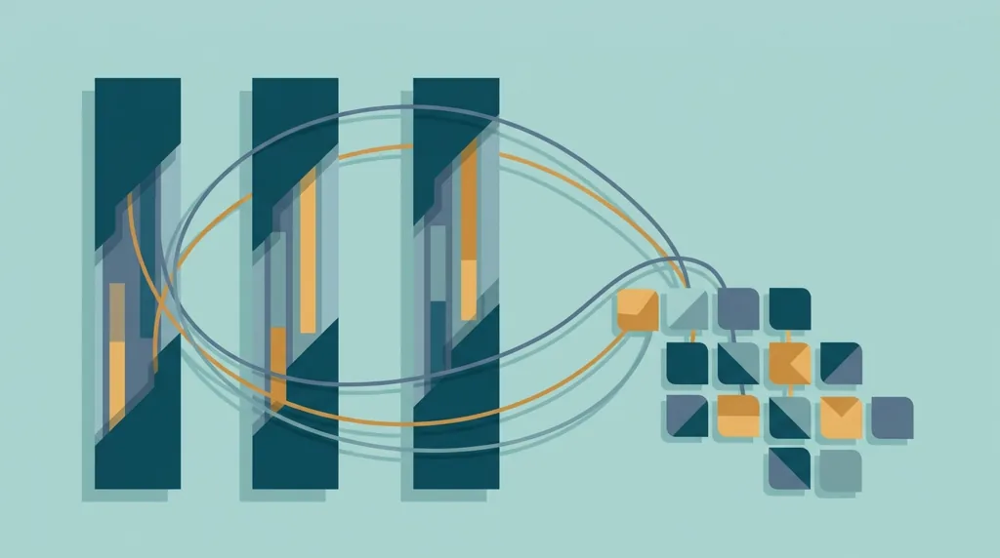
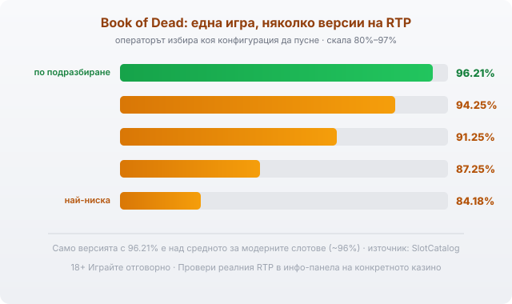

Title tag: Play'n GO: профил на доставчика, механики и топ слотове
Meta description: Кой е Play'n GO, какви игри прави и кои са топ заглавията му като Book of Dead и Reactoonz. Защо една игра идва с няколко RTP версии и как да провериш реалния процент.

---

# Play'n GO: профил на доставчика, механики и топ слотове

Ако си въртял Book of Dead или Reactoonz, вече познаваш Play'n GO, дори да не си поглеждал името на разработчика. Това е шведска компания, която прави слотове от края на 90-те и стои зад няколко заглавия, появяващи се в почти всяко българско онлайн казино. Едни и същи механики се въртят в различните ѝ игри, а под ярките теми стои математика, писана в полза на казиното.

## Шведски корени

Play'n GO е основана през 1997 г. във Векшьо, малък град в южна Швеция. В началото компанията пише казино софтуер по поръчка за други доставчици, а собствените ѝ заглавия тръгват към средата на 2000-те, когато тя се насочва изцяло към видео слотовете. Оттогава е независима шведска фирма с офиси в Малта и Гибралтар и екипи в още няколко държави. Пуска по две-три нови игри месечно и каталогът ѝ вече надхвърля 400 заглавия.

## Доставчик, не оператор

Play'n GO прави игрите, но не ги предлага директно на играча. Тя е доставчик на софтуер (B2B), а казиното е операторът, който приема залозите, държи парите и отговаря пред регулатора. Заглавията ѝ минават през независими лаборатории като Gaming Laboratories International и BMM Testlabs, а компанията държи доставчически лицензи за регулирани пазари като Малта, Великобритания и Гибралтар. Този тест потвърждава, че генераторът на случайни числа работи коректно и че играта връща обявения си процент. Той не я прави изгодна за теб. Домашното предимство си остава вградено, а проверката гарантира само, че то е точно такова, каквото пише в правилата.

## Слотове преди всичко

Ядрото на Play'n GO са видео слотовете и точно с тях компанията се наложи. За разлика от доставчици с широки каталози от игри на живо и маси, тук фокусът е тесен: ротативки с различни теми и механики, обновявани с ново заглавие на всеки няколко седмици. Затова и игрите, които българският играч разпознава от марката, са почти изцяло слотове.

## Механиките, които разпознаваш

В „book" заглавията преди безплатните завъртания играта избира на случаен принцип един символ, който после се разгъва и покрива цял барабан. Другаде печелиш от клъстери върху мрежа: групи еднакви символи, независимо къде стоят на екрана, а не по фиксирани линии, като печелившите изчезват и отгоре падат нови. Има и слотове със зареждащ се измерител, който трупа енергия от последователните печалби и при запълване отключва допълнителни функции. Тези схеми се пренасят между заглавия, така че щом разбереш едната, разчиташ бързо и следващата игра със същата логика.

## Топ слотове

Book of Dead с изследователя Rich Wilde е най-известното заглавие на Play'n GO и на практика синоним на марката. До него стоят Reactoonz с извънземните върху мрежа, поредицата Rich Wilde, Moon Princess, Fire Joker, Legacy of Dead и Rise of Olympus. Двете най-типични механики се виждат най-чисто в двата ѝ хита: [Book of Dead](/blog/book-of-dead/) показва разширяващия се символ, а [Reactoonz](/blog/reactoonz/) — клъстерите и зареждащия се измерител.

## Една игра, няколко версии на RTP

Play'n GO доставя доста от заглавията си в няколко конфигурации с различен обявен RTP и операторът избира коя да пусне. Book of Dead например има версия с 96.21%, но съществуват и по-ниски: 94.25%, 91.25%, 87.25% и чак 84.18%. Reactoonz тръгва от 96.51%, с по-ниски варианти около 94.51% и 91.49%. Една и съща игра при две казина може да ти връща осезаемо различен процент, а два процентни пункта разлика са реални пари върху дълъг оборот.

*Едно заглавие, няколко конфигурации: обявените RTP версии на Book of Dead, от които операторът пуска една. Провери коя работи в конкретното казино, преди да заложиш.*

## Провери, преди да въртиш

Затова в [методологията ни](/kak-ocenyavame/) гледаме реалния RTP на конкретното казино, а не рекламния. Отвори инфо-панела на играта, намери реда за RTP и виж коя версия върти това казино. Ако искаш да сравниш Play'n GO с други имена, [прегледът ни на доставчиците](/blog/games-providers/) стъпва на същата логика, а профилите на [Pragmatic Play](/blog/pragmatic-play-provajdar/) и [Amusnet](/blog/amusnet-egt-provajdar/) я показват при други каталози. [Слот игрите](/slot-igri/) на Play'n GO обикновено имат демо режим, в който да усетиш темпото и волатилността, без да залагаш. Задай си лимит за загуба и за време преди първото завъртане. 18+ Хазартът може да пристрасти. Играйте отговорно. Ако усетите, че играта излиза извън контрол, вижте [инструментите за отговорна игра](/otgovorna-igra/).

---

**Георги Тодоров**
Публикувано: 11.09.2026 · Последна редакция: 11.09.2026

[About Всички Казина boilerplate]

**Отговорна игра.** 18+ Хазартът може да пристрасти. Играйте отговорно. Ако усетиш, че играта излиза извън контрол или искаш да я ограничиш, виж [инструментите за отговорна игра](/otgovorna-igra/) и възможността за самоизключване чрез националния регистър на уязвимите лица към НАП (подава се писмено само от засегнатото лице). Национална информационна линия за наркотиците, алкохола и хазарта („Солидарност") 0888 99 18 66, делнични дни 10:00–17:00.

**Разкриване на партньорства.** Всички Казина съдържа партньорски (афилиейт) връзки; когато отвориш оферта през такава връзка, това може да финансира сайта, без да променя цената за теб и без да влияе на оценките ни. От 1 август 2026 г. дейността на афилиейт оператори в България се лицензира съгласно Закона за държавния бюджет за 2026 г. (ДВ, бр. 69 от 31.07.2026 г.). Всички Казина е подало заявление за лиценз пред Националната агенция по приходите и очаква издаването му.
