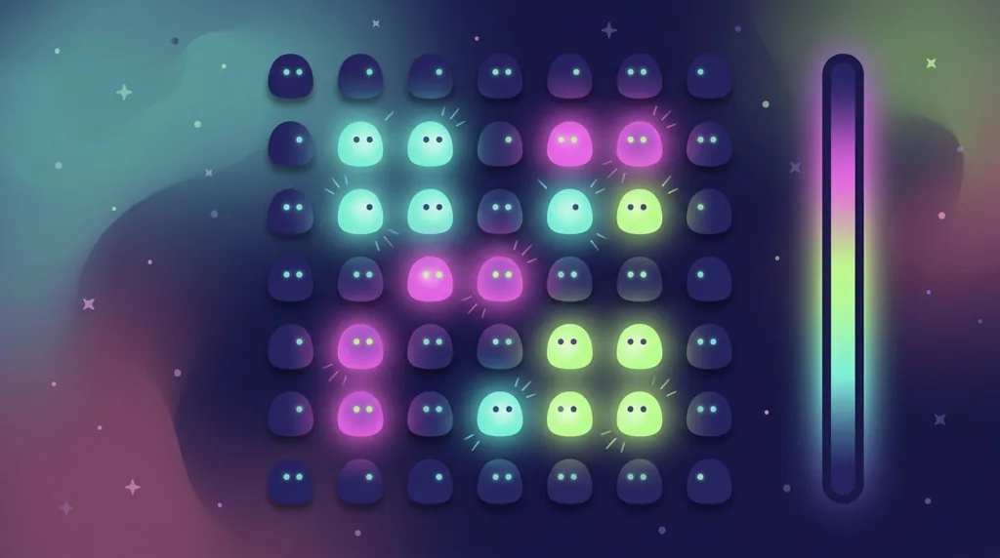
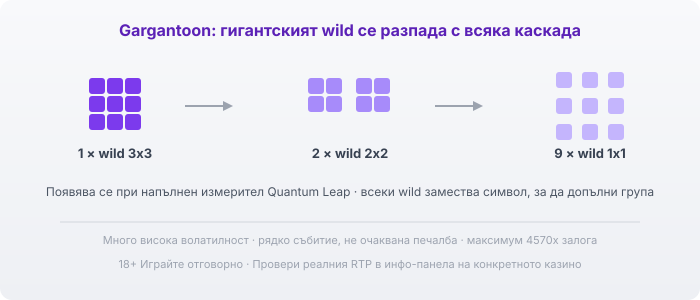

Title tag: Reactoonz: RTP, клъстер печалби и как се играе
Meta description: Как работи Reactoonz на Play'n GO: мрежа 7x7, клъстер печалби, каскади и измерителят Quantum Leap, гигантският Gargantoon, RTP 96.51% и защо няма безплатни завъртания.

---

# Reactoonz: RTP, клъстер печалби и как се играе

Reactoonz на Play'n GO излиза през 2017 г. и бързо се откроява с нещо, което не прилича на класическа ротативка: квадратна мрежа 7 на 7, пълна с малки извънземни, вместо барабани и линии. Печелиш, като събереш групи еднакви същества, а над всичко това седи измерител, който трупа енергия и от време на време преобръща цялото поле.

## Мрежа 7х7 и клъстер печалби

Тук няма линии на печалба. Полето е решетка от 49 позиции и комбинация се образува, когато 5 или повече еднакви символа се допират, хоризонтално или вертикално. Колкото по-голяма е групата, толкова по-голяма е печалбата за нея. Погледът не следи редове, а брои струпвания, и понеже полето е широко, често се засичат няколко групи наведнъж.

## Каскади и измерителят Quantum Leap

Печелившите символи не остават на екрана. След като платят, изчезват и на тяхно място падат нови отгоре, което може да образува следваща група и още една печалба. Всяка такава каскада освен това зарежда измерителя Quantum Leap отстрани. Когато той стигне определено ниво, се задейства случайна допълнителна функция: някои превръщат част от символите в wild, други унищожават избрани символи или преобразуват еднакви по полето. Тези функции не идват по твое желание, а от натрупаните печалби, и точно те държат играта жива между обикновените завъртания.

## Гаргантоон: гигантският wild

Ако напълниш измерителя докрай, се появява Gargantoon: гигантски wild с размер 3 на 3 клетки. При всяка следваща каскада той се разпада, първо на два wild-а с размер 2 на 2, а после на девет единични wild-а, всеки от които замества символ, за да допълни групи. Това е моментът с най-голям потенциал в играта, но идва рядко и изисква дълга поредица от печеливши каскади, за да се стигне дотам.

*Gargantoon при пълен измерител: 3x3 wild, който при следващите каскади се разпада на два 2x2, а после на девет 1x1 wild-а.*

## Няма безплатни завъртания

Тук идва разликата, която изненадва мнозина. Reactoonz няма отделен режим на безплатни завъртания, какъвто имат повечето популярни слотове. Няма scatter, който да отваря бонус, и няма бройка завъртания за спечелване. Цялата допълнителна стойност минава през каскадите и измерителя Quantum Leap. Ако очакваш класически бонус кръг, тук просто го няма, а вълнението идва от натрупването на полето.

## RTP и волатилност

Обявеният RTP на Reactoonz по подразбиране е 96.51%, което оставя домашно предимство от около 3.49%. Play'n GO обаче доставя играта и в по-ниски версии, около 94.51% и 91.49%, а операторът избира коя да пусне. Волатилността е много висока: играта е сред най-екстремните в каталога на Play'n GO по този показател. На практика балансът често пада през дълги серии дребни или никакви печалби, докато измерителят се зареди и обърне полето. Заради това в [методологията ни](/kak-ocenyavame/) гледаме реалния RTP на конкретното казино, а не рекламния; отвори инфо-панела и виж коя версия работи там, преди да заложиш.

## Символите и максималната печалба

Съществата са два вида. Едноокните са нископлатените и са четири на цвят, а двуокките са високоплатените, също четири, като розовото плаща най-много при голяма група. Максималната теоретична печалба е 4570 пъти залога. При €1 залог това са €4570, но е екстремно рядко събитие, което изисква Gargantoon да съвпадне с богато поле, и не бива да влиза в никаква сметка за бюджет.

## Преди да завъртиш

Reactoonz е бърза, шумна игра, в която едно струпване вика следващото. [Слот игрите](/slot-igri/) на Play'n GO обикновено имат демо режим, в който да усетиш темпото и колко дълго може да мълчи измерителят, без да залагаш; за марката виж профила на [Play'n GO](/blog/playn-go-provajdar/). Различните [ротативки](/kazino-igri/rotativki/) се сравняват най-честно по реалния им RTP. Задай си лимит за загуба и за време преди първото завъртане и го спазвай, дори когато полето е на ръба да се обърне. 18+ Хазартът може да пристрасти. Играйте отговорно. Ако усетите, че играта излиза извън контрол, вижте [инструментите за отговорна игра](/otgovorna-igra/).

---

**Георги Тодоров**
Публикувано: 11.09.2026 · Последна редакция: 11.09.2026

[About Всички Казина boilerplate]

**Отговорна игра.** 18+ Хазартът може да пристрасти. Играйте отговорно. Ако усетиш, че играта излиза извън контрол или искаш да я ограничиш, виж [инструментите за отговорна игра](/otgovorna-igra/) и възможността за самоизключване чрез националния регистър на уязвимите лица към НАП (подава се писмено само от засегнатото лице). Национална информационна линия за наркотиците, алкохола и хазарта („Солидарност") 0888 99 18 66, делнични дни 10:00–17:00.

**Разкриване на партньорства.** Всички Казина съдържа партньорски (афилиейт) връзки; когато отвориш оферта през такава връзка, това може да финансира сайта, без да променя цената за теб и без да влияе на оценките ни. От 1 август 2026 г. дейността на афилиейт оператори в България се лицензира съгласно Закона за държавния бюджет за 2026 г. (ДВ, бр. 69 от 31.07.2026 г.). Всички Казина е подало заявление за лиценз пред Националната агенция по приходите и очаква издаването му.
