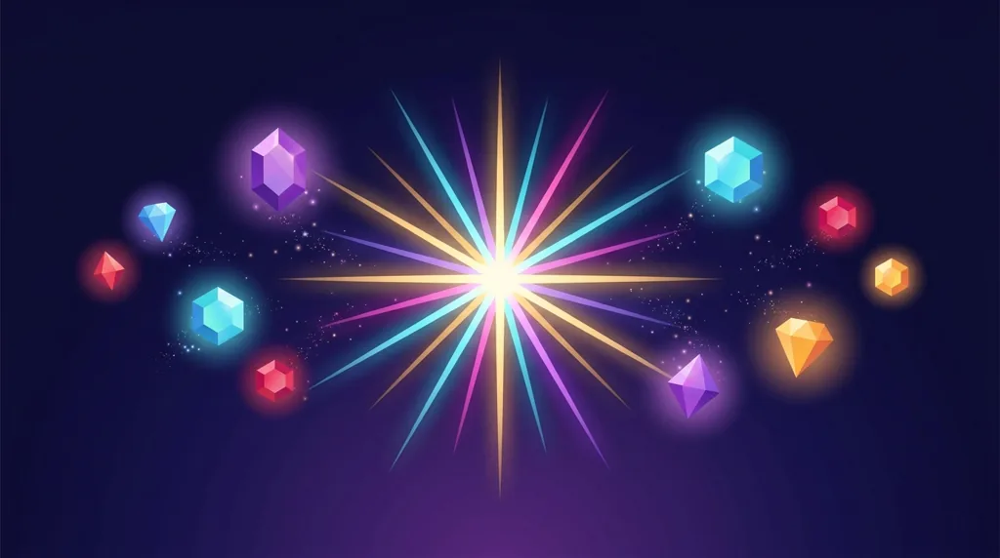
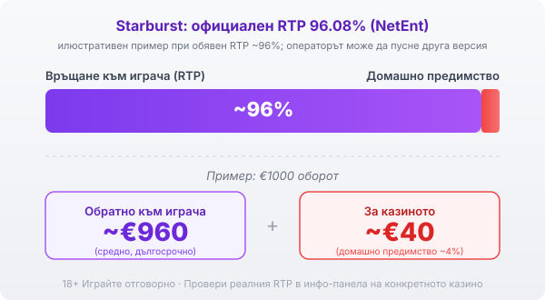

Title tag: Starburst: защо е класика с ниска волатилност
Meta description: Starburst на NetEnt с RTP 96.08%, ниска волатилност и една-единствена функция: разширяващ се wild с respin. Защо няма бонус игра и за кого е подходяща.

---

# Starburst: защо е класика с ниска волатилност

Starburst е може би първият слот, който начинаещ играч вижда в българско казино, защото операторите често го дават като заглавие за безплатни завъртания. Излязла е през 2012 г. от NetEnt и оттогава почти не се е променила, което само по себе си говори нещо: играта работи, защото е проста.

## Как изглежда играта

Полето е 5 барабана на 3 реда с 10 линии, а печалбите се броят и от двете посоки, не само отляво надясно. Символите са лъскави скъпоценни камъни в различни цветове плюс класическата седморка и златна лента. Няма история, няма герой, няма тематика отвъд космическия блясък. Точно тази голота я прави лесна за разбиране от първото завъртане.

## Единствената функция: разширяващият се wild

Цялото действие се върти около един символ. Когато символът Starburst падне на някой от вътрешните барабани, той се разтяга и покрива целия барабан, замества всички обикновени символи и задейства безплатно повторно завъртане, докато се задържи на екрана. Ако при завъртането падне още един wild, той също се разширява и получаваш ново завъртане, до три подред. Печалбите се пресмятат в двете посоки, така че разширен wild често дава няколко удара наведнъж. Това е механиката в цялост.

## Няма бонус игра и защо това има значение

Тук няма безплатни завъртания със собствено меню, няма колело, няма купуване на бонус. Всичко, което играта може да ти даде, минава през същия wild и respin в основната игра. За едни това е плюс, защото няма чакане и залъгване, а за други е минус, понеже липсва големият множител, който в друг слот може да обърне цяла лоша сесия за едно завъртане. Когато баланса ти намалява в Starburst, няма скрит бонус, който да го спаси. Играта е точно толкова, колкото изглежда.

## RTP и волатилност

Обявеният RTP на Starburst е 96.08% по данни на NetEnt, а волатилността е ниска. На практика това значи, че играта плаща често, но дребно, и балансът ти се движи по-плавно, отколкото при високоволатилен слот. Ниската волатилност обаче не е по-голям шанс да си на плюс; тя само разпределя същото домашно предимство на по-малки и по-чести колебания. Много заглавия се доставят в няколко RTP версии и операторът избира коя да пусне, затова в [методологията ни](/kak-ocenyavame/) гледаме реалния RTP на конкретното казино, а не рекламния. При обявен RTP около 96% и €1000 оборот средно се връщат около €960 в дългосрочен план, а към €40 остават за казиното.

*Илюстративен пример при обявен RTP ~96%: €1000 оборот връща средно ~€960, ~€40 остават за казиното. Официалният RTP на Starburst е 96.08%, но операторът може да пусне друга версия, затова се проверява в инфо-панела.*

## За кого е ниската волатилност

Ако предпочиташ дълга сесия с малък бюджет и не гониш едра печалба, ниската волатилност ти пасва: парите стигат за повече завъртания и рядко изчезват наведнъж. Ако търсиш адреналина на резките скокове или мечтаеш за големия множител, Starburst ще ти се стори скучна, а и таванът ѝ е скромен. Максималната печалба е ограничена до около 800 пъти залога по данни на NetEnt, което за слот е малко в сравнение с игри, стигащи хиляди пъти залога. Изборът е въпрос на темперамент и бюджет, не на по-добра или по-лоша игра.

## Демо режим, лимити и реален RTP

[Слот игрите](/slot-igri/) на NetEnt обикновено имат демо режим, в който да пробваш Starburst без залог, а ако искаш да сравниш студиата, [прегледът ни на доставчиците](/blog/games-providers/) стъпва на същата логика. Задай си лимит за загуба и за време, преди да отвориш играта, и провери реалния RTP на конкретното казино в инфо-панела. Хазартът не е начин да си върнеш пари или да изкараш доход; в дългосрочен план математиката работи за казиното и това важи и за най-безобидно изглеждащия слот. 18+ Хазартът може да пристрасти. Играйте отговорно. Ако усетиш, че играта излиза извън контрол, виж [инструментите за отговорна игра](/otgovorna-igra/).

---

**Георги Тодоров**
Публикувано: 11.09.2026 · Последна редакция: 11.09.2026

[About Всички Казина boilerplate]

**Отговорна игра.** 18+ Хазартът може да пристрасти. Играйте отговорно. Ако усетиш, че играта излиза извън контрол или искаш да я ограничиш, виж [инструментите за отговорна игра](/otgovorna-igra/) и възможността за самоизключване чрез националния регистър на уязвимите лица към НАП (подава се писмено само от засегнатото лице). Национална информационна линия за наркотиците, алкохола и хазарта („Солидарност") 0888 99 18 66, делнични дни 10:00–17:00.

**Разкриване на партньорства.** Всички Казина съдържа партньорски (афилиейт) връзки; когато отвориш оферта през такава връзка, това може да финансира сайта, без да променя цената за теб и без да влияе на оценките ни. От 1 август 2026 г. дейността на афилиейт оператори в България се лицензира съгласно Закона за държавния бюджет за 2026 г. (ДВ, бр. 69 от 31.07.2026 г.). Всички Казина е подало заявление за лиценз пред Националната агенция по приходите и очаква издаването му.
