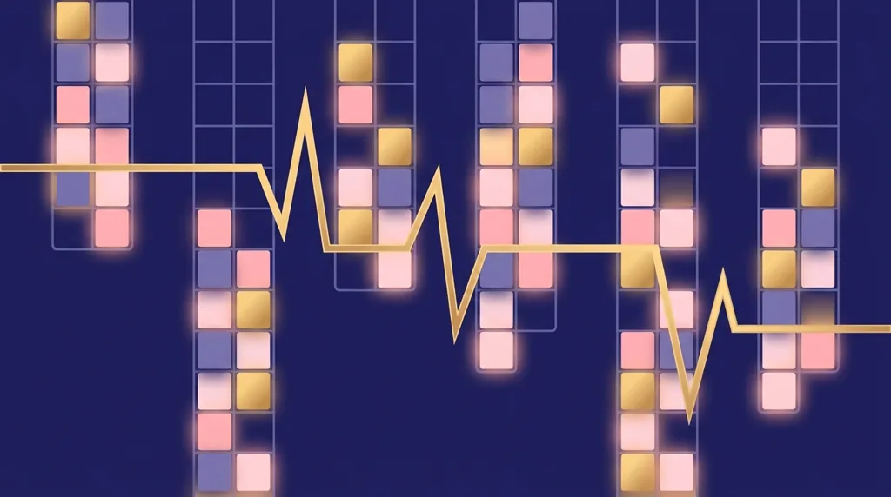
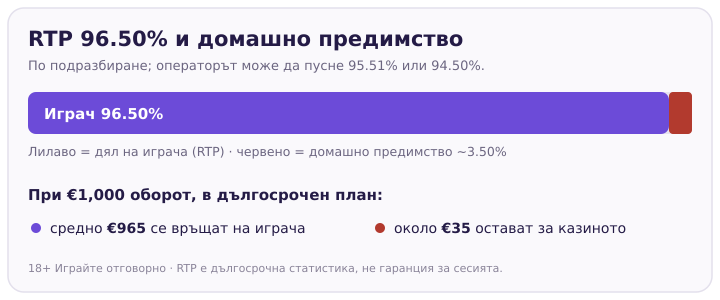
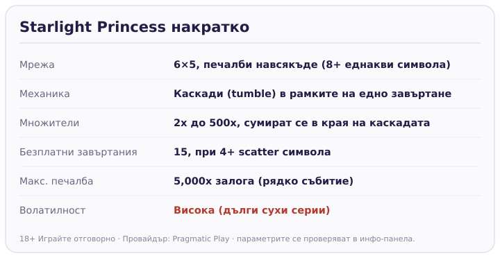

Title tag: Starlight Princess: RTP, волатилност и как се играе
Meta description: Как работи Starlight Princess на Pragmatic Play: 6x5, печалби навсякъде, каскади и множители 2x–500x, RTP 96.50%, макс. 5,000x залога. Защо високата волатилност значи дълги сухи серии.

---

# Starlight Princess: RTP, волатилност и как се играе

Starlight Princess е ротативка на [Pragmatic Play](/blog/pragmatic-play-provajdar/) с аниме визия и същия енджин, който направи Gates of Olympus разпознаваем: печалби навсякъде по екрана, каскади и множители, които се събират в едно голямо число. Пастелната обвивка подвежда, защото под нея стои игра с висока волатилност, в която дълги серии без нищо са нормалната цена за редките големи попадения.

## Печалбите падат навсякъде, не по линии

Мрежата е шест барабана на пет реда и в нея няма линии на печалба. Вместо това играта плаща по система „навсякъде": стигнеш ли осем или повече еднакви символа някъде по екрана, комбинацията плаща, без значение къде точно са паднали. След всяка печалба се задействат каскади. Печелившите символи изчезват, на тяхно място падат нови отгоре и ако те подредят нова комбинация, тя също плаща. Едно завъртане може да се разиграе на няколко вълни, преди барабаните да спрат.

## Множителите правят голямата разлика

Тук е двигателят на едрите печалби. По барабаните падат символи-множители със случайна стойност между 2x и 500x, както в основната игра, така и в бонуса. В края на всяка каскадна серия стойностите на всички паднали множители се събират и се прилагат наведнъж върху спечеленото. Няколко средни множителя, паднали заедно с добра каскада, са начинът, по който заглавието стига до тавана си. Няма ги често, а когато ги няма, банката просто се топи завъртане след завъртане. Точно това е усещането за висока волатилност на практика.

## Безплатните завъртания и опцията ante bet

Четири или повече scatter символа задействат 15 безплатни завъртания. В тях множителите се трупат по същата логика, което прави бонуса мястото с най-голям потенциал в играта. Pragmatic предлага и залог с опция ante bet: плащаш повече на завъртане срещу по-голям шанс да уцелиш скатерите. Това не покачва RTP и не прави бонуса по-щедър, а само разменя по-скъпи завъртания за по-чест вход към него. За малък бюджет по-скъпото завъртане изяжда банката по-бързо, така че опцията не е безплатен пряк път.

## RTP и волатилност: числата зад визията

Обявеният RTP на Starlight Princess по подразбиране е 96.50%, което оставя домашно предимство от около 3.50%. При €1,000 оборот това значи средно връщане от порядъка на €965 в дългосрочен план и около €35 за казиното. Числото е близо до средното за модерните ротативки, но операторите могат да пуснат и по-ниски конфигурации, например 95.51% или 94.50%, затова реалният процент за конкретното казино стои в инфо-панела на самата игра. В [методологията ни](/kak-ocenyavame/) гледаме RTP като реално число, което си струва да провериш, преди да завъртиш.

*RTP 96.50% по подразбиране; операторът може да пусне 95.51% или 94.50%. Провери в инфо-панела.*

Таванът на печалбата е 5,000 пъти залога. При €1 това са €5,000, но е добре да се чете като горна граница на математиката, не като реалистична цел: за да се стигне дотам, трябва рядко съвпадение на силна каскада с високи множители. Високата волатилност значи точно този профил, дълги сухи серии, разбивани от редки резки скокове.

*Основните параметри на играта. Множителите и таванът се случват рядко, това е висока волатилност.*

## Преди да завъртиш

[Ротативките](/kazino-igri/rotativki/) на Pragmatic често имат демо режим, в който да усетиш темпото и каскадите, без да залагаш. Пусни няколко минути в демо и виж колко бързо се движи банката при висока волатилност, преди да сложиш реални пари. Задай си лимит за загуба и за време предварително, защото игра с такъв профил може да мълчи дълго. 18+ Хазартът може да пристрасти. Играйте отговорно. Ако усетите, че играта излиза извън контрол, вижте [инструментите за отговорна игра](/otgovorna-igra/).

---

**Георги Тодоров**
Публикувано: 11.09.2026 · Последна редакция: 11.09.2026

[About Всички Казина boilerplate]

**Отговорна игра.** 18+ Хазартът може да пристрасти. Играйте отговорно. Ако усетиш, че играта излиза извън контрол или искаш да я ограничиш, виж [инструментите за отговорна игра](/otgovorna-igra/) и възможността за самоизключване чрез националния регистър на уязвимите лица към НАП (подава се писмено само от засегнатото лице). Национална информационна линия за наркотиците, алкохола и хазарта („Солидарност") 0888 99 18 66, делнични дни 10:00–17:00.

**Разкриване на партньорства.** Всички Казина съдържа партньорски (афилиейт) връзки; когато отвориш оферта през такава връзка, това може да финансира сайта, без да променя цената за теб и без да влияе на оценките ни. От 1 август 2026 г. дейността на афилиейт оператори в България се лицензира съгласно Закона за държавния бюджет за 2026 г. (ДВ, бр. 69 от 31.07.2026 г.). Всички Казина е подало заявление за лиценз пред Националната агенция по приходите и очаква издаването му.
