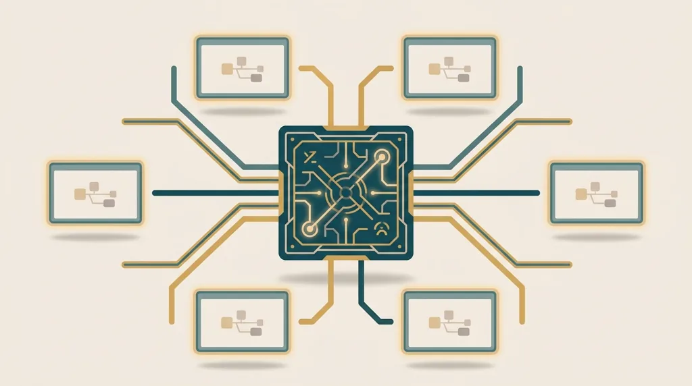
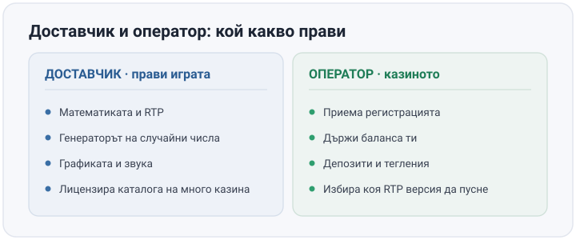
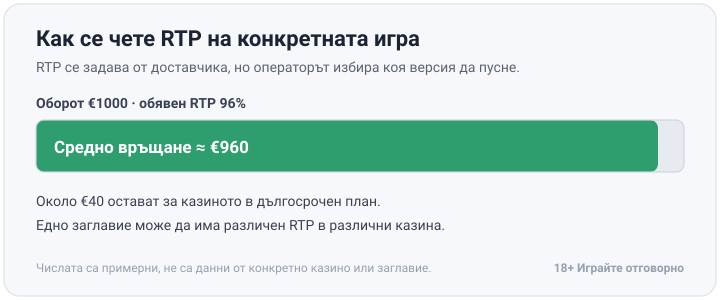

Title tag: Кои са доставчиците на казино игри и защо са важни
Meta description: Кои са доставчиците на казино игри, какво прави казино софтуер честен и защо сертификатът не гарантира по-добра игра. RTP се проверява в инфо-панела.

---

# Кои са доставчиците на казино игри и защо са важни

Играта, която въртиш в българско онлайн казино, почти никога не е дело на самото казино. Зад нея, без значение дали е ротативка, маса за блекджек на живо или джакпот, стои друга компания - доставчик, или провайдър на игри. Играчът рядко чете името ѝ, макар да гледа право в нейния продукт при всяко завъртане. Разликата изглежда дребна, но точно заради нея един и същ сертифициран доставчик спокойно може да ти върне различно в две различни казина.

## Доставчик и оператор: две различни компании

Операторът е казиното, в което играеш - той приема регистрацията ти, държи баланса и движи депозитите и тегленията. Самата игра обаче не е негова: софтуера зад нея, математиката, генератора на случайни числа, графиката и звука ги прави доставчикът, който после лицензира готовия продукт на десетки или стотици оператори едновременно. Едно и също заглавие на Pragmatic Play или Amusnet се среща в множество различни казина по проста причина: операторите не пишат игрите сами, купуват достъп до чужд каталог. Репутацията на казиното и репутацията на доставчика зад една игра се оценяват по различни критерии и просто не се препокриват.

*Доставчикът прави играта, операторът я предлага. Двете роли се оценяват по различни критерии.*

## Защо доставчикът решава математиката

RTP и волатилността не се задават от казиното. Зашити са в самата игра от доставчика още при създаването ѝ и остават такива, докато операторът не пусне друга версия на заглавието, ако такава изобщо съществува. Волатилността решава колко често и колко едро плаща една игра, а не колко "щедро" е самото казино. Това също е избор на доставчика. Затова в [методологията ни](/kak-ocenyavame/) гледаме реалния RTP на конкретното казино, не рекламния процент на доставчика.

## RNG и независимите лаборатории: какво доказва сертификатът

Генераторът на случайни числа (RNG) решава резултата от всяко завъртане в момента, в който се случва, без връзка с предишни завъртания и без памет за резултата преди това. Няма "затоплена" машина, няма и "изстинала" - всяко завъртане е отделно събитие. Независими лаборатории тестват този генератор и проверяват дали обявеният RTP отговаря на реалната математика на играта. Сред най-разпространените имена в бранша е GLI (Gaming Laboratories International); eCOGRA работи от 2003 г. във Великобритания, а BMM Testlabs тества игри чак от 1981 г. насам. iTech Labs пък, основана през 2004 г., от 2023 г. също е под шапката на GLI. Сертификатът от която и да е от тях потвърждава едно конкретно нещо: RNG-то е случайно, а обявеният процент на връщане отговаря на кода зад играта. Той не гарантира, че тези правила са в твоя полза, нито че сертифициран доставчик е по-добър от друг сертифициран. Домашното предимство остава вградено във всяка игра. Лабораторията само проверява, че то е точно такова, каквото пише в инфо-панела.

## Как да разпознаеш сериозен доставчик

RTP и правилата на играта стоят директно в инфо-панела ѝ при сериозния доставчик, а не само в общ маркетингов текст някъде другаде. Софтуерът е минал през призната лаборатория, а каталогът е проверим: виждаш кой оператор го предлага и под чий лиценз работи самият доставчик. Липсата на тази прозрачност е също толкова показателна. Доставчик, чиито игри никъде не показват RTP или чиито заглавия не се откриват в каталог на нито един лицензиран оператор, заслужава повече скептицизъм, отколкото доверие. Прозрачността е първото, по което си струва да съдиш.

## Доставчиците, които се срещат най-често в българските казина

Пет доставчика се срещат най-често в каталозите на българските онлайн казина, а историите им са доста различни. [Pragmatic Play](/blog/pragmatic-play-provajdar/) е сравнително млад играч, основана през 2015 г., с офиси в Малта, Гибралтар и Великобритания, но каталогът ѝ расте с по няколко нови заглавия месечно и това я нарежда сред най-разпространените в бранша. Съвсем различен профил има [Amusnet](/blog/amusnet-egt-provajdar/) с българските си корени: седалището е в София, а самата компания израства от EGT (Euro Games Technology), основана у нас през 2002 г.; онлайн заглавията ѝ вървяха дълго под името EGT Interactive, преди преименуването на Amusnet през 2022 г.

Другите три носят различен почерк. NetEnt е родена в Стокхолм през 1996 г. и от 2020 г. е част от групата Evolution Gaming, а Play'n GO тръгва само година по-късно, през 1997 г., от Векшьо в Швеция - двете скандинавски студиа, чиито заглавия личат по изчистения дизайн. Най-възрастна от всички е австрийската Novomatic - Йохан Граф я основава през 1980 г. в Гумполдскирхен и днес тя е една от най-големите международни групи с игри и в наземни, и в онлайн зали. Почеркът им се различава не случайно: скандинавците идват от дигиталния свят и стабилната репутация на регулираните пазари, докато Novomatic и Amusnet носят наследството на наземните зали право в математиката на класическите си заглавия.

## Едно заглавие, различен RTP в различни казина

При обявен RTP от 96% и €1000 общ оборот, играта връща средно около €960 на играча в дългосрочен план, а около €40 остават за казиното. Числата са примерни, не са данни от конкретно казино или заглавие. Много заглавия обаче се доставят в няколко сертифицирани версии с различен RTP, а операторът избира коя точно да пусне на платформата си. Едно и също заглавие на един и същ доставчик може да ти връща различен процент в различни казина, макар и двете версии да са напълно честни и сертифицирани. Ако сравняваш заглавия по този показател, [прегледът на слотове с висок RTP](/slot-igri/visok-rtp/) е по-полезната отправна точка от името на доставчика само по себе си.

*При RTP 96% и €1000 оборот средно се връщат около €960, а около €40 остават за казиното. Числата са примерни.*

Името на доставчика е само първи филтър. Числото, което наистина решава колко ще ти струва сесията, е RTP-то в инфо-панела на конкретната игра, в конкретното казино, в което играеш точно сега. Провери го, преди да заложиш. Задай си лимит за депозита и загубата предварително и играй с пари, които можеш да си позволиш да загубиш изцяло. 18+ Хазартът може да пристрасти. Играйте отговорно. Ако усетиш, че играта излиза извън контрол, виж [инструментите за отговорна игра](/otgovorna-igra/).

---

**Георги Тодоров**
Публикувано: 12.09.2026 · Последна редакция: 12.09.2026

[About Всички Казина boilerplate]

**Отговорна игра.** 18+ Хазартът може да пристрасти. Играйте отговорно. Ако усетиш, че играта излиза извън контрол или искаш да я ограничиш, виж [инструментите за отговорна игра](/otgovorna-igra/) и възможността за самоизключване чрез националния регистър на уязвимите лица към НАП (подава се писмено само от засегнатото лице). Национална информационна линия за наркотиците, алкохола и хазарта („Солидарност") 0888 99 18 66, делнични дни 10:00–17:00.

**Разкриване на партньорства.** Всички Казина съдържа партньорски (афилиейт) връзки; когато отвориш оферта през такава връзка, това може да финансира сайта, без да променя цената за теб и без да влияе на оценките ни. От 1 август 2026 г. дейността на афилиейт оператори в България се лицензира съгласно Закона за държавния бюджет за 2026 г. (ДВ, бр. 69 от 31.07.2026 г.). Всички Казина е подало заявление за лиценз пред Националната агенция по приходите и очаква издаването му.
