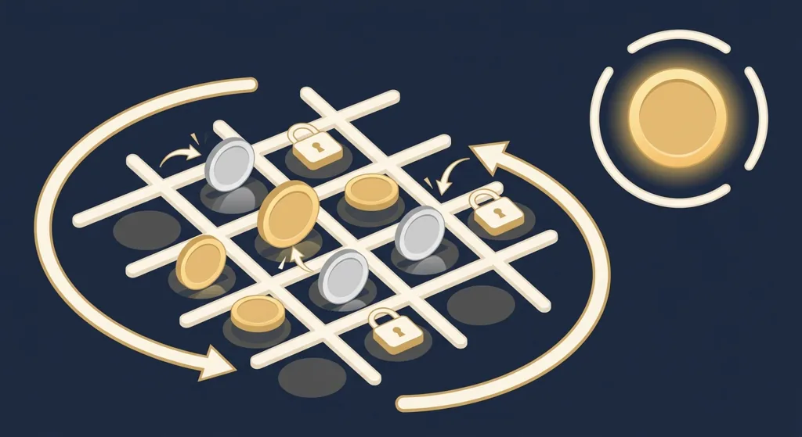
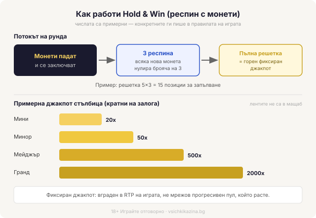

Title tag: Hold & Win (Hold and Spin): как работят респините с монети
Meta description: Hold & Win / Hold and Spin: монети се заключват, три респина се нулират при всяка нова монета, а джакпотите почти винаги са фиксирани кратни на залога, не прогресивни. Защо голямото число не мени шанса ти.

---

# Hold & Win (Hold and Spin): как работят респините с монети и джакпоти

Hold & Win, наричан още Hold and Spin или просто респин, е бонус рунд с една задача: монети падат по екрана, заключват се на място и кратка серия завъртания се опитва да напълни решетката, преди да свърши. Всяка заключена монета носи число, а най-голямото от тези числа е фиксирано още преди да седнеш да играеш. То не расте, докато въртиш, и не се пълни от други играчи. Затова единственото, което тежи в този рунд, е колко монети ще задържиш, преди респините да свършат.

## Какво заключва рунда

Рундът тръгва, когато на екрана паднат достатъчно специални символи наведнъж, обикновено монети или кеш символи, най-често пет или шест според играта. В момента, в който се появят в нужния брой, те се заключват и спират да мърдат. Останалата решетка продължава да се върти около тях. Оттук нататък обикновените символи вече нямат значение за този рунд, брои се само дали ще паднат още монети.

## Трите респина и нулирането

Заключването ти дава три респина. Всяка нова паднала монета се заключва при вече стоящите и връща брояча обратно на три. Паднат ли монети една след друга, рундът се проточва далеч над първоначалните три завъртания. Спрат ли да идват и минат три завъртания без нова монета, рундът приключва и ти плаща каквото си събрал до момента. Повечето игри показват текущия сбор от заключените монети, така че през цялото време виждаш какво виси на екрана.

*Потокът на рунда и примерна джакпот стълбица (числата са примерни, конкретните ги пише в правилата на играта).*

## Какво носи всяка монета

Всяка заключена монета носи собствено число. Понякога това е кеш стойност, кратна на залога, да речем 1x, 2x или 5x. Друг път е етикет за джакпот от няколко нива. Типичната стълбица е Мини, Минор, Мейджър и Гранд, а някои игри я карат с три нива: Мини, Мейджър и Мега. Например една такава стълбица може да изглежда като Мини 20x, Минор 50x, Мейджър 500x и Гранд 2000x залога. Стойностите се движат с размера на залога ти, но самите множители са фиксирани, зададени преди първото ти завъртане. Да речем, съберат ли се на решетката монети за 5x, 2x и един Мейджър от 500x, накрая ти изплащат сбора им наведнъж, тоест 507x залога, а не всяка поотделно.

## Пълна решетка срещу изтекли респини

Най-често рундът просто изчерпва респините си и събраните стойности се сумират в едно плащане. По-рядкото и по-желаното е монетите да напълнят цялата решетка, защото пълната решетка обикновено носи горния джакпот на играта, Гранд или Мега нивото, независимо какви по-малки числа са се събрали дотам. На честа решетка от пет колони и три реда това прави петнайсет позиции за покриване. Игра като Wolf Gold използва точно тази механика, там под името Money Respin. Не всяка популярна ротативка обаче е Hold & Win: The Dog House например се крепи на лепкави wild символи, а не на заключени монети.

## Фиксирано, не прогресивно

Джакпотите в Hold & Win почти винаги са фиксирани: кратно на залога, вградено в математиката на самата игра, а не общ пул, който расте от залозите на хиляди играчи. Гранд джакпот от 2000x залога стои точно толкова голям в първата ти минута, колкото и в хилядната, и е еднакъв за всеки, който върти същия залог. Не се пълни от играта и не „назрява". Размерът му не подсказва нищо за теб, нито колко „назрял" е, нито колко играчи са наливали в него, защото растящ пул тук просто няма. Число, което „отдавна не е падало", не е по-вероятно да падне на следващото завъртане, отколкото на кое да е друго, защото всяко завъртане е независимо, а стойността е записана предварително. Прогресивните джакпоти работят по коренно различен принцип, като отклоняват дял от всеки залог в растящ пул, и как точно става това [сме разписали отделно](/blog/progresivni-dzhakpoti/). Сбъркаш ли двете, почваш да гониш фиксирано число така, все едно е лотария, която се качва.

## Какво не мени механиката

Заключените монети и джакпотите на монетите не пипат домашното предимство. Понеже джакпотът е фиксиран, стойността му е сметната в обявения RTP на играта от самото начало, за разлика от прогресивна ротативка, при която част от залога се отклонява в пула и сваля базовото връщане. На практика Hold & Win заглавие често носи малко по-висок базов RTP от съпоставима прогресивна игра, защото нищо не изтича настрани. По-голямото число на екрана обаче не подобрява шанса ти на едно завъртане, а понякога дори струва повече на входа: за най-горния тир редица игри искат минимален залог или изричен opt-in, иначе просто не си допустим за него. Волатилността тук обикновено е висока, тоест дълги серии почти без нищо и рядко наистина голям резултат от плътна или пълна решетка, така че банката ти може да се стопи между два бонус рунда. RTP пък си остава дългосрочна статистика над милиони завъртания, не обещание за твоята сесия. Ако някой термин тук ти убягва, [речникът с казино термини](/blog/rechnik-kazino-termini/) ги разписва по-подробно.

## Как да го гледаш разумно

Пусни играта в демо режим и ще видиш колко рядко решетката се пълни докрай, без да заложиш и стотинка. Задай си лимит за загуба преди първото завъртане, залагай със сума, която можеш да загубиш изцяло, и гледай на онова голямо число като на декор, не като на план. Тези монети джакпоти са част от [слот игрите](/slot-igri/), не отделна вселена с по-щедри правила. 18+ Хазартът може да пристрасти. Играйте отговорно. Ако усетиш, че играта тегли повече, отколкото си планирал, виж [инструментите за отговорна игра](/otgovorna-igra/). Голямото число е там, за да те задържи на екрана. Реши предварително колко даваш за развлечението и спри дотам, каквото и да свети в ъгъла.

---

**Георги Тодоров**
Публикувано: 12.09.2026 · Последна редакция: 12.09.2026

[About Всички Казина boilerplate]

**Отговорна игра.** 18+ Хазартът може да пристрасти. Играйте отговорно. Ако усетиш, че играта излиза извън контрол или искаш да я ограничиш, виж [инструментите за отговорна игра](/otgovorna-igra/) и възможността за самоизключване чрез националния регистър на уязвимите лица към НАП (подава се писмено само от засегнатото лице). Национална информационна линия за наркотиците, алкохола и хазарта („Солидарност") 0888 99 18 66, делнични дни 10:00–17:00.

**Разкриване на партньорства.** Всички Казина съдържа партньорски (афилиейт) връзки; когато отвориш оферта през такава връзка, това може да финансира сайта, без да променя цената за теб и без да влияе на оценките ни. От 1 август 2026 г. дейността на афилиейт оператори в България се лицензира съгласно Закона за държавния бюджет за 2026 г. (ДВ, бр. 69 от 31.07.2026 г.). Всички Казина е подало заявление за лиценз пред Националната агенция по приходите и очаква издаването му.
