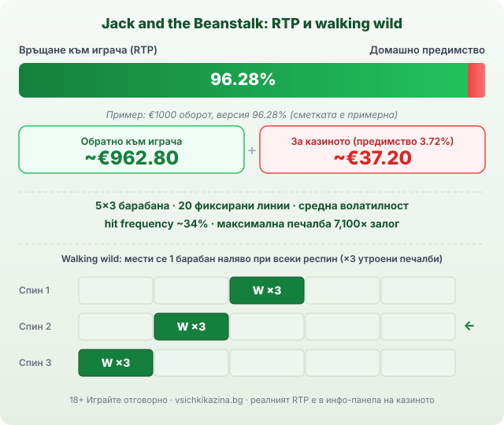

Title tag: Jack and the Beanstalk: RTP 96.28% и walking wilds
Meta description: NetEnt Jack and the Beanstalk: вървящи wild-ове (walking wilds) с утроени печалби, безплатни завъртания, Treasure Collection и RTP 96.28%.

---

# Jack and the Beanstalk: RTP, вървящи wild-ове и как се играе

Jack and the Beanstalk е слот на NetEnt от 2011 г. върху класическа мрежа от 5 барабана и 3 реда с 20 фиксирани линии. Помни се заради един символ, който отказва да стои на място. Wild-ът тук върви: появи ли се на барабан, той се измества стъпка по стъпка наляво при следващи завъртания и по пътя утроява всяка печалба, в която участва. Заради тази механика играта още се цитира, макар да е на повече от десет години.

## Вървящите wild-ове: сърцето на играта

Появи ли се wild символ на някой барабан, случват се две неща наведнъж. Всяка печеливша комбинация, която го съдържа, се умножава по три, а веднага след изплащането се задейства безплатен респин. При него wild-ът се премества с един барабан наляво и остава там за ново завъртане. Процесът се повтаря завъртане след завъртане, докато символът стигне барабан 1 и излезе от полето. Един-единствен wild така може да произведе няколко последователни респина, всеки с утроени печалби, преди да изчезне. Механиката работи и в основната игра, и в безплатните завъртания, което е рядкост при слотовете от онова поколение и е причината заглавието да се цитира и днес, когато някой обяснява какво значи walking wild.

## Безплатни завъртания и Treasure Collection

Специалният scatter символ е ковчегът със съкровище. Съберат ли се три или повече от него някъде по екрана, играта дава 10 безплатни завъртания, а нови три ковчега по време на рунда добавят още. В този режим се включва и събирането на ключове: всеки ключ, който падне на барабан 5, се трупа в отделен брояч. Достигне ли определени прагове, обикновените wild-ове се надграждат до струпани и накрая до разширяващи се символи, които покриват цял барабан. Оттам идват най-едрите резултати на играта, защото утроените печалби от walking wild се засрещат с по-плътни wild формации. Извън безплатните завъртания този пласт го няма.

## RTP 96.28%: дългосрочна статистика, не обещание

Обявеният RTP на класическата версия е 96.28%, което оставя домашно предимство от около 3.72%. При примерен оборот от €1000 това значи средно връщане от порядъка на €962.80 към играча и около €37.20 за казиното, разпределени върху хиляди завъртания, а не гарантиран резултат за една сесия. NetEnt обаче доставя игрите си в няколко конфигурации с различен RTP и операторът избира коя да пусне. Едно и също заглавие при две казина може да ти връща различен процент, затова отвори инфо-панела на конкретната игра и провери числото, преди да заложиш. [Начинът, по който оценяваме казината](/kak-ocenyavame/), гледа реалния RTP, не рекламния, и същата логика важи, когато търсиш [ротативки с висок RTP](/slot-igri/visok-rtp/). Утроените печалби и вървящите wild-ове са вътре в тази сметка.

*Спецификации на класическата версия и как ходи wild-ът (€ сметката е примерна; операторът може да пусне различен RTP, провери инфо-панела).*

## Средна волатилност и таван от 7,100×

Волатилността на Jack and the Beanstalk обикновено се описва като средна, макар част от каталозите да я слагат към средно-висока. На практика балансът се движи без дългите сухи периоди на екстремните слотове, а по-едрите удари идват най-често от вериги респини с walking wild или от безплатните завъртания. Играта пуска някаква печалба на около една трета от завъртанията (hit frequency около 34%), тоест дребните връщания се появяват сравнително често, докато голямото натрупване чака бонус режима. Теоретичният таван е 7,100 пъти залога. При €1 залог това са €7,100, само че вероятността е нищожна и подобно попадение не бива да влиза в никаква сметка за бюджет.

## Как се различава от другите NetEnt заглавия

Ако си играл други класики на NetEnt, разликата е в самата механика на печелене. Starburst разчита на wild, който заема цял барабан и връща безплатен респин в двете посоки. Gonzo's Quest пуска символите да падат каскадно и трупа множител при всяка последователна печалба. Twin Spin стартира със свързани съседни барабани, а Dead or Alive 2 е известен с крайно висока волатилност и дълги сухи серии. Jack and the Beanstalk стои на своя ъгъл с вървящия wild и утроените печалби, което го прави по-спокоен за наблюдение от повечето, без да променя факта, че всяка от тези [ротативки](/kazino-igri/rotativki/) е построена с предимство за казиното.

## Темпо, демо и лимити

Респините с walking wild карат едно завъртане да води до следващото и създават усещане за движение дори когато балансът стои на място. Затова си струва да пуснеш играта в демо режим и да видиш колко рядко ключовете стигат до най-добрите wild формации, без да залагаш реални пари. Задай си лимит за загуба и за време преди първото завъртане и го спазвай, дори когато wild-ът тръгне да върви наляво и ти се стори, че големият рунд е на косъм. Утроените печалби изглеждат щедри в момента, но математиката на играта не се променя от анимацията. 18+ Хазартът може да пристрасти. Играйте отговорно. Ако усетиш, че играта излиза извън контрол, виж [инструментите за отговорна игра](/otgovorna-igra/), а самите слот игри са развлечение с предварително известна цена, не начин да си върнеш загубеното.

## Стара игра, честна сметка

Jack and the Beanstalk държи на възрастта си заради една механика, която се разбира от първото завъртане и остава приятна за гледане. Зад вървящите wild-ове и утроените печалби стоят RTP от 96.28%, който операторът може и да свали, средна волатилност и таван, който почти никой няма да види. Провери реалния процент в инфо-панела, гледай на 7,100× като на рядкост, а не като на план, и залагай със сума, която можеш да загубиш изцяло.

---

**Георги Тодоров**
Публикувано: 12.09.2026 · Последна редакция: 12.09.2026

[About Всички Казина boilerplate]

**Отговорна игра.** 18+ Хазартът може да пристрасти. Играйте отговорно. Ако усетиш, че играта излиза извън контрол или искаш да я ограничиш, виж [инструментите за отговорна игра](/otgovorna-igra/) и възможността за самоизключване чрез националния регистър на уязвимите лица към НАП (подава се писмено само от засегнатото лице). Национална информационна линия за наркотиците, алкохола и хазарта („Солидарност") 0888 99 18 66, делнични дни 10:00–17:00.

**Разкриване на партньорства.** Всички Казина съдържа партньорски (афилиейт) връзки; когато отвориш оферта през такава връзка, това може да финансира сайта, без да променя цената за теб и без да влияе на оценките ни. От 1 август 2026 г. дейността на афилиейт оператори в България се лицензира съгласно Закона за държавния бюджет за 2026 г. (ДВ, бр. 69 от 31.07.2026 г.). Всички Казина е подало заявление за лиценз пред Националната агенция по приходите и очаква издаването му.
