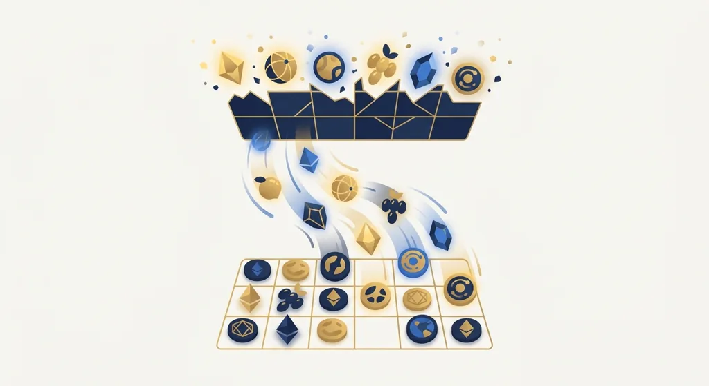
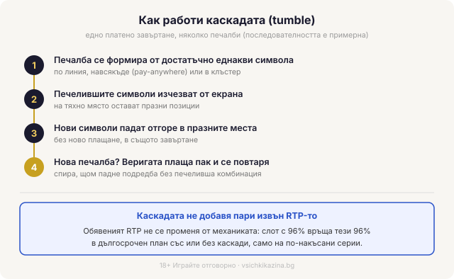
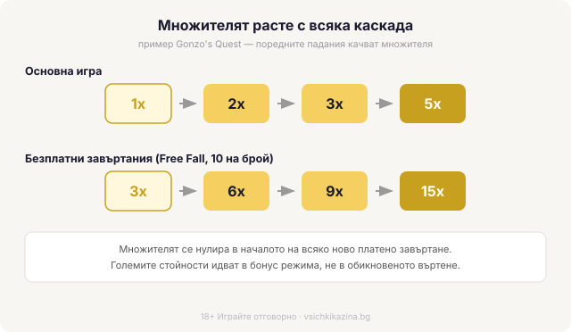

Byline: Георги Тодоров (editorial register) | Market: BG — game-mechanic explainer, no persona receipts (no operator/НАП facts in scope)

Title tag: Каскадни символи (tumble): как работят падащите печалби
Meta description: Каскадни/падащи символи (tumble, Avalanche): печелившите изчезват, нови падат в същото завъртане и веригата плаща пак. Защо това не сваля предимството на казиното.

---

# Каскадни символи (tumble): как едно завъртане носи няколко печалби

При каскадните ротативки печелившите символи не остават на екрана. Съберат ли се достатъчно за печалба, тя се изплаща, символите изчезват и на празните места падат нови отгоре. Ако новите оформят следваща печеливша комбинация, тя също плаща и падането се повтаря. Всичко това се случва в рамките на едно платено завъртане. Затова една-единствена заложена сума понякога изплаща три, четири или повече удара подред, преди екранът да спре.

## Какво пада и какво идва на негово място

Механиката има няколко имена за едно и също нещо. Pragmatic Play я нарича tumble, играчите казват каскада или падащи символи, а NetEnt я кръсти Avalanche още в Gonzo's Quest. Схемата навсякъде е една: печалба, изчезване, ново падане, проверка за нова печалба. Веригата спира в мига, в който падне подредба без печеливша комбинация. При обикновеното завъртане резултатът се отчита веднъж и толкова; тук същото завъртане може да се преоцени по няколко пъти, без да плащаш повторно. Ако някой термин ти убягва, [речникът с казино термини](/blog/rechnik-kazino-termini/) държи определенията на едно място.

## Каскадата не добавя пари извън RTP-то

Тук е лесно да се подведеш. Веригата от печалби изглежда като бонус върху нормалната игра. Всъщност каскадата не носи пари отвън, а разсипва вече заложеното връщане на порции. Теоретичният RTP на слота стои същият, независимо колко ефектно се сриват символите. Вместо една средна печалба от време на време, играта ти връща процента си на серии: дълго нищо, после верига, която компенсира. Слот с обявени 96% връща тези 96% в дългосрочен план със или без каскади. Механиката мени ритъма на плащане, а математиката отдолу остава недокосната. Пример без конкретни стотинки: една група плаща, изчезва, падат нови символи и втора група добавя още, като двата удара идват от едно завъртане, но средното връщане на играта не помръдва от това.

*Как тече една каскада в рамките на едно платено завъртане (последователността е примерна). Обявеният RTP не се променя от механиката.*

## Множителят, който расте с всяка каскада

Каскадите често идват с множител, който се качва на всяко следващо падане в рамките на завъртането. Gonzo's Quest е учебникарският пример: в основната игра поредните лавини вдигат множителя 1x, 2x, 3x и до 5x, а спечелиш ли безплатните завъртания (Free Fall, 10 на брой), стълбицата тръгва от 3x и минава през 6x, 9x до 15x. Големите числа живеят в бонус режима, не в обикновеното въртене. Sweet Bonanza работи по същата логика: множителите-бомби от 2x до 100x падат само по време на безплатните завъртания, а извън тях каскадата плаща без тях. Затова обикновеното завъртане и попадналият бонус са две различни игри по размер на печалбата, а рекламните клипове почти винаги показват второто. Как изглежда всичко това при една конкретна игра можеш да видиш в разбора на [Sweet Bonanza](/blog/sweet-bonanza/).

*Множителят се качва с всяка поредна каскада; при Gonzo's Quest достига 5x в основната игра и 15x в безплатните завъртания.*

## Клъстери и печалба навсякъде

Падащите символи рядко вървят със стари линии на печалба. По-често лежат върху широка мрежа, където се брои цвят, а не редица. При pay-anywhere печелиш, ако се съберат достатъчно еднакви символа където и да е из полето, както е в Sweet Bonanza. При клъстерите (cluster pays) трябва група от съседни еднакви символа, като в Sugar Rush или Reactoonz. И двете подхождат на изчезването: махаш групата, оставяш дупки и ги запълваш отгоре, без да въртиш наново цели барабани. Затова каскадите и клъстерите се срещат заедно толкова често.

## Защо каскадите значат търпение

Ефектната верига има цена, и тя е волатилността. Игрите с падащи символи клонят към средна и висока волатилност: балансът пада бавно през завъртания без нищо, а после рядка каскада или бонус с качен множител наваксва наведнъж. Усещането за щедрост идва точно от тези серии, докато между тях стоят сухи периоди, които същата статистика изисква. Волатилността тук е въпрос на темперамент и бюджет. Ако не понасяш дълги минуси в очакване на един голям удар, каскадният слот ще ти къса нервите, колкото и приятно да се сриват бонбоните на екрана.

## С какво се различава от линиите

При класическа ротативка с фиксирани линии всяко завъртане е една оценка: барабаните спират, играта проверява линиите веднъж, плаща или не и приключва. При [слот игрите](/slot-igri/) с каскади същото платено завъртане се проверява отново и отново, докато спре да ражда печалби. Броят на линиите или начините за печалба е отделен въпрос от каскадата, макар двете механики често да се комбинират в една игра. За сметката ти значение има само едно: повече удари в едно завъртане не подобряват шансовете ти в дългосрочен план, а разбъркват същото връщане на по-накъсани серии. Как претегляме подобни неща, когато гледаме една игра, е описано в [начина ни на оценяване](/kak-ocenyavame/).

## Верига за окото, същата математика отдолу

Каскадните символи са една от най-приятните за гледане механики в казиното, и точно там е капанът: изглеждат по-щедри, отколкото са. Завъртане с четири последователни падания си остава едно завъртане със същото домашно предимство. Пусни играта в демо режим, за да усетиш колко рядко идва дългата верига с качен множител, и си задай лимит за загуба и за време преди първото реално завъртане. 18+ Хазартът може да пристрасти. Играйте отговорно. Ако усетиш, че гониш следващата каскада повече, отколкото си планирал, виж [инструментите за отговорна игра](/otgovorna-igra/). Гледай веригата като зрелище, не като план: числата под нея не мърдат от това колко красиво падат символите.

---

**Георги Тодоров**
Публикувано: 12.09.2026 · Последна редакция: 12.09.2026

[About Всички Казина boilerplate]

**Отговорна игра.** 18+ Хазартът може да пристрасти. Играйте отговорно. Ако усетиш, че играта излиза извън контрол или искаш да я ограничиш, виж [инструментите за отговорна игра](/otgovorna-igra/) и възможността за самоизключване чрез националния регистър на уязвимите лица към НАП (подава се писмено само от засегнатото лице). Национална информационна линия за наркотиците, алкохола и хазарта („Солидарност") 0888 99 18 66, делнични дни 10:00–17:00.

**Разкриване на партньорства.** Всички Казина съдържа партньорски (афилиейт) връзки; когато отвориш оферта през такава връзка, това може да финансира сайта, без да променя цената за теб и без да влияе на оценките ни. От 1 август 2026 г. дейността на афилиейт оператори в България се лицензира съгласно Закона за държавния бюджет за 2026 г. (ДВ, бр. 69 от 31.07.2026 г.). Всички Казина е подало заявление за лиценз пред Националната агенция по приходите и очаква издаването му.
