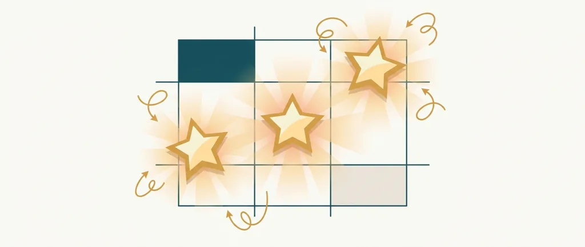
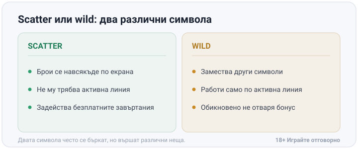
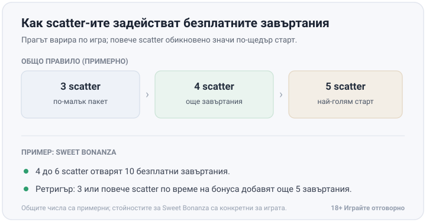

Title tag: Scatter символи: как се задействат безплатни завъртания
Meta description: Какво е scatter символ, с какво се различава от wild и колко трябват за bonus trigger. Обясняваме безплатните завъртания, ретригър и feature buy.

---

# Scatter символи и bonus trigger: как се задействат безплатните завъртания

Scatter символът (или скатер, както го наричат българските играчи) не признава платежни линии. Пада ли той на екрана, брои се, независимо на коя ролка и на кой ред е застанал. Обикновените символи работят другояче: трябва да са подредени по конкретна активна линия, за да платят. Wild пък замества други символи, за да довърши комбинация по линия, но сам по себе си обикновено не отваря бонус рунд. Двата символа често се бъркат, защото изглеждат еднакво "специални" на екрана, но вършат противоположни неща. На практика познаваш scatter-а по това, че остава важен дори когато не стои на активна линия. Всеки друг символ извън wild-а просто пропада, ако е кацнал на ред, който не се брои.

## Scatter срещу wild: два различни символа

Wild довършва комбинация, която иначе би пропуснала. Паднат ли два еднакви символа плюс wild на трета позиция по линията, печелиш все едно там е паднал третият истински символ. Scatter не помага на чужда комбинация. Той действа напълно самостоятелно и плаща или отключва бонус само заради присъствието си някъде по grid-а. Затова в повечето игри правилата за двата символа стоят в отделни редове на таблицата с изплащания, не един до друг. Обяснението и на двата стои в [речника с казино термини](/blog/rechnik-kazino-termini/).

*Scatter и wild са различни символи: единият брои навсякъде и отваря бонуса, другият замества по линия.*

## Как се задейства бонусът

Прагът, при който бонусът се отключва (на английски bonus trigger), най-често е 3 или повече scatter-a някъде по екрана, а по-високият брой обикновено носи по-щедра награда. Точните стойности се менят по игра: 3 scatter-a отварят по-малък пакет безплатни завъртания, 4 добавят още, а 5 обикновено е таванът за конкретния слот с най-голямата стартова стойност. В [Sweet Bonanza](/blog/sweet-bonanza/) на Pragmatic Play прагът е по-висок от типичния. Трябват 4 до 6 от кръглите бонбонени scatter-и, за да се отвори бонус рундът от 10 безплатни завъртания.

*Прагът за бонуса варира по игра. Общите числа са примерни; стойностите за Sweet Bonanza (4 до 6 scatter, 10 завъртания, ретригър още 5) са конкретни за играта.*

## Scatter, който плаща, и scatter, който само отключва

Не всеки scatter носи пари сам по себе си. В част от игрите той плаща малка сума, ако паднат достатъчно копия, отделно от това дали отваря бонус, а всеки допълнителен scatter над прага добавя по нещо към тази сума. Има обаче и слотове, където скатерът няма собствена стойност и служи само като тригер, който отключва бонуса при достатъчен брой символи. В Sweet Bonanza символите плащат навсякъде по мрежата вместо по линии (scatter pays), а печелившите групи изчезват и се заменят от нови чрез каскаден (tumble) елемент. Печалбите от безплатните завъртания после доразиграваш по същите условия като всеки друг бонус, тоест същото [разиграване (wagering)](/blog/kak-raboti-razigravaneto/), което важи и за депозитните бонуси.

## Повторно задействане в бонуса

Паднат ли нови scatter-и, докато тече бонус рундът, те добавят завъртания към оставащите. Това се нарича ретригър. В Sweet Bonanza три или повече scatter-a по време на бонуса добавят още 5 завъртания към оставащите. Част от слотовете обаче залагат твърд таван на завъртанията и спират дотам, колкото и добре да върви бонусът.

## Wild без scatter: примерът Starburst

Starburst на NetEnt няма нито един scatter символ и няма бонус рунд с безплатни завъртания въобще. Wild-ът там се разширява върху цяла ролка (2, 3 или 4) и се заключва за респин. Появи ли се нов wild по време на респина, ефектът се повтаря. Тук няма никаква scatter логика.

## Купуване на бонус (feature buy) и математиката зад него

Функцията "купи бонус" пуска играча направо в бонус рунда срещу фиксирана сума, обикновено изразена като кратно на залога. Появява се като отделно копче до обичайния бутон за завъртане, там където студиото е решило да я вгради. Студиата калкулират тази цена спрямо реалния шанс и средната стойност на бонуса, който играчът иначе би чакал да падне сам, което прави покупката приблизително неутрална спрямо математиката на играта, не отстъпка от домашното предимство. Плащаш за момента, в който бонусът се случва, не за по-добри шансове вътре в него. Същият бонус може да се пробва и безплатно в [безплатните казино игри](/blog/bezplatni-kazino-igri/), за да видиш темпото му, преди да платиш за него.

## Влияят ли повечето scatter-и на RTP-то?

По-щедрите scatter тригери означават по-чест бонус и повече безплатни завъртания. Това обаче е факт за честотата, не за печалбата. Колкото и лесно да пада бонусът, RTP на играта не помръдва - безплатните завъртания са калкулирани в общото RTP число предварително, а не допълнителен подарък.

18+ Хазартът може да пристрасти. Играйте отговорно. Реши бюджета си, преди да натиснеш първото завъртане, а не докато гониш бонус, който вече е закъснял. [Инструментите за отговорна игра](/otgovorna-igra/) са там за тази граница.

---

**Георги Тодоров**
Публикувано: 12.09.2026 · Последна редакция: 12.09.2026

[About Всички Казина boilerplate]

**Отговорна игра.** 18+ Хазартът може да пристрасти. Играйте отговорно. Ако усетиш, че играта излиза извън контрол или искаш да я ограничиш, виж [инструментите за отговорна игра](/otgovorna-igra/) и възможността за самоизключване чрез националния регистър на уязвимите лица към НАП (подава се писмено само от засегнатото лице). Национална информационна линия за наркотиците, алкохола и хазарта („Солидарност") 0888 99 18 66, делнични дни 10:00–17:00.

**Разкриване на партньорства.** Всички Казина съдържа партньорски (афилиейт) връзки; когато отвориш оферта през такава връзка, това може да финансира сайта, без да променя цената за теб и без да влияе на оценките ни. От 1 август 2026 г. дейността на афилиейт оператори в България се лицензира съгласно Закона за държавния бюджет за 2026 г. (ДВ, бр. 69 от 31.07.2026 г.). Всички Казина е подало заявление за лиценз пред Националната агенция по приходите и очаква издаването му.
