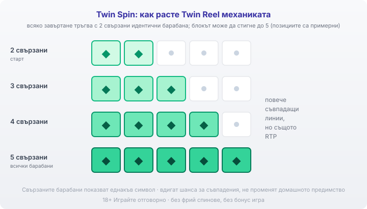
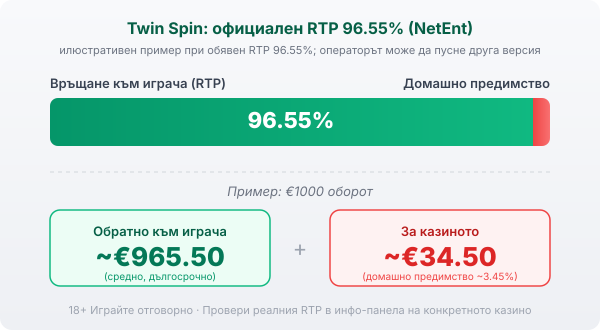

Title tag: Twin Spin: RTP, свързани барабани и как се играе
Meta description: Twin Spin на NetEnt с RTP 96.55%, 243 начина и Twin Reel: два свързани барабана, които стигат до пет. Без фрий спинове и бонус, само базова игра.

---

# Twin Spin: RTP, свързани барабани и как се играе

Twin Spin (туин спин) излиза през 2013 г. и до днес държи място в лобитата, макар да няма нито едно от нещата, с които слотовете обикновено се хвалят. Без бонус рунд, без фрий спинове, без нива за отключване. Темата е неонов Лас Вегас с диаманти, седмици и BAR символи, а цялата игра стъпва на един-единствен трик: свързаните барабани.

## 5x3, 243 начина и залогът

Полето е класическо 5 на 3 и печелившите комбинации се броят по 243 начина отляво надясно, тоест не залагаш на конкретни линии, а на съвпадащи символи по съседни барабани. Залогът върви от €0.25 до €125.00 на завъртане. Символите са ретро: скъпоценни камъни, седмици, звънци и BAR-ове, а синият wild заменя всеки от тях, за да дострои комбинация. Дотук е ротативка като хиляди други.

## Twin Reel: свързаните барабани

Всяко завъртане започва с поне два съседни барабана, залепени един за друг като близнаци, които показват едни и същи символи. Ако имаш късмет по време на завъртането, свързаният блок се разраства и покрива три, четири или всичките пет барабана с идентични символи. Пет еднакви барабана значат, че екранът се пълни с една и съща картинка и почти всички от 243-те начина се задействат наведнъж. Тук е тръпката на играта. Само че тази механика вдига шанса да уцелиш съвпадащи символи, без да пипа домашното предимство: обявеният RTP вече я включва.

*Twin Reel: всяко завъртане тръгва с поне 2 свързани идентични барабана, а блокът може да се разшири до 3, 4 или всичките 5. Повече съвпадащи линии наведнъж, но домашното предимство не се променя.*

## Няма фрий спинове, няма бонус

Повечето модерни слотове пазят големите пари за отделен режим, до който трябва да стигнеш. Twin Spin не прави това. Няма скатери, няма безплатни завъртания, няма бонус игра. Единственото извън обикновените въртения е Twin Reel и обикновеният wild. Базовата игра е цялата игра, което е рядкост и всъщност е основната причина хора да я търсят: няма какво да чакаш, всяко завъртане е с еднакъв потенциал.

## RTP и волатилност

Обявеният RTP на Twin Spin е 96.55% по данни на NetEnt, съвсем близо до средните за индустрията около 96%. Много заглавия се доставят в няколко RTP версии и операторът избира коя да пусне, затова в [методологията ни](/kak-ocenyavame/) гледаме реалния RTP на конкретното казино, а не рекламния; при Twin Spin международните бази изброяват и по-ниски конфигурируеми версии, така че проверката в инфо-панела не е формалност. Волатилността се описва като ниска до средна: балансът се движи по-плавно, отколкото при рязък високорисков слот, но и без огромните върхове. При обявен RTP 96.55% и €1000 оборот средно се връщат около €965.50, а към €34.50 остават за казиното в дългосрочен план.

*Илюстративен пример при обявен RTP 96.55%: €1000 оборот връща средно ~€965.50, ~€34.50 остават за казиното (домашно предимство ~3.45%). Операторът може да пусне друга версия, затова се проверява в инфо-панела.*

## Максималната печалба

Тук числата се разминават според къде гледаш. Самата страница на NetEnt изписва в полето „Max Win" скромните 1 000х залога, докато международните бази цитират 1 080х, което в монети прави 270 000. И двете са далеч от петцифрените множители на високорисковите заглавия. Свързаните барабани звучат мащабно, но те правят печалбите по-чести, а не по-едри: таванът си остава скромен, защото играта няма множител или бонус, който да го изстреля нагоре.

## Какво да очакваш реалистично

Twin Spin е слот за темпо и за простота. Ако си играл Dead or Alive 2 и си усетил колко брутални са сухите му серии, тук е обратната крайност: по-равен баланс, по-чести дребни съвпадения, по-нисък таван. По темперамент е близо до Starburst, само че с друга механика. Не го отваряй с очакване за живототпроменящ удар, защото играта просто не е построена за това. Сертификатът ѝ и името на голям доставчик значат честна математика, а не предимство за теб; в дългосрочен план парите клонят към казиното, колкото и приятно да се подреждат близнаците.

## Демо, лимити и реален RTP

[Слот игрите](/slot-igri/) на NetEnt обикновено имат демо режим, в който да видиш как се разрастват свързаните барабани, без да залагаш, а за самото студио виж профила на [NetEnt](/blog/netent-provajdar/) или по-широкия [преглед на доставчиците](/blog/games-providers/). Задай си лимит за загуба и за време, преди да отвориш играта, и провери реалния RTP на конкретното казино в инфо-панела. Хазартът не е начин да си върнеш пари или да изкараш доход; в дългосрочен план математиката работи за казиното. 18+ Хазартът може да пристрасти. Играйте отговорно. Ако усетиш, че играта излиза извън контрол, виж [инструментите за отговорна игра](/otgovorna-igra/).

---

**Георги Тодоров**
Публикувано: 12.09.2026 · Последна редакция: 12.09.2026

[About Всички Казина boilerplate]

**Отговорна игра.** 18+ Хазартът може да пристрасти. Играйте отговорно. Ако усетиш, че играта излиза извън контрол или искаш да я ограничиш, виж [инструментите за отговорна игра](/otgovorna-igra/) и възможността за самоизключване чрез националния регистър на уязвимите лица към НАП (подава се писмено само от засегнатото лице). Национална информационна линия за наркотиците, алкохола и хазарта („Солидарност") 0888 99 18 66, делнични дни 10:00–17:00.

**Разкриване на партньорства.** Всички Казина съдържа партньорски (афилиейт) връзки; когато отвориш оферта през такава връзка, това може да финансира сайта, без да променя цената за теб и без да влияе на оценките ни. От 1 август 2026 г. дейността на афилиейт оператори в България се лицензира съгласно Закона за държавния бюджет за 2026 г. (ДВ, бр. 69 от 31.07.2026 г.). Всички Казина е подало заявление за лиценз пред Националната агенция по приходите и очаква издаването му.
