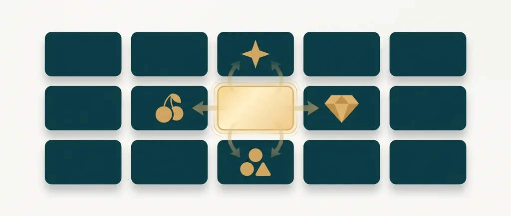
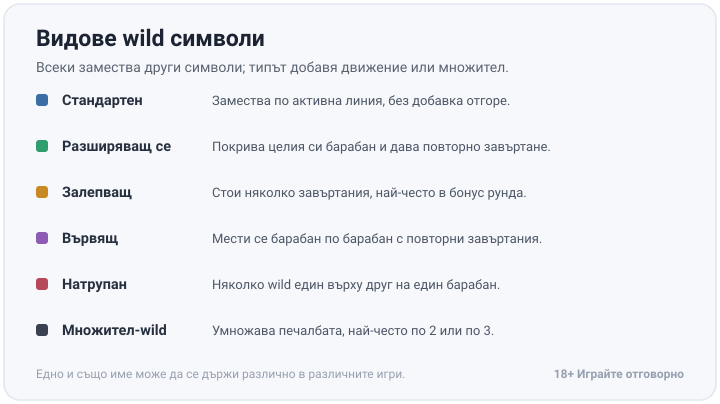
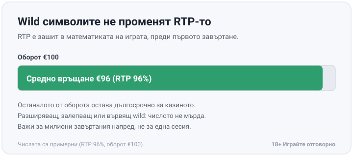

Title tag: Wild символи в ротативките: видове и как работят
Meta description: Wild символи обяснени: стандартен, разширяващ се, залепващ, вървящ и натрупан wild. Как работят и защо не променят RTP-то на ротативката.

---

# Wild символи в ротативките: видове и как работят

„WILD" на екрана изглежда като един-единствен символ, но под етикета се крият няколко различни механики. При всяка от тях wild символът замества други плащащи символи в активна линия или начин на печалба, за да довърши или подобри комбинация. Почти навсякъде има едно изключение: символът scatter, който обикновено пуска безплатни завъртания или плаща без значение от позицията си на екрана, стои отделно и wild не го замества.

## Какво прави wild символът

Паднат ли на печеливша линия два еднакви символа и на третото място кацне wild, играта чете реда все едно и то носи същия символ, и комбинацията плаща. Оттам идва името „диви символи": на повечето игри те нямат собствена стойност, а заемат тази на съседите си и сглобяват печалба, която иначе би пропаднала. Непознатите етикети по-долу са обяснени в [речника на казино термините](/blog/rechnik-kazino-termini/).

## Стандартен wild: основата

Най-обикновеният wild седи на барабана като всеки друг символ и замества редовните печеливши символи по активна линия. Замества и толкова, без разширяване, движение или множител отгоре. Повечето играчи се срещат първо точно с него, а всеки следващ тип е същото заместване с по една добавка отгоре.

## Разширяващ се, залепващ и вървящ wild

Разликата при следващите типове е в движението, което добавят:

- **Разширяващ се (expanding).** Щом кацне, се разтяга по целия барабан, на който е паднал, и обикновено дава безплатно повторно завъртане на останалите.
- **Залепващ (sticky).** Остава на мястото си през определен брой завъртания, най-често вътре в бонус рунд или серия безплатни завъртания, докато другите барабани се въртят около него.
- **Вървящ, или местещ се (walking).** Пада, задейства повторно завъртане, после се измества с едно поле към съседен барабан и повтаря цикъла, докато не напусне мрежата.

## Натрупан wild и множител-wild

Натрупаният (stacked) wild подрежда няколко wild символа един върху друг на един и същ барабан, така че при завъртане цял барабан или голяма част от него може да се окаже див наведнъж, което вдига шанса точно тази позиция да участва в печеливш ред. Множител-wild не е отделно семейство, а добавка върху някой от изброените по-горе типове: символът замества както обикновено, но печалбата, в която участва, се умножава, най-често по 2 или по 3.

*Шестте вида wild накратко: всеки замества други символи, а типът добавя движение или множител. Едно и също име може да се държи различно в различните игри.*

## Две познати игри, две различни движения

Jack and the Beanstalk на NetEnt показва вървящия wild в чист вид: символът пада и задейства повторно завъртане. После се мества с един барабан наляво, а цикълът се повтаря, докато wild не излезе от мрежата през първия барабан. Starburst, пак на NetEnt, прави същото за разширяващия тип: wild на втория, третия или четвъртия барабан се разтяга по целия барабан, заключва позицията и върти отново останалите, и това се повтаря до три пъти в един цикъл. И двете са сред [ротативките в казино игрите](/kazino-igri/rotativki/), където движението личи най-добре в самата игра.

## Помагат на екрана, не и на дългосрочния резултат

Всеки от изброените типове прави печелившите комбинации по-чести на вид и по-ефектни за гледане, но нито един не пипа RTP или домашното предимство на играта: това число е зашито в математическия модел на софтуера, преди изобщо да завъртиш барабан. RTP от 96% означава, че в дългосрочен план играта връща средно €96 от всеки €100 заложен оборот, независимо колко разширяващи се или залепващи wild символа си видял по пътя. Числото е валидно за милиони завъртания напред, а една сесия е твърде кратка извадка, за да го провери. Игра, щедра на wild символи на екрана, обикновено компенсира с по-нисък базов пейаут другаде в таблицата с печалбите. Ефектите на екрана са за гледане; дългосрочното връщане стои в RTP числото и не мърда заради тях. Ако подбираш по това число, а не по това кой wild е най-зрелищен, гледай [слотовете с висок RTP](/slot-igri/visok-rtp/).

*При RTP 96% от €100 оборот се връщат средно €96 в дългосрочен план. Разширяващ, залепващ или вървящ wild не мърда това число. Числата са примерни.*

## Провери го първо в демо

Едно и също име на тип не значи еднакво поведение: залепващ wild в едно заглавие стои 3 завъртания, в друго 5, а точното правило пише на екрана с информация или в таблицата с печалбите на самата игра. Демо режимът пуска играта без депозит, с виртуален баланс, и е най-бързият начин да видиш какво прави wild символът, преди да заложиш реални пари. При [безплатните казино игри](/blog/bezplatni-kazino-igri/) това отнема минута-две.

Разширяващ се барабан, сериен залепващ wild или дълга разходка на символ през цялата мрежа изглеждат зрелищно и лесно те подтикват към още едно завъртане заради самия ефект, а не заради играта. По-разумно е да приемаш тези моменти като анимация, а не като знак, че играта е „щедра". Играй с бюджет, който можеш да загубиш изцяло, задай лимит за депозит и за загуба, преди да пуснеш първото завъртане на нова игра, и приемай wild символите като част от зрелището, стойността им спира дотам. 18+ Хазартът може да пристрасти. Играйте отговорно. Ако усетиш, че гониш определен тип wild само заради усещането, а не заради самата игра, спри и виж [инструментите за отговорна игра](/otgovorna-igra/).

---

**Георги Тодоров**
Публикувано: 12.09.2026 · Последна редакция: 12.09.2026

[About Всички Казина boilerplate]

**Отговорна игра.** 18+ Хазартът може да пристрасти. Играйте отговорно. Ако усетиш, че играта излиза извън контрол или искаш да я ограничиш, виж [инструментите за отговорна игра](/otgovorna-igra/) и възможността за самоизключване чрез националния регистър на уязвимите лица към НАП (подава се писмено само от засегнатото лице). Национална информационна линия за наркотиците, алкохола и хазарта („Солидарност") 0888 99 18 66, делнични дни 10:00–17:00.

**Разкриване на партньорства.** Всички Казина съдържа партньорски (афилиейт) връзки; когато отвориш оферта през такава връзка, това може да финансира сайта, без да променя цената за теб и без да влияе на оценките ни. От 1 август 2026 г. дейността на афилиейт оператори в България се лицензира съгласно Закона за държавния бюджет за 2026 г. (ДВ, бр. 69 от 31.07.2026 г.). Всички Казина е подало заявление за лиценз пред Националната агенция по приходите и очаква издаването му.
