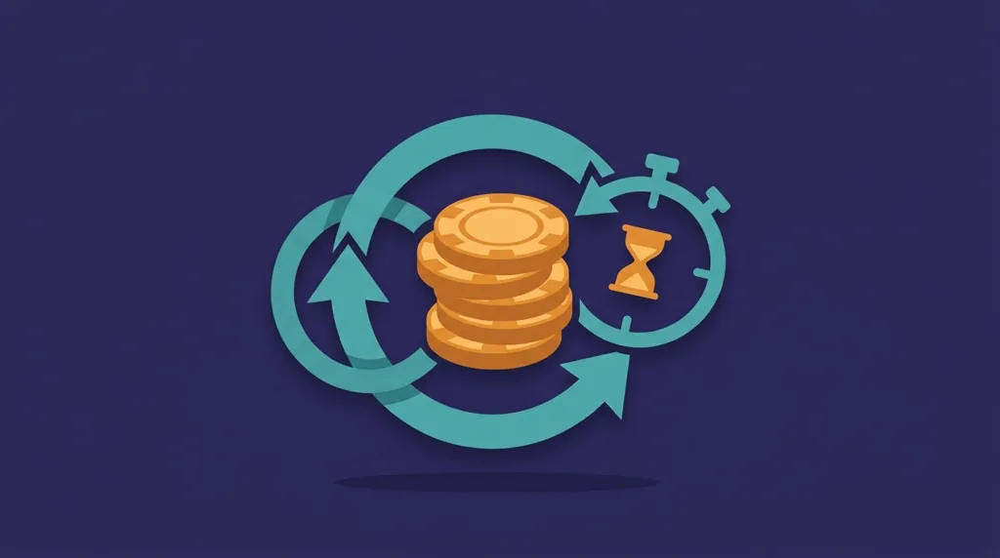
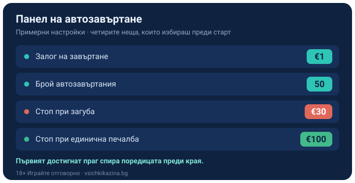

Title tag: Автоматично завъртане (autoplay): настройки и рискове
Meta description: Как работи автоматичното завъртане в ротативките, кои настройки и лимити има, защо UKGC го забрани за британските слотове и защо autoplay не мени шансовете, само темпото.

---

# Автоматично завъртане (autoplay) в ротативките: настройки и рискове

Бутонът за автоматично завъртане пуска ротативката да върти сама зададен брой пъти на фиксиран залог, без да натискаш копчето всеки път. Удобство е, когато не искаш да седиш над екрана за всяко завъртане. Същото това удобство маха ръката ти от паузата между завъртанията, а паузата е моментът, в който човек обикновено решава да спре.

## Какво избираш, преди да го пуснеш

При включен autoplay избираш колко завъртания да минат едно след друго и с какъв залог, а играта ги изпълнява без твоя намеса. По същество прехвърляш управлението на софтуера за определен брой рундове и гледаш резултата. Освен броя завъртания и залога на завъртане, повечето слотове предлагат два стопа, които решават кога поредицата да прекъсне по-рано. Лимитът на загубата спира автозавъртанията, ако балансът ти падне с определена сума. Лимитът на единичната печалба ги спира, ако едно завъртане плати над зададен праг, за да не подмине голямо попадение незабелязано. Примерна настройка изглежда така: залог €1, 50 автозавъртания, лимит на загубата €30 и лимит на единична печалба €100. При нея поредицата спира, ако изгубиш €30, преди да минат 50-те завъртания, или ако някое завъртане ти донесе €100 или повече.

*Панелът за автозавъртане с четирите ключови настройки (числата са примерни). Двата стопа, при загуба и при единична печалба, са всъщност инструментът за контрол.*

## Защо е удобно и къде е капанът

Autoplay спестява стотици натискания, но точно това го прави рисково. Когато завъртанията текат сами, е лесно да изгубиш следа колко пъти си заложил и колко е свалено от баланса, защото не участваш активно в нито едно решение. При залог €1 и темпо от няколко завъртания в минута една поредица разиграва десетки евро оборот, преди изобщо да си вдигнал очи от екрана, а точно този оборот храни домашното предимство.

## Какво казаха регулаторите

Комисията по хазарта на Обединеното кралство прецени autoplay като достатъчно проблемен, за да го забрани изцяло за слотовете с британски лиценз, със срок за прилагане 31 октомври 2021 г. В същия пакет мерки влязоха забрана за завъртане по-бързо от 2.5 секунди, за функции, които създават илюзия за контрол над резултата, и за звуци или картини, които имитират печалба, когато връщането е под залога. Мотивът беше пряк: autoplay кара част от играчите да губят следа на играта, а слотовете носят най-високите средни загуби на играч сред онлайн хазартните продукти. Това е британско правило и не важи автоматично за всеки пазар, така че дали конкретно казино или игра предлага автозавъртане зависи от оператора и заглавието.

## Не мени шансовете, само темпото

Автоматичното завъртане не променя нито RTP-то на играта, нито шанса на което и да е завъртане. Всяко автозавъртане тръгва от същата математика като ръчното, с точно същото домашно предимство върху залога. Разликата е в скоростта и в дистанцията: правиш повече завъртания за по-малко време и решаваш по-малко неща сам. При среден резултат повече завъртания за същото време значат и по-бързо приближаване до очакваната загуба. Реалният RTP на конкретното казино проверяваме по [методологията ни](/kak-ocenyavame/); темпото остава единственото в тази сметка, което е в твои ръце.

## Настрой стоповете, преди да пуснеш поредицата

Задай си лимит на загубата и лимит на времето още преди да пуснеш първата поредица, и използвай вградените стопове, вместо да разчиташ, че ще натиснеш пауза навреме. Малък залог на завъртане удължава сесията при същия бюджет и прави автозавъртането по-малко рязко. Демо режимът на [слот игрите](/slot-igri/) показва темпото на конкретното заглавие, без да залагаш нищо. Ако усетиш, че пускаш нова поредица, за да върнеш изгубеното, спри автозавъртането. 18+ Хазартът може да пристрасти. Играйте отговорно. Ако усетите, че играта излиза извън контрол, вижте [инструментите за отговорна игра](/otgovorna-igra/).

## Кога autoplay работи за теб и кога не

Автозавъртането има смисъл за дисциплиниран играч, който залага малко, задава стоповете за загуба и печалба предварително и гледа на поредицата като на предварително платена порция забавление. За някой, който лесно губи следа на харченето или посяга към нова поредица след загуба, autoplay сваля точно спирачката, която му трябва, и ръчната игра с пауза между завъртанията ще му свърши по-добра работа.

---

**Георги Тодоров**
Публикувано: 13.09.2026 · Последна редакция: 13.09.2026

*За Всички Казина.* Всички Казина е независим сайт за сравнение на онлайн казина, лицензирани за българския пазар. Обясняваме функции и механики, проверяваме условия и оценяваме операторите по публична методология от шест претеглени критерия, за да избираш с отворени очи. Не сме оператор и не сме типстер.

**Отговорна игра.** 18+ Хазартът може да пристрасти. Играйте отговорно. Ако усетиш, че играта излиза извън контрол или искаш да я ограничиш, виж [инструментите за отговорна игра](/otgovorna-igra/) и възможността за самоизключване чрез националния регистър на уязвимите лица към НАП (подава се писмено само от засегнатото лице). Национална информационна линия за наркотиците, алкохола и хазарта („Солидарност") 0888 99 18 66, делнични дни 10:00–17:00.

**Разкриване на партньорства.** Всички Казина съдържа партньорски (афилиейт) връзки; когато отвориш оферта през такава връзка, това може да финансира сайта, без да променя цената за теб и без да влияе на оценките ни. Тази статия обяснява игрална функция и не препоръчва конкретен оператор. От 1 август 2026 г. дейността на афилиейт оператори в България се лицензира съгласно Закона за държавния бюджет за 2026 г. (ДВ, бр. 69 от 31.07.2026 г.). Всички Казина е подало заявление за лиценз пред Националната агенция по приходите и очаква издаването му.
