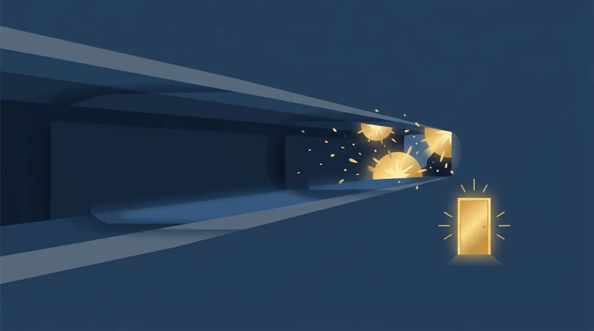
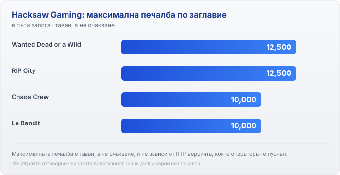

Title tag: Hacksaw Gaming: профил на доставчика, механики и топ слотове
Meta description: Кой е Hacksaw Gaming, какви механики прави (Feature Buy, висока волатилност) и кои са топ слотовете. Защо RTP се проверява в инфо-панела на казиното, не в рекламата.

---

# Hacksaw Gaming: профил на доставчика, механики и топ слотове

Hacksaw Gaming е основана през 2017 г. в Мсида, Малта, и за няколко години се превърна в едно от разпознаваемите имена в по-новата, високорискова част от каталозите на онлайн казината. Играта ѝ се появява в лобитата тук често, обикновено без играчът да обръща внимание на самото студио: заглавие като Wanted Dead or a Wild отдавна се върти и в българските казина.

## От скреч карти до слотове

Студиото не тръгва от слотовете. В началото Hacksaw прави дигитални скреч карти и instant-win игрички, тоест бързи заглавия с фиксирана награда, които се разиграват за секунди. Около 2019 г. компанията завива към видео слотовете и тъкмо те стават основният ѝ продукт. Днес каталогът стъпва на три крака: слотове, скреч карти и instant-win заглавия, но слотовете ѝ направиха името.

## Какво значат лицензите на студиото

Hacksaw Gaming държи лицензи на ниво доставчик от Malta Gaming Authority и UK Gambling Commission, сред други регулатори. Практическото значение за теб е тясно: генераторът на случайни числа е тестван от независими лаборатории и обявеният RTP отговаря на реалната математика на играта. Лицензът на студиото потвърждава, че играта е честна спрямо собствените си правила, не че тези правила са в твоя полза. Домашното предимство си остава вградено. И не смесвай тези лицензи с лиценза на казиното, в което играеш: разрешението за оператора в България идва от НАП и е съвсем отделна проверка.

## Фирменият почерк: висока волатилност и Feature Buy

Опишеш ли Hacksaw с едно изречение, то е студио на високата волатилност. Игрите ѝ са построени около редки, но потенциално едри попадения, тоест дълги серии без нищо, прекъсвани от отделни големи резултати. Втората ѝ запазена марка е Feature Buy, купуването на бонус: срещу фиксирана цена в кратни на залога влизаш директно в бонус рунда, вместо да го чакаш. При Wanted Dead or a Wild има няколко нива на това купуване, от 80 през 200 до 400 пъти залога, всяко с различен вход към функциите. Логиката е една и съща навсякъде. Плащаш веднага за по-бърз достъп до вариацията, не за по-добри шансове, а дългосрочното домашно предимство не мърда, независимо дали чакаш бонуса или си го купуваш. Едно уточнение обаче: купуването на бонус не е налично на всеки пазар и при всеки оператор, в някои юрисдикции е ограничено, затова провери дали опцията изобщо присъства в самата игра, преди да разчиташ на нея.

## Топ слотове на Hacksaw Gaming

Няколко заглавия направиха студиото разпознаваемо. Wanted Dead or a Wild от 2021 г. е може би най-известното, с максимална печалба 12,500 пъти залога и три отделни режима на бонус, между които избираш при купуване. Chaos Crew, едно от по-ранните заглавия от 2020 г., стига до 10,000 пъти залога и е също толкова волатилно. Le Bandit предлага таван от 10,000 пъти залога при обявен RTP 96.30%. RIP City е малко по-мек като темперамент, средна волатилност вместо висока, но таванът му пак е 12,500 пъти залога, а бонусът в него се купува за 200 пъти залога. Числата са тавани, не очаквания. Популярността на едно заглавие говори повече за визията и маркетинга му, отколкото за шансовете ти, а широко играна игра не ти връща повече от друга само защото е известна.

*Максимална печалба при четири заглавия на Hacksaw Gaming, изразена в пъти залога. Числата са тавани, а не очаквания, и не зависят от волатилността или от RTP версията, която операторът е пуснал.*

## RTP: проверявай в инфо-панела

Обявеният RTP на Wanted Dead or a Wild по подразбиране е 96.38%, което оставя домашно предимство от около 3.62%. При €1000 оборот това значи средно връщане от порядъка на €964 в дългосрочен план и около €36 за казиното. Уловката при Hacksaw, както при повечето модерни доставчици, е че една и съща игра се доставя в няколко версии с различен RTP, а операторът избира коя да пусне. При Wanted Dead or a Wild по-ниските версии слизат чак до 88.42%, което е огромна разлика на дълга дистанция: при същия €1000 оборот това е средно връщане около €884 и близо €116 за казиното. Полезно е и че студиото обявява собствена скала на волатилността (Wanted Dead or a Wild е оценено на 4 от 5, а RIP City на 3 от 5), която ти дава груба представа колко дълги ще са сухите серии. Затова обявеното число от ревю или от рекламата не ти върши работа: отвори инфо-панела на играта в конкретното казино и виж кой RTP работи там, преди да заложиш. Заради същата логика в [методологията ни](/kak-ocenyavame/) гледаме реалния RTP на казиното, а не рекламния.

## Преди да завъртиш

[Слот игрите](/slot-igri/) на Hacksaw обикновено имат демо режим, в който да усетиш темпото и волатилността, без да залагаш, а ако искаш да видиш къде се вписва това студио сред останалите, [прегледът ни на доставчиците](/blog/games-providers/) стъпва на същата логика. Различните ротативки се сравняват най-честно по реален RTP. При толкова волатилни игри задай си лимит за загуба и за време преди първото завъртане, защото банката ти трябва да издържи на дългите сухи серии, преди изобщо да види бонус рунд. 18+ Хазартът може да пристрасти. Играйте отговорно. Ако усетите, че играта излиза извън контрол, вижте [инструментите за отговорна игра](/otgovorna-igra/).

---

**Георги Тодоров**
Публикувано: 13.09.2026 · Последна редакция: 13.09.2026

[About Всички Казина boilerplate]

**Отговорна игра.** 18+ Хазартът може да пристрасти. Играйте отговорно. Ако усетиш, че играта излиза извън контрол или искаш да я ограничиш, виж [инструментите за отговорна игра](/otgovorna-igra/) и възможността за самоизключване чрез националния регистър на уязвимите лица към НАП (подава се писмено само от засегнатото лице). Национална информационна линия за наркотиците, алкохола и хазарта („Солидарност") 0888 99 18 66, делнични дни 10:00–17:00.

**Разкриване на партньорства.** Всички Казина съдържа партньорски (афилиейт) връзки; когато отвориш оферта през такава връзка, това може да финансира сайта, без да променя цената за теб и без да влияе на оценките ни. От 1 август 2026 г. дейността на афилиейт оператори в България се лицензира съгласно Закона за държавния бюджет за 2026 г. (ДВ, бр. 69 от 31.07.2026 г.). Всички Казина е подало заявление за лиценз пред Националната агенция по приходите и очаква издаването му.
