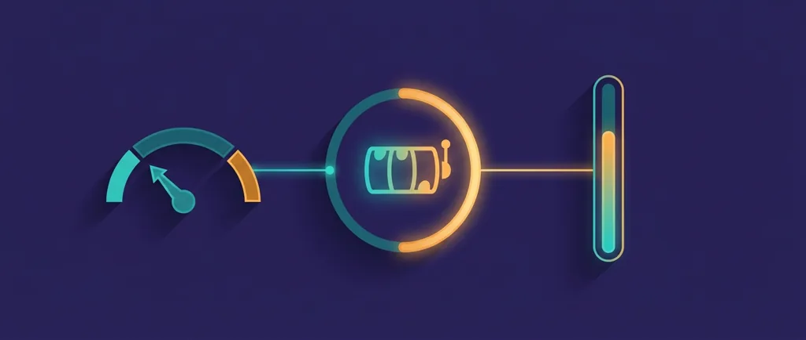
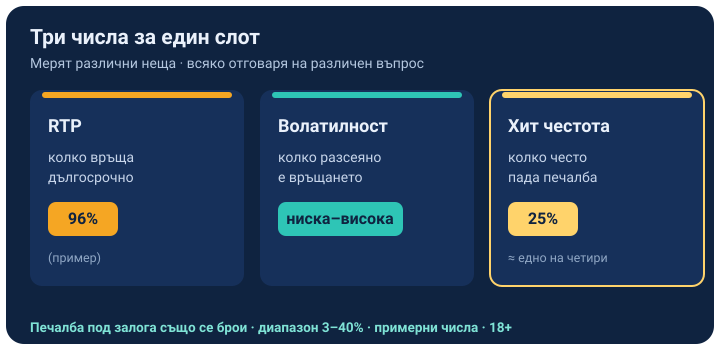

Title tag: Хит честота (hit frequency): колко често пада печалба и защо не е RTP
Meta description: Какво е хит честота в ротативките, защо печалба под залога също се брои за попадение, как се различава от RTP и волатилност и защо честата печалба не значи печеливша игра.

---

# Хит честота (hit frequency): колко често пада печалба и защо не е RTP

Хит честотата показва колко често едно завъртане връща някаква печалба. Ако игра има хит честота 25%, средно едно от всеки четири завъртания завършва с печалба, а останалите три не връщат нищо. Това е трето число до RTP и волатилността, и мери нещо различно от двете.

## Какво измерва хит честотата

Числото брои завъртанията с печалба спрямо всички завъртания, без да гледа колко голяма е печалбата. При повечето слотове попада някъде между 3% и 40%, като по-ниските стойности значат по-редки попадения. Хит честота 25% не обещава, че на четвъртото завъртане задължително идва печалба; означава, че в дълъг период около една четвърт от завъртанията връщат нещо, разпределени неравномерно, с поредици от празни завъртания между тях.

## Печалба под залога също е попадение

Тук се крие подвеждащото. Попадение се брои всяка печалба, включително такава, която е по-малка от залога ти. На игра с много начини на печалба е обичайно да заложиш €1 и да върнеш €0.40 на едно завъртане: софтуерът го отчита като печалба, звучи и светва като печалба, а балансът ти в този момент е паднал с €0.60. Хит честотата брои това като попадение наравно с голямата печалба, затова високото число може да идва почти изцяло от дребни връщания под залога.

*Трите числа мерят различни неща за една игра. Хит честотата е ритъмът, RTP е дългосрочният резултат, а печалба под залога също влиза в честотата. Числата са примерни.*

## Три числа, три различни въпроса

RTP отговаря на въпроса колко връща играта в дълъг период, волатилността на въпроса колко разсеяно е това връщане, а хит честотата на въпроса колко често изобщо пада печалба. Две игри с еднакъв обявен RTP от 96% могат да се усещат напълно различно на екрана: едната сипе дребни печалби почти през завъртание, другата мълчи дълго и после плаща голямо. Дългосрочното връщане им е еднакво, ритъмът на стигане дотам не е.

## Честота и волатилност вървят заедно

По-ниската хит честота обикновено придружава по-високата волатилност: печалбите идват рядко, но когато дойдат, са по-едри. Обратното също важи, игрите, които попадат често, обикновено плащат на малки порции и рядко правят голям удар. Затова хит честотата и волатилността се четат заедно; едната казва колко често, другата колко разсеяно е разпределението около средното.

## Защо честата печалба подвежда

Висока хит честота изглежда като добра новина, но не прави играта печеливша. Ако попаденията са предимно под залога, балансът пада въпреки постоянните светещи печалби, а домашното предимство работи все така върху всеки залог. Числото описва усещането по пътя, тоест колко често екранът ти дава нещо, докато крайната сметка се решава от RTP-то. Заради това [методологията ни](/kak-ocenyavame/) стъпва на реалния RTP на конкретното казино, а хит честотата я гледаме като предупреждение колко бързо дребните връщания могат да замажат една бавна загуба.

## Как да четеш числото

Хит честотата е въпрос на темперамент и бюджет, не оценка за качество. Висока честота държи баланса по-жив с чести дребни печалби и пасва на играч, който иска дълга спокойна сесия; ниска честота изисква повече търпение и по-дебел буфер за сухите серии. Демо режимът на [слот игрите](/slot-igri/) показва ритъма на конкретно заглавие, без да залагаш, и е най-бързият начин да усетиш дали честотата ти е приятна. Не чети поредица от дребни печалби като знак, че играта ти връща парите. 18+ Хазартът може да пристрасти. Играйте отговорно. Ако усетите, че играта излиза извън контрол, вижте [инструментите за отговорна игра](/otgovorna-igra/).

## Кое число да гледаш накрая

Хит честотата решава ритъма и колко често екранът ти дава нещо, но дългосрочният резултат стои при RTP-то и не зависи от това колко чести са попаденията. Избери честотата, която пасва на търпението и бюджета ти, и приеми дребните чести печалби за това, което са, порции забавление по пътя, а не доказателство, че печелиш. Ако искаш да прецениш една игра сериозно, започни от реалния RTP и чак тогава виж дали ритъмът ѝ ти понася.

---

**Георги Тодоров**
Публикувано: 13.09.2026 · Последна редакция: 13.09.2026

*За Всички Казина.* Всички Казина е независим сайт за сравнение на онлайн казина, лицензирани за българския пазар. Обясняваме механики и понятия, проверяваме условия и оценяваме операторите по публична методология от шест претеглени критерия, за да избираш с отворени очи. Не сме оператор и не сме типстер.

**Отговорна игра.** 18+ Хазартът може да пристрасти. Играйте отговорно. Ако усетиш, че играта излиза извън контрол или искаш да я ограничиш, виж [инструментите за отговорна игра](/otgovorna-igra/) и възможността за самоизключване чрез националния регистър на уязвимите лица към НАП (подава се писмено само от засегнатото лице). Национална информационна линия за наркотиците, алкохола и хазарта („Солидарност") 0888 99 18 66, делнични дни 10:00–17:00.

**Разкриване на партньорства.** Всички Казина съдържа партньорски (афилиейт) връзки; когато отвориш оферта през такава връзка, това може да финансира сайта, без да променя цената за теб и без да влияе на оценките ни. Тази статия обяснява понятие и не препоръчва конкретен оператор. От 1 август 2026 г. дейността на афилиейт оператори в България се лицензира съгласно Закона за държавния бюджет за 2026 г. (ДВ, бр. 69 от 31.07.2026 г.). Всички Казина е подало заявление за лиценз пред Националната агенция по приходите и очаква издаването му.
