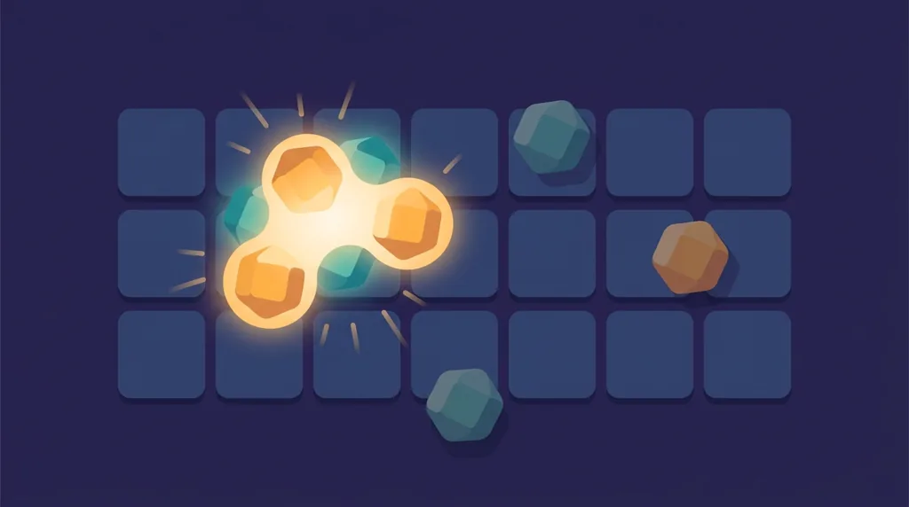

Title tag: Клъстърни печалби (cluster pays): как се печели без линии
Meta description: Как работят клъстърните печалби в ротативките: група съседни еднакви символи вместо линия, мрежи 7×7, каскади и защо начинът на броене не променя RTP-то.

---

# Клъстърни печалби (cluster pays): как се печели без линии

При клъстърните слотове печалба идва, когато достатъчно еднакви символа се допрат някъде на полето, а не когато легнат в редица отляво надясно. Няма линии на печалба и няма „начини". Има петна от еднакъв цвят. Названието cluster pays се наложи през 2016 г. с Aloha! Cluster Pays на NetEnt, а днес го носят едни от най-популярните заглавия по казината, включително Sugar Rush и Reactoonz.

## Групата плаща, стига да се допира

Символите се броят по допир, хоризонтално или вертикално. Диагоналът не се брои: два еднакви символа, които се докосват само с ъгъл, не са част от една група. Колко трябва да са, за да плати групата, зависи от играта. При повечето заглавия минимумът е между 5 и 8 еднакви символа, но има и игри, които искат 9 или повече. По-голямата група носи повече за своя символ, а щом полето е широко, нерядко се засичат няколко групи наведнъж в едно завъртане.

## По-голямата мрежа

Клъстърните игри почти винаги стоят върху по-широко поле от класическите 5×3. Срещат се мрежи 6×5, 6×6, 7×7 и 8×8. Логиката е проста откъм геометрия: колкото повече клетки има на екрана, толкова повече място за съседни символи да се съберат в група. Заради това клъстърният слот изглежда по-натоварен от линейния, с повече неща, които се случват на един екран.

## Каскадата отгоре

Клъстърните заглавия рядко спират след една печалба. Печелившите символи изчезват от полето, отгоре падат нови, и ако новите оформят следваща група, и тя плаща, а падането се повтаря. Този механизъм се нарича tumble или каскада и означава, че едно завъртане може да върже няколко печалби подред, преди да дойде подреждане без група. Парите за тези вериги вече са част от RTP-то на играта. Каскадата само ги разпределя на порции и прави ритъма по-бърз, без да добавя стойност отгоре.

## Откъде тръгна: Aloha! Cluster Pays

Aloha! Cluster Pays на NetEnt излезе през 2016 г. върху мрежа 6×5 и поиска минимум 9 еднакви символа за печеливша група. Обявеният ѝ RTP е 96.42%. Играта не измисли идеята за групите от нулата, но лепна върху нея търговското име, което остана, и показа схемата на достатъчно играчи, за да тръгнат след нея и другите студиа. Оттогава Pragmatic Play, Play'n GO и почти всеки голям доставчик имат свои клъстърни заглавия, повечето върху 7×7 и с по-нисък минимум от пет символа.

## Клъстърът не значи по-добри шансове

Тук е мястото за честната част. Начинът, по който слотът брои печалбата, група вместо линия, не променя математиката отдолу. Домашното предимство се начислява върху всеки залог по същия начин, а RTP си остава дългосрочна статистика над милиони завъртания, не обещание за сесията. Широката мрежа и падащите символи създават усещане за постоянно движение и близка голяма печалба, но това е усещане за екшън, не предимство за играча. Клъстърен слот с обявен RTP 96% и линеен слот с обявен RTP 96% ти връщат едно и също в дългосрочен план. Заради това в [методологията ни](/kak-ocenyavame/) гледаме реалния RTP на конкретното казино, а не как изглежда механиката на банера, и преди игра си струва да отвориш инфо-панела и да провериш кое число работи там.

## Волатилността при клъстър и множители

Много от клъстърните хитове връзват групите с растящи множители, които се трупат по време на бонуса и се нулират в основната игра. Схемата дърпа волатилността нагоре: балансът често пада бавно през дребни или никакви печалби, а голямото идва рядко, обикновено когато множителите се струпат в безплатните завъртания. Sugar Rush и Reactoonz са точно такива, високоволатилни игри, в които обикновеното завъртане и попадналият бонус са две различни игри по размер на печалбата. Ако искаш да видиш механиката в конкретно заглавие, разгледай [слот игрите](/slot-igri/) в демо режим и сравни как се държи полето при няколко от тях.

## Как да го подходиш разумно

Каскадите и растящите множители правят клъстърните игри бързи, а бързият ритъм изяжда бюджет по-незабелязано от бавния. Преди реални пари демо режимът показва темпото и колко рядко идва плътната каскада, без да залагаш нищо. Задай си лимит за загуба и за време още преди първото завъртане и го спазвай, дори когато мрежата е грейнала от свързани символи и следващото завъртане ти се струва сигурно. Всяко завъртане тръгва от същата математика като предишното. 18+ Хазартът може да пристрасти. Играйте отговорно. Ако усетите, че играта излиза извън контрол, вижте [инструментите за отговорна игра](/otgovorna-igra/).

## Струва ли си клъстърът за теб

Клъстърните слотове пасват на играч, който харесва широки полета, обича веригите от каскади и е готов да търпи дълги сухи серии заради шанса множителите да се струпат в бонуса. Ако предпочиташ равномерни, чести дребни печалби и по-предвидим ритъм, високата волатилност на повечето клъстърни заглавия ще ти дойде тежко и класическа линейна ротативка ще ти легне по-добре. Каквото и да избереш, спомни си, че мрежата брои печалбите иначе, но не мени цената на играта, и залагай със сума, която можеш да загубиш изцяло.

---

**Георги Тодоров**
Публикувано: 13.09.2026 · Последна редакция: 13.09.2026

*За Всички Казина.* Всички Казина е независим сайт за сравнение на онлайн казина, лицензирани за българския пазар. Обясняваме механики, проверяваме условия и оценяваме операторите по публична методология от шест претеглени критерия, за да избираш с отворени очи. Не сме оператор и не сме типстер.

**Отговорна игра.** 18+ Хазартът може да пристрасти. Играйте отговорно. Ако усетиш, че играта излиза извън контрол или искаш да я ограничиш, виж [инструментите за отговорна игра](/otgovorna-igra/) и възможността за самоизключване чрез националния регистър на уязвимите лица към НАП (подава се писмено само от засегнатото лице). Национална информационна линия за наркотиците, алкохола и хазарта („Солидарност") 0888 99 18 66, делнични дни 10:00–17:00.

**Разкриване на партньорства.** Всички Казина съдържа партньорски (афилиейт) връзки; когато отвориш оферта през такава връзка, това може да финансира сайта, без да променя цената за теб и без да влияе на оценките ни. Тази статия обяснява игрална механика и не препоръчва конкретен оператор. От 1 август 2026 г. дейността на афилиейт оператори в България се лицензира съгласно Закона за държавния бюджет за 2026 г. (ДВ, бр. 69 от 31.07.2026 г.). Всички Казина е подало заявление за лиценз пред Националната агенция по приходите и очаква издаването му.
