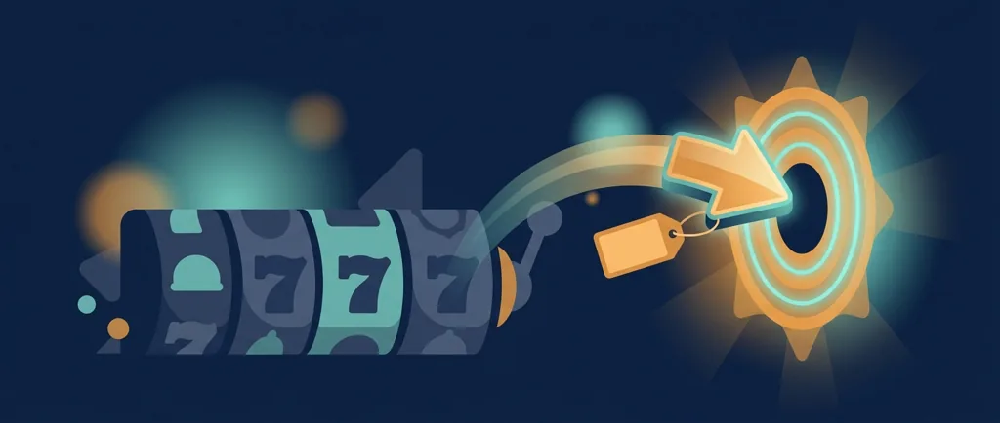
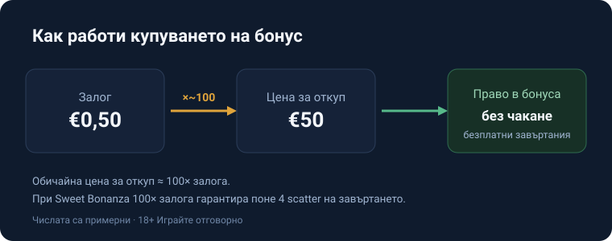
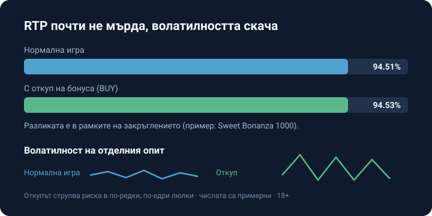

# 03 — HUMANISER (Step 3) · vk-0059

AI-FINGERPRINT REPORT
Overall verdict: MIXED
Overall score: 39/60
Layer scores: Lexical 7/10 | Syntactic 6/10 | Structural 6/10 | Density 8/10 | Experiential 6/10 | Rhythm 6/10

CRITICAL FLAGS (must fix):
- „Названията се разминават според доставчика — „купи бонус", „buy free spins", „feature buy" —" → em-dash pair used as afterthought tacker (3 em-dashes in the draft total) → replace with colon/commas; final stage removes all.
- „Ето какво банерът пропуска:" → signposting lead-in announcing the point → cut, state the mechanism directly.
- „Причината е проста:" → reveal-signal before the explanation (confirmed BG tell) → delete the label, give the reason.
- „Именно тази умора от чакането" → demonstrative intensifier (confirmed BG tell) → drop „Именно тази".
- „Плащаш за момента, не за по-добри шансове." + „удобство с ценоразпис, не стратегия." → two „не A, а B" mic-drop endings in one section (top BG tell) → keep the contrast once (the verdict line), rewrite the other affirmatively.
- „Ниска цена значи малка гаранция; висока цена значи по-добър старт" → stacked symmetric „везни" sentence (confirmed BG structural tell) → fold into one asymmetric sentence.

MODERATE FLAGS:
- Sections thin/uniform in length; variance section merges two ideas without room to breathe → split and expand with the worked contrast at €0.50.
- RTP section lacks the concrete €-edge anchor that makes „not a house-edge discount" land.
- Ending slightly balanced; sharpen to an opinionated verdict and add the demo/where-allowed depth the topic needs.

WHAT ALREADY WORKS (preserve): the honest RTP-neutrality spine; the exact figures 94.51/94.53 and 100×/4 scatters; the [VERIFY] flag placement; dry register; „примерни" labelling.

Action: MIXED → rewrite.

---

REWRITTEN ARTICLE

# Купуване на бонус (bonus buy): как работи и струва ли си

Купуването на бонус е бутон до този за завъртане. Плащаш фиксирана цена, кратна на залога, и влизаш право в бонус рунда, без да чакаш специалните символи да паднат сами. Названията се разминават според доставчика: „купи бонус", „buy free spins", „feature buy". Механиката е една и съща. Пропускаш чакането и започваш от частта, заради която повечето хора изобщо сядат на играта, безплатните завъртания или специалната функция.

Бутонът се среща предимно при по-новите ротативки с висока волатилност, там, където естественото падане на бонуса може да те кара да въртиш дълго на сухо. Затова и изкушението е реално: вместо стотици завъртания в очакване, натискаш веднъж и си вътре. Само че това чакане не е било безплатно, а сега просто го плащаш накуп. Сухите серии, които изнервят играча, правят функцията продаваема; студиото ги е сметнало много преди теб.

Цената рядко е дребна. За откупуване на безплатни завъртания сметка около 100 пъти залога е обичайна, макар да се движи широко според заглавието и конкретната функция. При Sweet Bonanza бутонът струва точно 100× общия залог и срещу тази цена гарантира поне 4 скатера на завъртането, което пуска рунда. Тоест плащаш за вход, който вече е с осигурен старт. Някои заглавия дават по няколко нива на откупуване, по-евтин вход с по-скромна гаранция и по-скъп с по-добър старт, като по-скъпото ниво почти винаги е и по-волатилно. Цената се смята върху общия залог, не върху една линия, така че вдигнеш ли залога, вдига се право пропорционално и сумата за откуп.

*Залогът, умножен по около 100, купува директен вход в бонус рунда; числата са примерни.*

## Откупеният бонус не бие играта

Студиата остойностяват бутона спрямо реалната очаквана стойност на самия бонус, затова RTP на купения рунд излиза горе-долу колкото при нормална игра. Студиото знае колко носи бонусът средно и слага толкова на етикета, плюс обичайния си дял, затова цената рядко е далеч от честната. При Sweet Bonanza 1000 теоретичният RTP е 94.51%, а при използване на BUY FREE SPINS е 94.53%. Разликата е в рамките на закръглението, понякога с косъм нагоре, понякога надолу според заглавието. Купуването не смъква предимството на казиното с нито стотна. Мести момента, в който бонусът се случва, и толкова. На €100 обиколен оборот и в двата случая теорията прибира около €5.50 за казиното; сметката не се променя от това дали си изчакал бонуса, или си го платил. RTP при това е статистика над милиони завъртания, не обещание за твоята вечер. Отделният откуп може да гръмне високо или да излезе празен далеч от тази средна, и точно това разминаване плащаш, когато натиснеш бутона.

*RTP почти не мърда (94.51% срещу 94.53%), но волатилността на отделния откуп е чувствително по-висока.*

## Стоте залога наведнъж

Разликата се усеща във волатилността. При залог от €0.50 един откуп по 100× струва €50 (примерни числа). Всеки опит сваля €50 наведнъж и ако рундът излезе слаб, толкова. Същите €50 при обикновена игра по €0.50 стигат за сто завъртания, през които бонусът може и да падне сам, без да си заложил цялата сума на едно натискане. Три-четири студени откупа един след друг изпразват вечерния бюджет, докато при базова игра същите пари ще те държат много по-дълго на екрана. Опасното е серията: щом рундовете излизат слаби, инстинктът е да натиснеш пак, за да си върнеш платеното, и там бюджетът се стапя най-бързо. За това плащаш в действителност: струпване на риска в няколко скъпи натискания, при непроменени шансове.

Има и практична уловка около бонусите за добре дошли. При част от операторите бутонът е заключен, докато тече активен бонус, а спечеленото от откуп с бонус средства влиза в бонус баланс и носи изискване за разиграване, преди да стане за теглене. Струва си да го провериш в условията, преди да натиснеш.

## Къде е разрешено

Не всеки пазар допуска функцията. Великобритания например забранява откупуването на сайтове с британски лиценз; регулаторът прецени, че бутонът ускорява харченето и маскира по-високата загуба на сесия. Други пазари не се занимават с ограничение, трети допускат само версии на игрите без бутона, така че картината е нашарена и зависи от лиценза, под който играеш. За България наличността зависи от оператора и от конкретната версия на играта. [VERIFY: наличност на „купи бонус" при лицензирани в България оператори]

## Пробвай в демо, преди да платиш

Същата функция обикновено се върти и в демо режим, без реални пари и без регистрация. Няколко откупа наужким показват темпото на бонуса и колко често слабо завъртане изяжда цената, преди да заложиш €50 наистина. Демото не връща реални печалби, но показва точно това, което банерът не казва: колко празни рунда може да излязат подред. Десетина откупа в демото дават по-честен усет за играта от всеки клип с голяма печалба онлайн.

## Струва ли си

Купуването на бонус е удобство с ценоразпис, не стратегия. Плащаш, за да не чакаш, и в замяна поемаш по-остра волатилност при същото домашно предимство. За някого си струва заради самото усещане да влезе право в рунда, веднъж или два пъти, с пари, заделени точно за това. За бюджет, който трябва да издържи вечерта, сто залога наведнъж са бърз начин да свърши. Натиснеш ли бутона, прави го с пари за забавление, които можеш да загубиш докрай, и с ясното съзнание, че той купува момента, а сметката накрая пак е на страната на казиното.

18+ Хазартът може да пристрасти. Играйте отговорно. Ако усетиш, че купуваш бонуси, за да върнеш изхарчена вечер, спри, точно там свършва забавлението. Инструментите за отговорна игра са там за тази граница.

---

**Георги Тодоров**
Публикувано: 13.09.2026 · Последна редакция: 13.09.2026

[About Всички Казина boilerplate]
[18+ / RG LINE + signposting — template]
[Affiliate-licensing footer — template]

CHANGE LOG:
- Removed all 3 em-dashes; replaced signposting „Ето какво банерът пропуска:" and reveal „Причината е проста:" with direct statements.
- Cut demonstrative „Именно тази"; reduced „не A, а B" to a single verdict-line contrast; folded the symmetric „везни" pair into one asymmetric sentence.
- Expanded variance (worked €0.50 → €50 / 100-spin contrast + chasing risk), RTP (concrete €5.50/€100 edge + long-run caveat), where-allowed and demo sections for burstiness and depth.
- All facts identical (100× / 4 scatters / 94.51 / 94.53); [VERIFY] BG-availability flag preserved. Internal links deferred to SEO stage.
