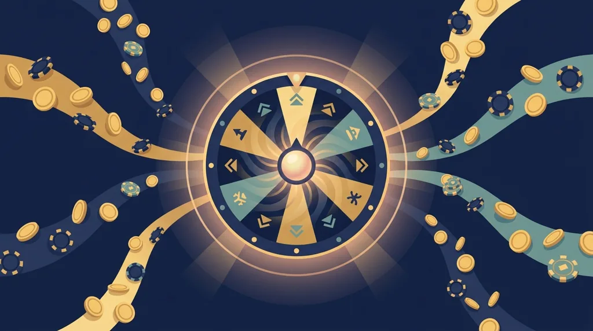
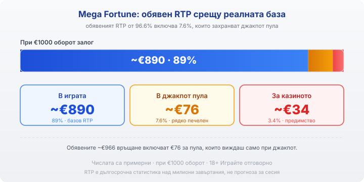

Title tag: Mega Fortune: как работи джакпотът на NetEnt и RTP
Meta description: Mega Fortune на NetEnt: три прогресивни джакпота (Rapid, Major, Mega) на бонус колело, RTP 96.6% (от които 7.6% за пула), реалната база ~89% и рекордът от €17,8 милиона.

---

# Mega Fortune: как работи прогресивният джакпот на NetEnt

Mega Fortune на NetEnt излезе през 2009 г. и повечето хора я знаят с едно число: €17,8 милиона, изплатени на един играч през 2013 г. Разкошната тема с яхти, лимузини и шампанско е само декор. Зад нея стои мрежов прогресивен джакпот, чийто пул се пълни от залозите на самите играчи, а не от джоба на казиното. Точно тази разлика решава колко реално ти се връща, докато въртиш.

## Как е устроена играта

Mega Fortune има пет барабана, три реда и 25 фиксирани линии. Символите са класическа лукс-иконография (часовници, пръстени, коли), а платената подредба е обичайната за ротативка: еднакви символи от левия барабан надясно по активна линия. Волатилността на базовата игра е ниска, тоест дребните печалби падат сравнително често и поддържат банката жива по-дълго. Максималната печалба извън джакпотите е скромните за днешните стандарти 1700 пъти залога. Голямото число, заради което играта е известна, не идва оттук.

## Трите джакпота и колелото на късмета

Три символа на бонус колелото на активна линия отключват бонус играта. Тя е колело с три концентрични нива и три прогресивни джакпота: Rapid (малкият, чест), Major (средният) и Mega (върхът). Спираш въртящото се колело сам. Паднеш ли на стрелка, продължаваш навътре към по-голямото ниво, а паднеш ли на монета, прибираш кеш награда и рундът приключва. Rapid седи на външното колело, а Major и Mega чакат на вътрешните, до които се стига само с последователни стрелки. Rapid се пада редовно и връща дребни суми. Mega е мрежовият джакпот, който събира дялове от много казина в общ пул и стига до многомилионните числа. Ориентировъчното му ниво по данни на NetEnt е около €4 милиона. Как расте самият пул е обща механика на всеки прогресив, която сме разгледали отделно в [прогресивните джакпоти](/blog/progresivni-dzhakpoti/).

## Безплатните завъртания

Три или повече символа с шампанско пускат рунд безплатни завъртания. Преди да започне, избираш едно от шампанските, за да разкриеш броя завъртания и множителя, който важи за целия рунд. Тук се случват по-едрите редовни печалби на играта, тези без джакпот, но и тук важи, че скромен множител прави скромен рунд.

## Какво всъщност се връща

Обявеният RTP на Mega Fortune е 96.6%. Числото звучи нормално за ротативка, но крие уловка, типична за прогресивите. От тези 96.6% цели 7.6 процентни пункта не се връщат в обичайната игра, а отиват в джакпот пула. Реалният процент, който усещаш на редовните завъртания, е около 89% (от които базова игра 62.8%, безплатни завъртания 16.8% и бонус колело 9.3%). Останалите 3.4% са чистото предимство на казиното.

При €1000 оборот сметката изглежда така: около €890 се въртят обратно през нормалната игра, около €76 се заделят за джакпотите, които почти никой не печели, и около €34 остават за казиното. Обявените €966 връщане включват онези €76, тоест на хартия ги имаш, на практика ще ги видиш само ако удариш джакпот. За огромното мнозинство играчи реалното връщане е по-ниското число.

*Обявеният RTP от 96.6% включва 7.6%, които захранват джакпот пула. Реалният процент в нормалната игра е около 89%. Числата в примера са примерни.*

## Рекордът от 2013 и реалните шансове

На 20.01.2013 г. играч в Paf взе €17 861 813 от Mega Fortune при залог от €0.25. Сумата влезе в Книгата на рекордите на Гинес като най-голямата онлайн джакпот печалба до онзи момент. Това е истинско събитие и истински човек, но е и точно това, което рекламата обича да показва, без да казва останалото.

Останалото е математиката. Mega е мрежов прогресив, а вероятността да го отключиш на отделно завъртане е от порядъка на лотария, за реалния мащаб на такива шансове виж отново концепцията за [прогресивните джакпоти](/blog/progresivni-dzhakpoti/). Всяко завъртане е независимо от предишното, така че джакпот, който „отдавна не е падал", не е по-близо до падане. И дългото въртене не те доближава до пула с нищо освен изхабен бюджет.

## Преди да завъртиш

[Слот игрите](/slot-igri/) на NetEnt обикновено имат демо режим, в който да усетиш темпото на Mega Fortune и колелото, без да залагаш, а ако искаш контекст за самия доставчик, [профилът на доставчиците](/blog/games-providers/) стъпва на същата логика. Задай си лимит за загуба и за време преди първото завъртане и гледай пула като част от развлечението, не като план. 18+ Хазартът може да пристрасти. Играйте отговорно. Ако усетиш, че играта излиза извън контрол, виж [инструментите за отговорна игра](/otgovorna-igra/). Числото на екрана е истинско. Просто почти сигурно не е за теб.

---

**Георги Тодоров**
Публикувано: 13.09.2026 · Последна редакция: 13.09.2026

[About Всички Казина boilerplate]

**Отговорна игра.** 18+ Хазартът може да пристрасти. Играйте отговорно. Ако усетиш, че играта излиза извън контрол или искаш да я ограничиш, виж [инструментите за отговорна игра](/otgovorna-igra/) и възможността за самоизключване чрез националния регистър на уязвимите лица към НАП (подава се писмено само от засегнатото лице). Национална информационна линия за наркотиците, алкохола и хазарта („Солидарност") 0888 99 18 66, делнични дни 10:00–17:00.

**Разкриване на партньорства.** Всички Казина съдържа партньорски (афилиейт) връзки; когато отвориш оферта през такава връзка, това може да финансира сайта, без да променя цената за теб и без да влияе на оценките ни. От 1 август 2026 г. дейността на афилиейт оператори в България се лицензира съгласно Закона за държавния бюджет за 2026 г. (ДВ, бр. 69 от 31.07.2026 г.). Всички Казина е подало заявление за лиценз пред Националната агенция по приходите и очаква издаването му.
