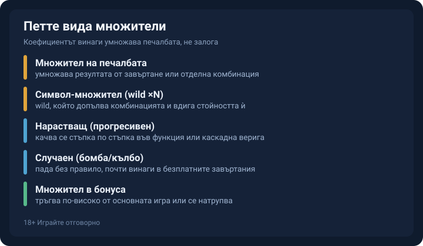
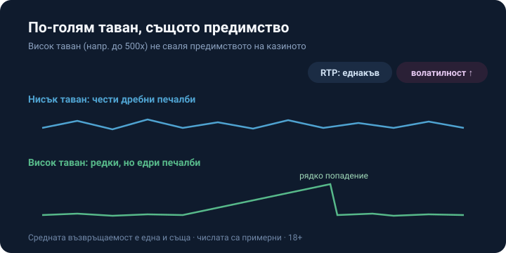

Title tag: Множители в ротативките: как работят и кога умножават
Meta description: Как работят множителите в ротативките: коефициентът умножава печалбата, RTP вече го отчита, а по-големият таван вдига само волатилността.

---

# Множители в ротативките: как работят и кога умножават печалбата

Множителят е число, което умножава една печалба по определен коефициент: x2, x3, понякога x100. При печалба от €0.20 и множител x100 на екрана излизат €20 (числата са примерни). Не идват пари отникъде допълнително; коефициентът просто мащабира резултата, който вече си получил от залога си. Заради това усещането за „безплатни допълнителни пари" подвежда. Той е част от същата математика, по която е построена ротативката, и не е отделна награда като джакпот.

## Върху какво пада коефициентът

Коефициентът се начислява върху печалбата, не върху залога: печалба от €0.20 става €0.40 при x2 и €20 при x100 (примерни), а разликата между двете е само коефициентът, докато базата си остава дребната сума, която комбинацията връща от малкия ти залог. При по-голям залог логиката е същата и се мени единствено абсолютната сума, върху която пада коефициентът.

## Видовете, които ще срещнеш

*Петте вида множители и къде се появява всеки от тях.*

Най-прекият коефициент умножава резултата от едно завъртане или от отделна комбинация. До него върви символ-множителят, обикновено wild с надпис ×N, който допълва комбинацията и вдига стойността ѝ. Прогресивният вариант не стои фиксиран, а се качва стъпка по стъпка в рамките на функция или каскадна верига, докато случайният пада без правило, най-често като кълбо или бомба и почти винаги в безплатните завъртания. Остава множителят в бонуса, който в повечето игри тръгва по-високо от основната игра или се натрупва. Ако някой термин ти убегне, [речникът с казино понятия](/blog/rechnik-kazino-termini/) ги държи на едно място.

## Нарастващият множител: Gonzo's Quest

Gonzo's Quest на NetEnt показва нарастващия множител в чист вид. При всяка поредна лавина коефициентът се качва през 1x, 2x, 3x и 5x, а на четвъртата поредна лавина остава на 5x. В бонуса Free Falls с 10 безплатни завъртания стълбицата тръгва по-нависоко и минава през 3x, 6x, 9x и 15x. RTP на играта е 95.97%. Този процент, изчислен над милиони завъртания, вече включва и лавините в основната игра, и по-високата стълбица в бонуса. Спре ли редицата от лавини, броячът се връща в началото и трупането започва отново от 1x.

## Случайният множител в безплатните завъртания

Случайният множител носи серия популярни заглавия на Pragmatic Play. В [Sweet Bonanza](/blog/sweet-bonanza/), която от излизането си през 2019 г. наложи този модел като стандарт, коефициентите падат като бомби само в безплатните завъртания и се начисляват върху общата печалба от завъртането, в диапазон от 2x до 100x. При Gates of Olympus кълбата стигат до 500x и се натрупват в общ сбор по време на безплатните завъртания, върху решетка 6×5, която плаща при 8 или повече символа, паднали където и да е. Тавани от 100x и 500x се виждат рядко и почти изцяло в бонуса, докато основната игра върви без тях. Двете трупат различно. Бомбите в Sweet Bonanza важат за печалбата от съответното завъртане, докато събраните кълба в Gates of Olympus се пазят в общ множител за целите безплатни завъртания.

## Голям таван, същото предимство за казиното

*По-голям таван значи по-висока волатилност при същия RTP (числата са примерни).*

По-високият таван на множителя не сваля предимството на казиното, колкото и да изглежда като повече пари на масата. RTP вече отчита всеки коефициент, който математиката на играта може да произведе, включително най-редките 100x и 500x. Голямото число не струпва повече стойност в играта. То я преразпределя: печалбите идват по-рядко и на по-едри порции, значи волатилността се качва. При €0.20 залог играта с нисък таван може да ти връща между €0.10 и €0.40 често, докато играта с таван 500x дава дълги сухи серии и веднъж на стотици завъртания попадение от порядъка на €20 и нагоре (примерни). Средната стойност на двете клони към близко число, а сесиите изглеждат съвсем различно. На практика повечето играчи никога не стигат до тавана и прекарват сесията в основната математика, където такива коефициенти просто ги няма. За разлика от [прогресивния джакпот](/blog/progresivni-dzhakpoti/), който трупа отделен награден пул от оборота на играчите, множителят работи другояче и само вдига коефициента върху печалба от собствения ти залог, тоест домашното предимство остава непокътнато.

## Печалба от бонус: коефициентът не отменя превъртането

Печалбата от коефициент по време на бонус или на безплатни завъртания от оферта пак минава през превъртане, преди да стане теглима. x100 бомба в бонус кръг вдига баланса на екрана, но условията на офертата продължават да важат върху получената сума. Колко струва това зависи от множителя на превъртането и от базата му, депозит+бонус или само бонус, защото един и същ множител върху различна база е различно задължение. Приносът на слотовете към превъртането обикновено е 100%, тоест коефициентите помагат за оборота, но условията пак трябва да се изпълнят в срок. Как се смята разиграването сме разписали в [ръководството за превъртане](/blog/kak-raboti-razigravaneto/).

x500 на банера обещава по-голямо число, но зад него стои същото предимство за казиното, само разлято в по-редки и по-едри попадения. Ако това темпо ти допада, играй го с пари, които можеш да загубиш изцяло, и задай лимит за депозит и загуба преди първото завъртане. Пусни играта в демо режим, за да видиш колко дълго умее да мълчи, преди да платиш за реалната ѝ волатилност.

18+ Хазартът може да пристрасти. Играйте отговорно. Ако гониш едно голямо попадение, реши предварително докъде си готов да въртиш и спри там. [Инструментите за отговорна игра](/otgovorna-igra/) са там за тази граница.

---

**Георги Тодоров**
Публикувано: 13.09.2026 · Последна редакция: 13.09.2026

[About Всички Казина boilerplate]

**Отговорна игра.** 18+ Хазартът може да пристрасти. Играйте отговорно. Ако усетиш, че играта излиза извън контрол или искаш да я ограничиш, виж [инструментите за отговорна игра](/otgovorna-igra/) и възможността за самоизключване чрез националния регистър на уязвимите лица към НАП (подава се писмено само от засегнатото лице). Национална информационна линия за наркотиците, алкохола и хазарта („Солидарност") 0888 99 18 66, делнични дни 10:00–17:00.

**Разкриване на партньорства.** Всички Казина съдържа партньорски (афилиейт) връзки; когато отвориш оферта през такава връзка, това може да финансира сайта, без да променя цената за теб и без да влияе на оценките ни. От 1 август 2026 г. дейността на афилиейт оператори в България се лицензира съгласно Закона за държавния бюджет за 2026 г. (ДВ, бр. 69 от 31.07.2026 г.). Всички Казина е подало заявление за лиценз пред Националната агенция по приходите и очаква издаването му.
