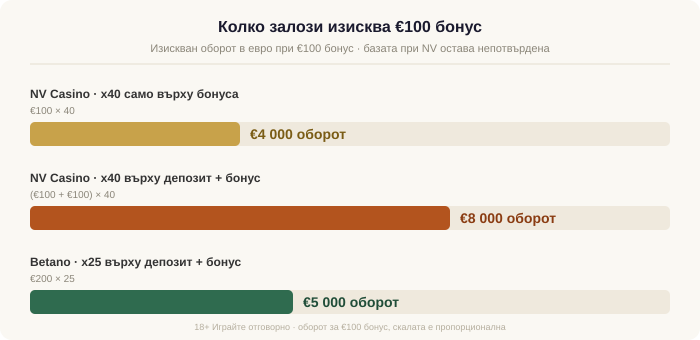

# NV Casino бонус: колко наистина струва €2 000-ната оферта

**Title tag:** NV Casino бонус: колко наистина струва €2 000
**Meta description:** NV Casino бонус до €2 000 + 225 FS: реалната цена на x40 превъртането в евро, липсата на НАП лиценз и защо лицензирана къща излиза по-евтино.

Byline: Георги Тодоров

„До €2 000 + 225 безплатни завъртания" стои изписано над формата за регистрация в NV Casino. Числото е реално и точно това го прави подвеждащо: сумата на банера е таван, до който почти никой не стига, а цената да я гониш е скрита в общите условия, не в рекламата. По-долу слагаме тази цена в евро, при реален депозит, за да се вижда какво купувате, когато натиснете бутона.

Преди математиката, едно нещо, което тежи повече от всеки бонус. NV Casino се оперира от Kaurum Limited, регистрирана в Кипър, и работи с лиценз от Кюрасао (GCB 8048/JAZ), не с лиценз от НАП. Без НАП лиценз операторът не може законно да предлага хазарт на български играчи, а печалбите ви не са защитени по Закона за хазарта: при спор нямате към кого да се обърнете в България. Правният разбор си има отделно място в нашата предупредителна страница за [NV Casino](/casino/nv-casino/); тук темата са парите.

**Не препоръчваме да играете в NV Casino.** Без лиценз от НАП не го препоръчваме на никого, колкото и щедро да изглежда офертата. Разглеждаме бонуса само за разяснение, защото рекламите му стигат до много български играчи, а условията зад банера рядко някой ги чете. Всички Казина не е свързано по никакъв начин с NV Casino: нямаме партньорство с оператора, не получаваме от него комисиона и не поставяме линкове към сайта му.

## Какво обещава пакетът

Офертата е стълба от три депозита, не единичен бонус. За сравнение с други [бонуси за добре дошли](/bonus-category/welcome-bonus/) е важно първо да се разчете самата стълба:

- 1-ви депозит: 100% до €500 + 100 FS
- 2-ри депозит: 125% до €500 + 50 FS
- 3-ти депозит: 120% до €1 000 + 75 FS

Минималният депозит е €10, а рекламните €2 000 се събират само ако минете и през трите стъпала, тоест ако депозирате близо €2 000 от собствени пари. Вторият тиер заслужава втори поглед: 125% означава, че връщат повече, отколкото сте вложили, а такъв процент не съществува, за да ви зарадва. Той е кукичка, която ви държи да заредите и трети път. Такава е стълбата към 13.09.2026, когато проверихме офертата, а операторите сменят бонусите си по-често, отколкото им е удобно да признаят.

## Реалната цена е x40 превъртане

Бонусът не пада в сметката ви като кеш, който да изтеглите. Той идва като бонус-баланс, който първо трябва да разиграете. При NV Casino коефициентът е x40, а за печалбите от безплатните завъртания важи отделно изискване x30 върху самите печалби. Как точно работи механиката на разиграването сме описали подробно в [ръководството за превъртане](/blog/kak-raboti-razigravaneto/); тук интересува само цената в евро.

Проблемът е, че в условията, които проучихме, x40 фигурира просто като „x40 бонус", без уточнение върху какво се начислява, а точно базата решава всичко. Двата възможни прочита при €100 бонус:

- Ако x40 е само върху бонуса: €100 × 40 = €4 000 оборот
- Ако x40 е върху депозит + бонус: (€100 + €100) × 40 = €8 000 оборот

*Един и същ €100 бонус, три различни изисквания за оборот: базата при NV решава дали са €4 000 или €8 000, а Betano при x25 иска €5 000.*

€4 000 и €8 000 водят до две различни съдби за същия €100 бонус: при неблагоприятния прочит трябва да завъртите двойно повече пари, преди да видите и цент от тях. При по-голям депозит разликата расте пропорционално, така че колкото по-сериозно гоните таблицата от €2 000, толкова по-скъпа става неяснотата. Затова базата не е дребен шрифт за прескачане. Същото важи за срока за разиграване и за приноса на игрите, който решава дали изобщо ще стигнете оборота през слотовете, масите или казиното на живо: и двете не открихме ясно публикувани. Щом операторът не казва кой прочит важи, разумно е да смятате с по-скъпия, тоест с €8 000.

Оборот от този порядък има и практическа страна, която банерът премълчава: бонус, който изисква €4 000 до €8 000 залози за €100, рядко се осребрява така, както изглежда на рекламата; по-често се стопява по пътя. Ако залозите спрат да са забавни и се превърнат в гонене на условие, спрете. Помагаме с лимити и самоизключване на [/otgovorna-igra/](/otgovorna-igra/).

## Същите €100 при лицензирана къща

Сложете същите €100 при [Betano](https://vsichkikazina.bg/go/betano/), която държи активен лиценз от НАП. Welcome офертата е 100% до €1 500 + 150 FS, превъртането е x25 върху депозит + бонус, срокът е 30 дни, а минималният депозит е €5. При €100 депозит и €100 бонус базата е €200, тоест €200 × 25 = €5 000 оборот, при ясна база и ясен срок.

Betano иска €5 000; NV иска €4 000 при благоприятния прочит на базата или €8 000 при неблагоприятния. На пръв поглед €4 000 бие €5 000, и това е примамката, върху която е построен целият банер. Но привидното предимство на NV съществува само докато базата остава неизяснена: щом се окаже „депозит + бонус", NV скача на €8 000 и Betano изведнъж иска почти с 40% по-малко оборот за същия ваш €100. Към това добавете и ясния 30-дневен срок при Betano: знаете точно колко време имате, вместо да разчитате на неуточнен период. И над цялата аритметика стои нещото, което никаква сметка не мери. При Betano има лиценз от НАП и защита на печалбите по Закона за хазарта. При NV няма.

## Честно за силните страни на NV

NV Casino не е празна витрина и няма смисъл да се преструваме, че е. Каталогът минава 2 400 игри; плащанията покриват както карти (Visa, Mastercard) и електронни портфейли (Skrill, Neteller, MiFinity), така и банков превод и крипто (BTC, ETH, LTC, USDT), а поддръжката работи на български 24/7. Минималното теглене е между €10 и €45 според метода; как сравняваме такива методи по скорост и такси е описано в раздела за [депозити и тегления](/depoziti-i-teglenia/). Всичко това е реално и за част от играчите тежи.

Нищо от него обаче не купува правна защита. Голям каталог и крипто плащания не връщат парите ви при спор, а защитата по Закона за хазарта важи само за лицензирани от НАП оператори. NV не е сред тях. По същата логика, по която претегляме лиценз, защита на печалбите и прозрачни условия, [оценяваме всеки оператор](/kak-ocenyavame/), преди да го препоръчаме.

## Заключение

„До €2 000" продава мечта; условията определят реалността. Реалната цена е x40 върху база, която не открихме ясно посочена, тоест между €4 000 и €8 000 оборот за €100 бонус, и това е още преди срока и приноса на игрите, които също не намерихме публикувани. Отгоре на всичко липсва лиценз от НАП, тоест за българския играч няма правна защита при спор. При равни €100 Betano иска сравним или по-нисък оборот при ясно определена база, ясен 30-дневен срок и защита, която NV просто не може да предложи. Ако въобще ще гоните welcome бонус, гонете го там, където правилата са прозрачни и печалбата е защитена.

---

**18+ Хазартът може да пристрасти. Играйте отговорно.** Помощ и лимити: [/otgovorna-igra/](/otgovorna-igra/) (регистър на уязвимите лица) и Национална информационна линия „Солидарност" 0888 99 18 66. Дали един оператор е законен в България проверете тук: [/zakonno-li-e/](/zakonno-li-e/).

*Разкриване на афилиейт отношения:* тази статия съдържа афилиейт линк към Betano; ако се регистрирате през него, Всички Казина може да получи комисиона, без това да оскъпява офертата за вас. Оценките ни не зависят от партньорства. С NV Casino нямаме никаква връзка: не сме партньори, не получаваме комисиона от оператора и тази статия не съдържа линкове към него. От 1 август 2026 г. дейността на афилиейт оператори в България се лицензира съгласно Закона за държавния бюджет за 2026 г. (ДВ, бр. 69 от 31.07.2026 г.). Всички Казина е подало заявление за лиценз пред Националната агенция по приходите и очаква издаването му.

[AUTHOR BIO BLOCK: Георги Тодоров] [BRAND BOILERPLATE: Всички Казина] [18+ / RG LINE]
