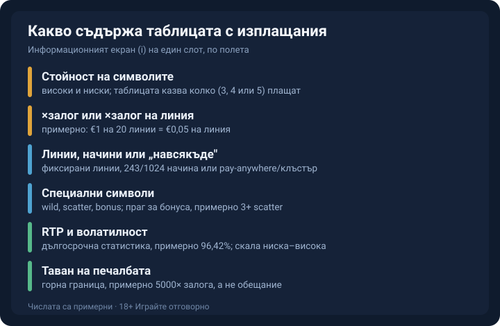
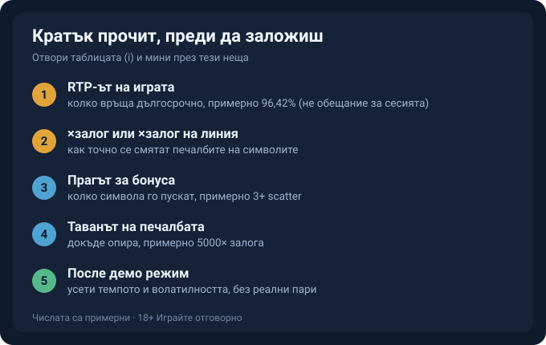

AI-FINGERPRINT REPORT
Overall verdict: MIXED
Overall score: 46/60
Layer scores: Lexical 9/10 | Syntactic 8/10 | Structural 8/10 | Density 8/10 | Experiential 7/10 | Rhythm 6/10

CRITICAL FLAGS (must fix):
- „ниска волатилност значи по-чести, но дребни печалби, висока значи дълги сухи серии и редки едри попадения." (RTP section) → the symmetric „ниска значи…; висока значи…" glossary-balance construction, the exact CONFIRMED BG structural tell (5/10 articles). → Break into two clauses of clearly unequal length and rhythm; state the low-vol case briefly, let the high-vol case run longer, and don't mirror the syntax.

MODERATE FLAGS:
- „Начинът, по който се образува печалбата, е три различни модела и таблицата казва кой е в сила." → mild counting-signpost flavour („три… модела" front-loaded). Softened by describing the models as distinct without numbering the sentence rhythm; acceptable, lightly reworded for flow.
- Em-dashes: 2 in the article, both inside image ALT text (not body prose). Under the ~1-per-400 budget for this main Phase-2 pass, but converted to commas now so the final light re-check has nothing to strip.
- „Казва ти обаче какво всъщност играеш, а това е информацията, която банерът старателно спестява." → borderline aphoristic closer; kept because it is a single opinionated verdict at the very end (allowed), not a per-paragraph habit, and it takes a side rather than balancing.

WHAT ALREADY WORKS (preserve in rewrite):
- Burstiness present; deliberate short openers next to long analytical sentences. Anchor-dense (€1, 20 линии, €0,05, €0,50, €10, 96,42%, 5000×, 3+ scatter, 243/1024).
- No banned connectives, no „Причината е проста:"-type signposting, no numbered prose („Първата… Втората…"), no „не A, а B" paragraph-ending mic-drops, no rule-of-three negation, no narrated emotion, no Version A/B, no emoji checkboxes, no false climaxes.
- Intro opens on the concrete banner-vs-info-screen contrast, not a rhetorical question or announced intro. Ending is asymmetric and takes a side.
- Editorial „ти" register, dry edge; every €/% figure labelled примерни; internal-link tokens and footer placeholders intact.

MIXED (46 < 48) → rewrite the flagged volatility construction and the counting-flavoured line; everything else preserved.

---

Byline: Editorial Team (signed Георги Тодоров per brand override) | Market: bg — обучаващ, пазарно-неутрален регистър.

# Как да четеш таблицата с изплащания (paytable) в слота

Банерът на една ротативка ти показва голямата цифра и героя от корицата. Таблицата с изплащания ти показва как реално плаща играта, събрано на едно място: колко струва всеки символ, колко символа трябват за печалба и върху какво се смятат, какво правят wild и scatter, какъв е RTP-ът, каква е волатилността и докъде опира максималната печалба. Половин минута с този екран, преди да завъртиш за истински пари, върши повече работа от целия рекламен банер.

## Къде е бутонът и какво отваря

Търси „i", понякога „?", или менюто до бутона за завъртане; играта спира, докато четеш, а екранът се скролва. На телефон бутонът често се крие в хамбургер меню или под зъбно колело, а на десктоп седи по края на екрана. Част от заглавията разнасят правилата в няколко таба, обикновено символи, линии, функции и обща информация, така че ако не намираш RTP-а на първия екран, той почти сигурно е в друг раздел.

## Колко струва всеки символ

Символите се делят на високи и ниски по стойност, а таблицата казва колко от тях трябват за печалба, тоест 3, 4 или 5, и колко плаща всеки брой. Високите обикновено са тематичните символи и плащат в пъти повече от ниските, които често са картите A, K, Q, J и 10. Повечето таблици показват стойностите при текущия ти залог, така че смениш ли залога, всички числа се преизчисляват. Тук се крие и най-честото объркване при четенето: сумата до символа може да е ×залог или ×залог на линия. При примерен залог от €1, разпределен върху 20 линии, залогът на линия е €0,05; символ, който в таблицата стои с „10× на линия", носи €0,50, а не €10. Стойностите са примерни, но разликата между двата начина на смятане е реална и се проверява, преди числата от таблицата да ти обещаят нещо, което не значат.

*Какво съдържа един информационен екран, по полета. Числата са примерни.*

## Линии, начини за печалба или „навсякъде"

Печалбата се образува по три различни модела и таблицата казва кой е в сила при тази игра. Фиксираните линии, да речем 20, плащат само по определени пътеки през барабаните. Игрите с „начини за печалба", 243 или 1024, зачитат съседни символи по колони, без да ги държат на конкретна линия. При pay-anywhere и клъстърните игри стига да се съберат достатъчно символи където и да е на екрана. Провери и посоката, защото част от игрите плащат само отляво надясно, а други и в двете посоки. Ако някой термин ти е нов, [речникът с казино термини](/blog/rechnik-kazino-termini/) ги описва поотделно.

## Wild, scatter, bonus и прагът за задействане

Специалните символи си имат отделен ред в таблицата. Wild замества другите символи, за да допълни печалба; scatter обикновено плаща независимо от позицията си и често задейства функция; bonus стартира отделна игра. Някои таблици описват и допълнителни тънкости, например разширяващ се или залепващ wild, множител върху него, или дали заменя scatter, което обикновено не прави. Тук пише и прагът за задействане, например 3 или повече scatter пускат безплатни завъртания. Праговете са примерни и се различават при всяка игра, затова стойността в конкретната таблица е меродавната.

## RTP, волатилност и таванът на печалбата

RTP е дългосрочна статистика над милиони завъртания, не обещание за твоята сесия; в информационния екран често стои до два знака, примерно 96,42%. Едно и също заглавие понякога излиза в няколко RTP билда, така че числото в екрана на тази конкретна игра е това, което тя реално върти, а не някаква обща стойност от ревю. Волатилността пък показва темперамента на играта. При ниска ще виждаш дребни печалби често; високата държи баланса на сухо дълго и връща всичко в едно рядко, едро попадение, което може и да не дойде в твоята сесия. Част от игрите показват това като скала от ниска до висока или с оценка от едно до пет. Това е въпрос на бюджет и търпение, а не оценка колко „добра" е играта. Максималната печалба, която таблицата посочва като таван, също е ×залог, примерно 5000×, и е горна граница, а не нещо обещано; понякога е изписана и като абсолютна сума при максимален залог. Ако печалбите ти идват със свързан бонус, до изтеглянето стои и [изискването за разиграване](/blog/kak-raboti-razigravaneto/), което таблицата на самата игра не описва.

## Кратък прочит преди да заложиш

Преди първото завъртане с истински пари отвори таблицата и мини през няколко неща: RTP-а, дали печалбите се смятат ×залог или ×залог на линия, къде е прагът за бонуса и какъв е таванът на максималната печалба. После пусни играта в [демо режим](/blog/bezplatni-kazino-igri/), за да усетиш темпото и волатилността, без да рискуваш пари. Демото няма да промени RTP-а, но ще ти покаже дали ритъмът на играта ти понася.

*Кратък маршрут през информационния екран, преди първото завъртане. Стойностите са примерни.*

Таблицата няма да ти каже кога ще спечелиш, защото това не го знае никой. Казва ти обаче какво всъщност играеш, а това е информацията, която банерът старателно спестява.

18+ Хазартът може да пристрасти. Играйте отговорно. [18+ / RG LINE]

[AUTHOR BIO BLOCK or EDITORIAL] [BRAND BOILERPLATE] [18+ / RG LINE]

CHANGE LOG: De-machined the symmetric „ниска значи…; висока значи…" volatility balance into two clauses of unequal length and rhythm (the flagged CONFIRMED BG structural tell). Reworded the „три различни модела" opener so the count isn't front-loaded as a signpost. Converted the 2 em-dashes in image ALT text to commas so the final light re-check inherits zero. All facts, illustrative figures (примерни), internal-link tokens, RG line and footer placeholders preserved exactly. No fabricated experience added. Remaining flags: none.
