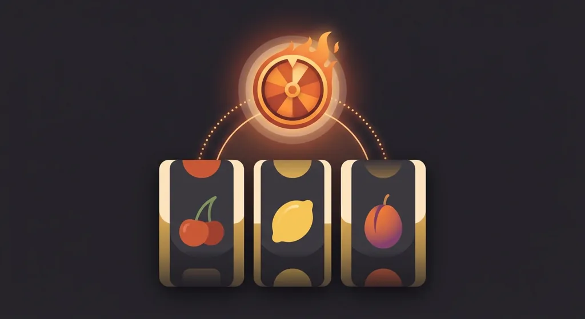
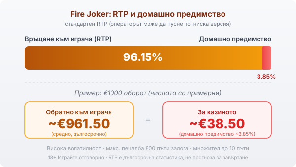

Title tag: Fire Joker: RTP и характеристики (Play'n GO)
Meta description: Fire Joker (файър джокер) на Play'n GO: 3x3, 5 линии, повторно завъртане и колело с множители до 10x. RTP 96.15%, макс. печалба ~800x, висока волатилност.

---

# Fire Joker: RTP, функции и защо колелото е единственият голям удар

Fire Joker (или файър джокер, както често се търси на кирилица) е плодова ротативка на Play'n GO от 2016 г. и е направена нарочно семпла. Три барабана, три реда, пет фиксирани линии. Печалба идва по стария начин: три еднакви символа върху някоя от петте линии. Символите са познатите плодове (череша, лимон, слива, грозде) заедно с BAR, звезда и седмица за по-стойностните комбинации. Fire Joker е дивият символ, появява се на всяка позиция на трите барабана и замества останалите символи по линиите. Най-добрата комбинация от три еднакви символа плаща 16 пъти залога на съответната линия. Това е цялата основна игра, без менюта за настройки и без разпръснати символи.

## Двете функции, които движат играта

Извън редовните линии Fire Joker има точно две допълнителни функции и двете тръгват от това колко еднакви символа са се събрали.

Повторното завъртане (Respin of Fire) се задейства, когато два от трите барабана се напълнят изцяло с един и същ символ, но подредбата не е образувала печалба. Тогава третият барабан се завърта още веднъж, безплатно, а двата вече напълнени остават на място. Играта се опитва да докара и третия барабан до същия символ.

Колелото с множители (Wheel of Multipliers) е другата функция и от него зависи голямата печалба. То се върти само когато целият екран покаже един и същ символ, тоест и деветте позиции по трите барабана съвпаднат. Колелото умножава печалбата от завъртането до 10 пъти. Пълненето на целия екран се случва рядко, а повторното завъртане е механизмът, който понякога го докарва. Класически рунд с безплатни завъртания тук няма, така че колелото е единственият път към по-едрия резултат, а таванът на печалбата е около 800 пъти залога.

## RTP и какво означава на практика

Стандартният **RTP на Fire Joker е 96.15%**, което оставя домашно предимство от около **3.85%**. При €1000 оборот това значи средно връщане от порядъка на **€961.50** към играча и около **€38.50** за казиното в дългосрочен план. Стойността е усреднена през милиони завъртания и не казва нищо за една конкретна вечер.

*Стандартен RTP 96.15%: при €1000 оборот средно ~€961.50 се връщат на играча, ~€38.50 остават за казиното (домашно предимство ~3.85%). Числата са примерни. Макс. печалба ~800x, множител до 10x.*

Play'n GO пуска играта и в конфигурируеми версии с по-нисък процент, например около 94.23%, а кое издание върви, решава операторът. Действащата стойност при конкретното казино пише в информационния панел на самата игра, затова я провери там, преди да заложиш. [VERIFY: коя RTP версия работи на живо при целевото казино: 96.15% по подразбиране срещу конфигурируема ~94.23%]

## Волатилност: дълги паузи, редки удари

Волатилността е между средна и висока. По-дребните печалби по линиите идват сравнително често, а по-едрите през колелото се случват рядко и на серии. Бюджетът трябва да издържи на дългите плоски участъци между тях, иначе играта свършва преди колелото изобщо да се появи.

## С какво се различава от другите плодови ротативки

Плодовете подвеждат. Fire Joker не е от серията Hot на EGT/Amusnet, колкото и еднакви да изглеждат череша до череша. Друг доставчик, друга математика, други функции: тук няма скатер за безплатни завъртания и целият горен потенциал минава през едно колело, докато плодовите класики на EGT работят по свой модел. Ако въобще харесваш този тип [ротативки](/kazino-igri/rotativki/), струва си да знаеш чия е играта и как е построена, преди да я сложиш до сходно изглеждащо заглавие. Нашия профил на Play'n GO и [прегледът ни на доставчиците](/blog/games-providers/) стъпват на същата логика, а различните [слот игри](/slot-igri/) се сравняват най-честно по реалния RTP, който гледаме и в [методологията ни](/kak-ocenyavame/). Play'n GO по-късно пусна и отделни издания като Fire Joker Freeze (пак 3x3) и Fire Joker Blitz (вече с 6 барабана и 4096 начина за печалба). Те са различни игри със своя математика и не бива да се бъркат с оригинала, за който е тази статия.

## Преди да завъртиш

Fire Joker е игра за настроение, не за дълга стратегия: пет линии, един див символ и едно колело, което решава дали вечерта ще е спокойна или ще има един по-голям миг. Пусни я първо в демо режим, за да усетиш темпото и паузите между по-едрите попадения, без да залагаш. Задай си лимит за загуба и за време преди първото истинско завъртане. 18+ Хазартът може да пристрасти. Играйте отговорно. Ако усетите, че играта излиза извън контрол, вижте [инструментите за отговорна игра](/otgovorna-igra/).

---

**Георги Тодоров**
Публикувано: 14.09.2026 · Последна редакция: 14.09.2026

[About Всички Казина boilerplate]

**Отговорна игра.** 18+ Хазартът може да пристрасти. Играйте отговорно. Ако усетиш, че играта излиза извън контрол или искаш да я ограничиш, виж [инструментите за отговорна игра](/otgovorna-igra/) и възможността за самоизключване чрез националния регистър на уязвимите лица към НАП (подава се писмено само от засегнатото лице). Национална информационна линия за наркотиците, алкохола и хазарта („Солидарност") 0888 99 18 66, делнични дни 10:00–17:00.

**Разкриване на партньорства.** Всички Казина съдържа партньорски (афилиейт) връзки; когато отвориш оферта през такава връзка, това може да финансира сайта, без да променя цената за теб и без да влияе на оценките ни. От 1 август 2026 г. дейността на афилиейт оператори в България се лицензира съгласно Закона за държавния бюджет за 2026 г. (ДВ, бр. 69 от 31.07.2026 г.). Всички Казина е подало заявление за лиценз пред Националната агенция по приходите и очаква издаването му.
