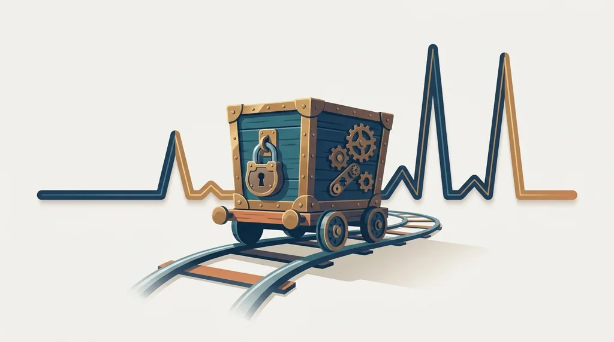
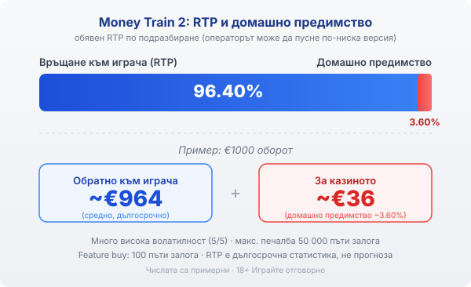

Title tag: Money Train 2: RTP 96.40%, волатилност и feature buy
Meta description: Money Train 2 на Relax Gaming: RTP 96.40% (конфигурируем), много висока волатилност, feature buy за 100x и защо 50 000x е таван, не очакване.

---

# Money Train 2: RTP, много висока волатилност и какво купуваш с feature buy

Money Train 2 (мъни трейн 2) на Relax Gaming излезе през 2020 г. и до края на същата година прибра отличията за игра и за доставчик на годината на Bigwinboard. Славата ѝ обаче стъпва на едно число, около 50 000 пъти залога, което почти никой не вижда. Зад стиймпънк темата на Дивия запад стои сурова математика: много висока волатилност и бонус рунд, който можеш да си купиш. Струва си да разделиш рекламните числа от реалистичните, преди да заложиш.

## Как е устроена играта

Мрежата е пет колони на четири реда с 40 фиксирани линии. Основната игра е сравнително тиха и по същество служи за чакалня към бонуса, където се случва почти всичко интересно. Два scatter символа задействат респини в основната игра, при които множителят се вдига с по 1 на всяко завъртане без печалба. Големият рунд се казва Money Cart и всичко в Money Train 2 води натам.

## Какво е Money Cart и защо всичко се върти около него

Три или повече scatter символа отключват Money Cart, същият бонус, който носи и тавана от около 50 000 пъти залога. Рундът стартира с 3 респина, а символите се заключват на местата си. Отличава го една проста, но коварна механика: всеки път, когато падне нов символ, броячът на респините се връща на 3. Докато има притока на символи, рундът продължава; спре ли, свършва. При достатъчно попадения се отварят до две допълнителни редици и мрежата се разраства.

Стойността в Money Cart идва от специалните символи, всеки с ясна роля. Collector събира стойността на всички видими символи към себе си. Payer добавя своята стойност към останалите по екрана. Sniper удвоява стойността на няколко други символа, Necromancer връща към живот вече изиграни символи, а Reset Plus вдига началния брой респини. Към тях има и „persistent" версии, които повтарят ефекта си на следващите завъртания, плюс комбинирани символи като Collector-Payer. Пълен екран от точните символи в точния ред е математическият път към горната граница, което на практика значи рядко.

## Колко е RTP и какво значи това за залога

96.40% е обявеният RTP по подразбиране, което оставя домашно предимство от около 3.60%. При €1000 оборот това е средно връщане от порядъка на €964 в дългосрочен план и около €36 за казиното. Relax Gaming доставя играта и в по-ниски конфигурации, в порядъка на 94%, а кой вариант работи избира операторът. Затова числото, което има значение за теб, е това в инфо-панела на самата игра при твоето казино, не рекламната стойност.

По-важна от точния процент е волатилността. Тя е много висока, 5 от 5 по стандартната скала. В практиката това са дълги серии завъртания без съществена печалба, прекъсвани рядко от едри попадения в бонуса. Банка, която не издържа на сухите периоди, свършва, преди изобщо да види Money Cart.

*Обявен RTP 96.40% по подразбиране: при €1000 оборот средно ~€964 се връщат на играча, ~€36 остават за казиното (домашно предимство ~3.60%). Волатилността е много висока, максималната печалба е около 50 000 пъти залога, а feature buy струва 100 пъти залога. Числата са примерни.*

## Feature buy: какво точно купуваш

Money Train 2 позволява да купиш бонус рунда Money Cart директно, вместо да го чакаш. Цената е 100 пъти залога, а обявеният RTP на купения режим е около 98%. Тук логиката лесно се обръща наопаки. По-високият RTP на купения бонус не значи по-добри шансове; той отразява, че плащаш скъпо за гарантиран достъп до най-волатилната част на играта. Плащаш за вариацията, докато дългосрочното домашно предимство на играта остава същото. Завъртане за €1 те държи в играта дълго; feature buy при същия залог струва €100 наведнъж и спокойно може да завърши с почти празен вагон. Дали изобщо можеш да купиш бонуса зависи от пазара. В някои юрисдикции feature buy е забранен: Обединеното кралство премахна купуването на бонус функции за своя регулиран пазар (UKGC), затова там опцията липсва в самата игра. Провери в конкретното казино дали feature buy изобщо е наличен, преди да разчиташ на него.

## 50 000 пъти залога е таван, не очакване

Числото 50 000x продава играта и е реално постижимо, но е горната граница на почти идеален Money Cart, не среден и дори не чест резултат. Повечето бонус рундове приключват на малка част от него. Да планираш около 50 000x е като да кроиш бюджет около джакпот, а математиката просто не работи така.

## Преди да завъртиш

Money Train 2 е игра за търпелив играч с ясен лимит, не за някой, който гони бърз резултат. Демо режимът е честният начин да усетиш темпото и колко дълги стават сухите серии, преди да вложиш реални пари. Relax Gaming има солидна репутация за високоволатилни заглавия и ако искаш повече контекст за доставчика, виж нашия профил на Relax Gaming и [прегледа ни на доставчиците](/blog/games-providers/). Различните [ротативки](/kazino-igri/rotativki/) се сравняват най-честно по реалния RTP на конкретното казино, който в [методологията ни](/kak-ocenyavame/) гледаме за всяко заглавие поотделно. Задай си лимит за загуба и за време преди първото завъртане, особено при толкова волатилна игра. 18+ Хазартът може да пристрасти. Играйте отговорно. Ако усетиш, че играта излиза извън контрол, виж [инструментите за отговорна игра](/otgovorna-igra/).

---

**Георги Тодоров**
Публикувано: 14.09.2026 · Последна редакция: 14.09.2026

[About Всички Казина boilerplate]

**Отговорна игра.** 18+ Хазартът може да пристрасти. Играйте отговорно. Ако усетиш, че играта излиза извън контрол или искаш да я ограничиш, виж [инструментите за отговорна игра](/otgovorna-igra/) и възможността за самоизключване чрез националния регистър на уязвимите лица към НАП (подава се писмено само от засегнатото лице). Национална информационна линия за наркотиците, алкохола и хазарта („Солидарност") 0888 99 18 66, делнични дни 10:00–17:00.

**Разкриване на партньорства.** Всички Казина съдържа партньорски (афилиейт) връзки; когато отвориш оферта през такава връзка, това може да финансира сайта, без да променя цената за теб и без да влияе на оценките ни. От 1 август 2026 г. дейността на афилиейт оператори в България се лицензира съгласно Закона за държавния бюджет за 2026 г. (ДВ, бр. 69 от 31.07.2026 г.). Всички Казина е подало заявление за лиценз пред Националната агенция по приходите и очаква издаването му.
